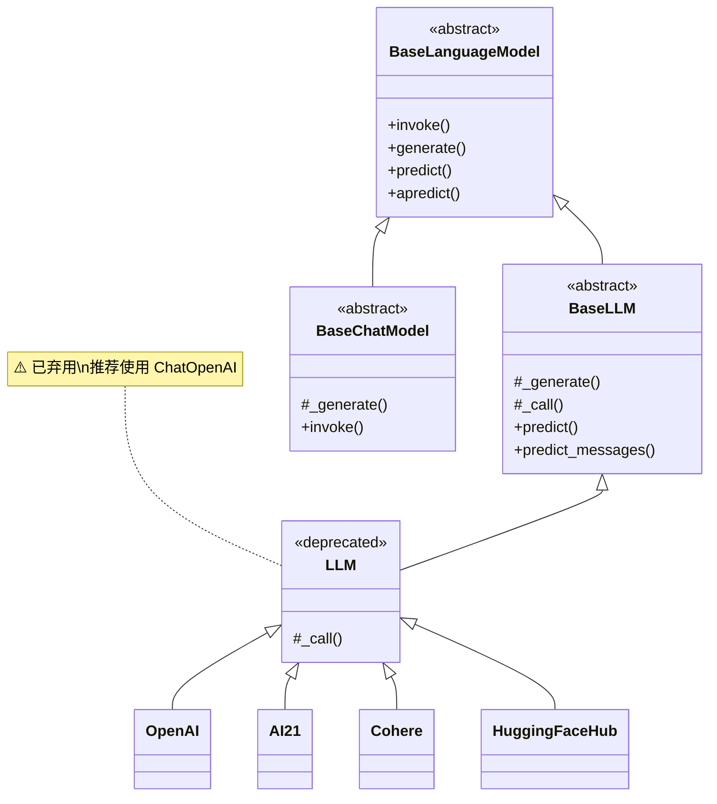
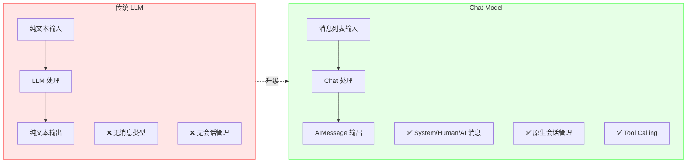

# 传统 LLM vs Chat Model

虽然 Chat Model 已成为主流，但了解传统 LLM（BaseLLM）仍有其价值。本章详细对比两者的区别，并提供迁移指南。

## BaseLLM 接口

### 类层次结构

::: v-pre

:::

### BaseLLM 核心方法

```python
from langchain_core.language_models import BaseLLM
from langchain_core.outputs import Generation, LLMResult
from typing import List, Optional

class BaseLLM(BaseLanguageModel):
    """传统 LLM 的基类"""
    
    # ============ 核心方法 ============
    
    def predict(
        self,
        text: str,
        stop: Optional[List[str]] = None,
        **kwargs
    ) -> str:
        """
        预测下一个 token/string
        
        Args:
            text: 输入提示词
            stop: 停止序列
        
        Returns:
            生成的文本
        """
        ...
    
    async def apredict(
        self,
        text: str,
        stop: Optional[List[str]] = None,
        **kwargs
    ) -> str:
        """异步版本"""
        ...
    
    def generate(
        self,
        prompts: List[str],
        stop: Optional[List[str]] = None,
        **kwargs
    ) -> LLMResult:
        """
        批量生成
        
        Returns:
            LLMResult 包含所有生成结果和 token 使用情况
        """
        ...
    
    async def agenerate(
        self,
        prompts: List[str],
        stop: Optional[List[str]] = None,
        **kwargs
    ) -> LLMResult:
        """异步批量生成"""
        ...
```

## 传统 LLM vs Chat Model 的区别

### 输入格式差异

```python
from langchain_openai import OpenAI, ChatOpenAI

# ============ 传统 LLM ============
llm = OpenAI(model="text-davinci-003")

# 输入：纯文本字符串
response = llm.predict("写一首诗")
print(response)
# 输出：纯文本字符串

# ============ Chat Model ============
chat = ChatOpenAI(model="gpt-3.5-turbo")

# 输入：消息列表或字符串（自动转换为 HumanMessage）
from langchain_core.messages import HumanMessage, SystemMessage

response = chat.invoke([
    SystemMessage(content="你是诗人"),
    HumanMessage(content="写一首诗")
])
print(response.content)
# 输出：AIMessage
```

### 输出格式差异

```python
from langchain_openai import OpenAI, ChatOpenAI

# 传统 LLM 输出：字符串
llm = OpenAI(model="text-davinci-003")
text_output = llm.predict("你好")
print(type(text_output))  # <class 'str'>

# Chat Model 输出：AIMessage
chat = ChatOpenAI(model="gpt-3.5-turbo")
message_output = chat.invoke("你好")
print(type(message_output))  # AIMessage
print(message_output.content)  # 字符串内容
```

### 功能支持对比

| 特性 | 传统 LLM | Chat Model |
|------|---------|-----------|
| **多轮对话** | ❌ 需要手动管理上下文 | ✅ 原生支持消息历史 |
| **System Message** | ❌ 需要拼接到 prompt | ✅ 原生支持 |
| **流式输出** | ⚠️ 有限支持 | ✅ 完整支持 |
| **Tool Calling** | ❌ 不支持 | ✅ 原生支持 |
| **结构化输出** | ❌ 需要手动解析 | ✅ with_structured_output |
| **多模态** | ❌ 不支持 | ✅ 支持图片等 |
| **Token 计数** | ⚠️ 需要手动计算 | ✅ 自动追踪 |

::: v-pre

:::

## 何时使用 LLM vs Chat Model

### 使用 Chat Model 的场景（推荐）

```python
# ✅ 场景 1：对话系统
from langchain_openai import ChatOpenAI
from langchain_core.messages import HumanMessage, AIMessage

chat = ChatOpenAI(model="gpt-3.5-turbo")

history = [
    HumanMessage(content="你好"),
    AIMessage(content="你好！"),
]
response = chat.invoke(history + [HumanMessage(content="继续")])

# ✅ 场景 2：需要结构化输出
from pydantic import BaseModel

class Response(BaseModel):
    answer: str
    confidence: float

structured_chat = chat.with_structured_output(Response)
result = structured_chat.invoke("问题...")

# ✅ 场景 3：Tool Calling
from langchain_core.tools import tool

@tool
def search(query: str): ...

chat_with_tools = chat.bind_tools([search])
response = chat_with_tools.invoke("搜索天气")
```

### 可能仍需要传统 LLM 的场景

```python
# ⚠️ 场景 1：简单的文本补全
from langchain_openai import OpenAI

llm = OpenAI(model="text-davinci-003")

# 代码补全
code_prefix = """
def fibonacci(n):
    \"\"\"计算斐波那契数列\"\"\"
"""
completion = llm.predict(code_prefix)

# ⚠️ 场景 2：非对话式生成
prompt = "这是一篇关于 AI 的论文的摘要："
abstract = llm.predict(prompt)

# ⚠️ 场景 3：Legacy 代码维护
# 现有代码库使用 OpenAI 类
```

### 实际情况

> 💡 **现实情况**：随着 GPT-3.5-turbo 及后续模型的出现，传统 LLM 已基本被淘汰。OpenAI 的 text-davinci-003 等模型已停产，新开发应始终使用 Chat Model。

## 迁移指南

### 从 OpenAI 迁移到 ChatOpenAI

```python
# ============ 旧代码 ============
from langchain_openai import OpenAI

llm = OpenAI(
    model="text-davinci-003",
    temperature=0.7,
    max_tokens=1000,
)

response = llm.predict("你好")
print(response)

# ============ 新代码 ============
from langchain_openai import ChatOpenAI
from langchain_core.prompts import PromptTemplate

chat = ChatOpenAI(
    model="gpt-3.5-turbo",  # 或 gpt-4-turbo
    temperature=0.7,
    max_tokens=1000,
)

# 方式 1：直接传入字符串（自动转为 HumanMessage）
response = chat.invoke("你好")
print(response.content)

# 方式 2：使用 PromptTemplate
prompt = PromptTemplate.from_template("你好，{topic}")
chain = prompt | chat
response = chain.invoke({"topic": "世界"})
```

### 从 LLMChain 迁移到 LCEL

```python
# ============ 旧代码 (LLMChain) ============
from langchain.chains import LLMChain
from langchain_openai import OpenAI
from langchain.prompts import PromptTemplate

llm = OpenAI(model="text-davinci-003")
prompt = PromptTemplate(
    input_variables=["topic"],
    template="写一篇关于{topic}的文章"
)

chain = LLMChain(llm=llm, prompt=prompt)
result = chain.run(topic="AI")

# ============ 新代码 (LCEL) ============
from langchain_openai import ChatOpenAI
from langchain_core.prompts import ChatPromptTemplate
from langchain_core.output_parsers import StrOutputParser

chat = ChatOpenAI(model="gpt-3.5-turbo")
prompt = ChatPromptTemplate.from_template("写一篇关于{topic}的文章")

chain = prompt | chat | StrOutputParser()
result = chain.invoke({"topic": "AI"})
```

### 从 ConversationChain 迁移

```python
# ============ 旧代码 (ConversationChain) ============
from langchain.chains import ConversationChain
from langchain_openai import OpenAI
from langchain.memory import ConversationBufferMemory

llm = OpenAI(temperature=0.7)
memory = ConversationBufferMemory()

chain = ConversationChain(
    llm=llm,
    memory=memory,
)

print(chain.run("你好"))
print(chain.run("我叫小明"))
print(chain.run("我叫什么？"))

# ============ 新代码 (LCEL + MessagesPlaceholder) ============
from langchain_openai import ChatOpenAI
from langchain_core.prompts import ChatPromptTemplate, MessagesPlaceholder
from langchain_core.messages import HumanMessage, AIMessage

chat = ChatOpenAI(temperature=0.7)

# 手动管理历史
class ChatMemory:
    def __init__(self):
        self.history = []
    
    def add(self, human: str, ai: str):
        self.history.extend([
            HumanMessage(content=human),
            AIMessage(content=ai)
        ])
    
    def get(self):
        return self.history

memory = ChatMemory()

prompt = ChatPromptTemplate.from_messages([
    MessagesPlaceholder(variable_name="history"),
    ("human", "{input}")
])

chain = prompt | chat

def chat_with_memory(input_text: str):
    response = chain.invoke({
        "history": memory.get(),
        "input": input_text
    })
    memory.add(input_text, response.content)
    return response.content

print(chat_with_memory("你好"))
print(chat_with_memory("我叫小明"))
print(chat_with_memory("我叫什么？"))
```

### 从 LLMMathChain 迁移

```python
# ============ 旧代码 ============
from langchain.chains import LLMMathChain
from langchain_openai import OpenAI

llm = OpenAI(temperature=0)
math_chain = LLMMathChain.from_llm(llm)
result = math_chain.run("123 的平方根是多少？")

# ============ 新代码 ============
from langchain_openai import ChatOpenAI
from langchain_core.tools import tool
from langchain_core.prompts import ChatPromptTemplate
import math

chat = ChatOpenAI(temperature=0)

@tool
def calculator(expression: str) -> float:
    """计算数学表达式"""
    return eval(expression)

llm_with_tools = chat.bind_tools([calculator])

# 手动处理工具调用或使用 Agent
```

## 完整的迁移示例

### 示例：客服对话系统迁移

```python
# ============ 旧代码 ============
from langchain.chains import ConversationChain
from langchain_openai import OpenAI
from langchain.memory import ConversationBufferMemory
from langchain.prompts import PromptTemplate

llm = OpenAI(temperature=0.7)

template = """
你是一个客服助手。请友好、专业地回答用户问题。

{history}
Human: {input}
Assistant:
"""

prompt = PromptTemplate(
    input_variables=["history", "input"],
    template=template
)

memory = ConversationBufferMemory()
conversation = ConversationChain(
    llm=llm,
    prompt=prompt,
    memory=memory,
)

# 使用
print(conversation.run("产品有问题怎么办？"))
print(conversation.run("如何退货？"))

# ============ 新代码 (LCEL) ============
from langchain_openai import ChatOpenAI
from langchain_core.prompts import ChatPromptTemplate, MessagesPlaceholder
from langchain_core.messages import HumanMessage, AIMessage

chat = ChatOpenAI(
    model="gpt-3.5-turbo",
    temperature=0.7,
)

# 系统提示
system_prompt = "你是一个客服助手。请友好、专业地回答用户问题。"

prompt = ChatPromptTemplate.from_messages([
    ("system", system_prompt),
    MessagesPlaceholder(variable_name="history"),
    ("human", "{input}")
])

chain = prompt | chat

# 记忆管理
class ChatHistory:
    def __init__(self, max_messages=10):
        self.messages = []
        self.max_messages = max_messages
    
    def add_message(self, role: str, content: str):
        if role == "human":
            self.messages.append(HumanMessage(content=content))
        elif role == "ai":
            self.messages.append(AIMessage(content=content))
        
        # 限制历史长度
        if len(self.messages) > self.max_messages:
            self.messages = self.messages[-self.max_messages:]
    
    def get_messages(self):
        return self.messages

history = ChatHistory()

def customer_service_chat(user_input: str):
    response = chain.invoke({
        "history": history.get_messages(),
        "input": user_input
    })
    history.add_message("ai", response.content)
    return response.content

# 记录用户输入
history.add_message("human", "产品有问题怎么办？")
print(customer_service_chat("产品有问题怎么办？"))

history.add_message("human", "如何退货？")
print(customer_service_chat("如何退货？"))
```

## 为什么 Chat Model 更好

1. **更符合现代 API**：GPT-4、Claude 等模型都针对聊天优化
2. **更好的对话管理**：原生支持多轮对话
3. **更丰富的功能**：Tool Calling、结构化输出等
4. **更好的类型系统**：消息类型明确，便于静态分析
5. **与 LCEL 完美集成**：声明式组合，类型推断

## 💡 提示块

> 💡 **迁移建议**
>
> 1. **新项目只用 Chat Model**：不要使用传统 LLM
> 2. **逐步迁移旧代码**：优先迁移核心功能
> 3. **使用 LCEL 替代 Chain**：LLMChain、ConversationChain 等已不推荐
> 4. **测试边界情况**：确保迁移后行为一致
> 5. **利用新功能**：迁移时考虑引入 Tool Calling、结构化输出等

## 总结

| 方面 | 传统 LLM | Chat Model |
|------|---------|-----------|
| **状态** | ⚠️ 弃用 | ✅ 推荐 |
| **输入** | 纯文本 | 消息列表 |
| **输出** | 字符串 | AIMessage |
| **对话支持** | 手动 | 原生 |
| **Tool Calling** | ❌ | ✅ |
| **结构化输出** | 手动 | 原生 |
| **流式** | 有限 | 完整 |

**结论**：新开发应始终使用 Chat Model，传统 LLM 仅用于维护遗留代码。