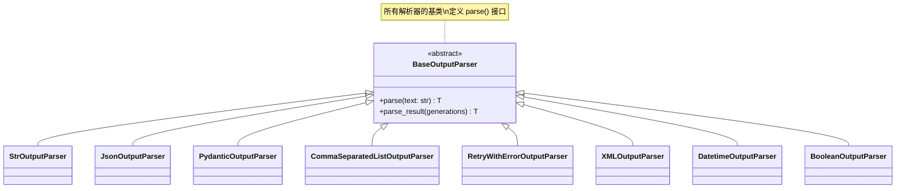
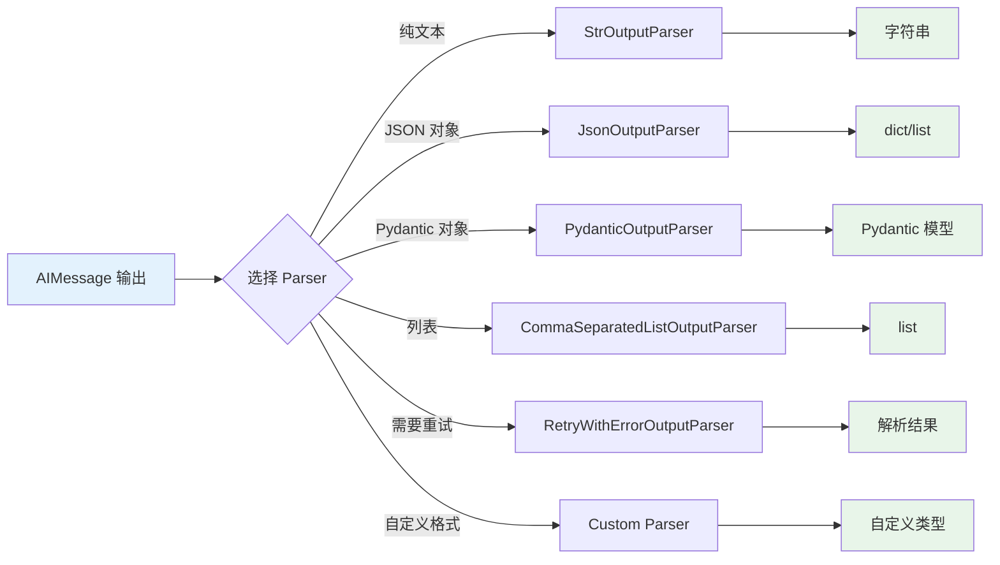

# Output Parser 输出解析器

Output Parser 用于将 LLM 的原始输出转换为结构化格式。它是 LCEL 管道中的重要组成部分，使模型输出能够被程序化处理。

## Output Parser 体系

::: v-pre

:::

## StrOutputParser - 字符串解析

最简单的解析器，从 AIMessage 中提取文本内容。

```python
from langchain_core.output_parsers import StrOutputParser
from langchain_openai import ChatOpenAI

llm = ChatOpenAI(model="gpt-3.5-turbo")
parser = StrOutputParser()

chain = llm | parser

result = chain.invoke("你好")
print(result)          # 字符串
print(type(result))    # <class 'str'>
```

### 使用场景

```python
# 当你只需要原始文本时使用
simple_chain = llm | StrOutputParser()

# 或在复杂管道的最后
from langchain_core.prompts import ChatPromptTemplate

prompt = ChatPromptTemplate.from_template("{question}")
chain = prompt | llm | StrOutputParser()

result = chain.invoke({"question": "什么是 AI？"})
```

## JsonOutputParser - JSON 解析

将 LLM 输出解析为 JSON 对象。

```python
from langchain_core.output_parsers import JsonOutputParser
from langchain_openai import ChatOpenAI

llm = ChatOpenAI(model="gpt-3.5-turbo")
parser = JsonOutputParser()

prompt = ChatPromptTemplate.from_template(
    "回答以下问题，以 JSON 格式返回:\n{question}\n{format_instructions}"
)

# 获取格式说明
format_instructions = parser.get_format_instructions()

chain = prompt | llm | parser

result = chain.invoke({
    "question": "列出 3 种水果及其颜色",
    "format_instructions": format_instructions
})

print(result)
# [{'fruit': '苹果', 'color': '红色'}, ...]
print(type(result))  # dict 或 list
```

### 带 Pydantic 的 JSON 解析

```python
from pydantic import BaseModel, Field
from langchain_core.output_parsers import JsonOutputParser

class WeatherResponse(BaseModel):
    city: str = Field(description="城市名称")
    temperature: float = Field(description="温度（摄氏度）")
    condition: str = Field(description="天气状况")

parser = JsonOutputParser(pydantic_object=WeatherResponse)

chain = llm | parser

result = chain.invoke("北京天气")
# {'city': '北京', 'temperature': 25.0, 'condition': '晴'}

# 类型安全访问
weather = WeatherResponse(**result)
print(weather.city)
```

## PydanticOutputParser - Pydantic 解析

直接使用 Pydantic 模型定义输出结构。

```python
from pydantic import BaseModel, Field
from langchain_core.output_parsers import PydanticOutputParser
from langchain_openai import ChatOpenAI

# 定义输出结构
class Joke(BaseModel):
    setup: str = Field(description="笑话的铺垫")
    punchline: str = Field(description="笑话的笑点")
    rating: int = Field(description="评分 1-10", ge=1, le=10)

# 创建解析器
parser = PydanticOutputParser(pydantic_object=Joke)

# 构建提示
prompt = ChatPromptTemplate.from_messages([
    ("system", "你是一个讲笑话的助手。"),
    ("human", "讲一个{topic}笑话。\n{format_instructions}")
])

llm = ChatOpenAI(model="gpt-3.5-turbo")

chain = prompt | llm | parser

result = chain.invoke({
    "topic": "程序员",
    "format_instructions": parser.get_format_instructions()
})

print(type(result))  # Joke 对象
print(result.setup)
print(result.punchline)
```

### 复杂嵌套结构

```python
from typing import List, Optional
from pydantic import BaseModel, Field

class Person(BaseModel):
    name: str
    age: int
    email: Optional[str] = None

class Team(BaseModel):
    name: str
    leader: Person
    members: List[Person]
    description: str

parser = PydanticOutputParser(pydantic_object=Team)

chain = llm | parser

result = chain.invoke(f"""
创建一个技术团队的信息。
{parser.get_format_instructions()}
""")

print(result.leader.name)      # 访问嵌套属性
print(result.members[0].name)  # 访问列表元素
```

## CommaSeparatedListOutputParser - 列表解析

解析逗号分隔的列表。

```python
from langchain_core.output_parsers import CommaSeparatedListOutputParser

llm = ChatOpenAI(model="gpt-3.5-turbo")
parser = CommaSeparatedListOutputParser()

prompt = ChatPromptTemplate.from_template(
    "列出 5 种{category}。\n{format_instructions}"
)

chain = prompt | llm | parser

result = chain.invoke({
    "category": "水果",
    "format_instructions": parser.get_format_instructions()
})

print(result)
# ['苹果', '香蕉', '橙子', '葡萄', '西瓜']
print(type(result))  # list
```

### 自定义分隔符

```python
from langchain_core.output_parsers import CommaSeparatedListOutputParser

# 使用分号分隔
parser = CommaSeparatedListOutputParser(separator=";")

# 或自定义 JSON 列表
class JSONListOutputParser:
    def parse(self, text: str) -> list:
        import json
        # 提取 JSON 数组部分
        start = text.find('[')
        end = text.rfind(']') + 1
        return json.loads(text[start:end])
```

## RetryWithErrorOutputParser - 错误重试

当解析失败时自动重试。

```python
from pydantic import BaseModel, Field
from langchain_core.output_parsers import (
    PydanticOutputParser,
    RetryWithErrorOutputParser
)
from langchain_openai import ChatOpenAI

class ValidatedResponse(BaseModel):
    answer: str
    confidence: float  # 0-1 之间

parser = PydanticOutputParser(pydantic_object=ValidatedResponse)

# 包装为带重试的解析器
retry_parser = RetryWithErrorOutputParser(
    parser=parser,
    llm=ChatOpenAI(model="gpt-3.5-turbo"),
    max_retries=3
)

# 使用
prompt = ChatPromptTemplate.from_template(
    "回答：{question}\n{format_instructions}"
)

chain = prompt | llm | retry_parser

result = chain.invoke({
    "question": "地球是圆的吗？",
    "format_instructions": parser.get_format_instructions()
})
```

### 自定义重试逻辑

```python
from langchain_core.output_parsers import BaseOutputParser

class SafeJSONParser(BaseOutputParser):
    """安全的 JSON 解析器，失败时返回默认值"""
    
    def parse(self, text: str) -> dict:
        import json
        try:
            return json.loads(text)
        except json.JSONDecodeError as e:
            # 尝试修复常见错误
            text = text.strip()
            if text.startswith('```json'):
                text = text[7:]
            if text.endswith('```'):
                text = text[:-3]
            try:
                return json.loads(text.strip())
            except:
                return {"error": "解析失败", "raw": text}

parser = SafeJSONParser()
```

## 自定义 Parser

### 基础自定义解析器

```python
from langchain_core.output_parsers import BaseOutputParser

class NumberExtractor(BaseOutputParser):
    """从文本中提取数字"""
    
    def parse(self, text: str) -> int:
        import re
        match = re.search(r'\d+', text)
        if match:
            return int(match.group())
        raise ValueError(f"未找到数字：{text}")

# 使用
from langchain_openai import ChatOpenAI

llm = ChatOpenAI(model="gpt-3.5-turbo")

prompt = ChatPromptTemplate.from_template(
    "回答这个问题，并在最后用'答案是 X'的格式给出数字：{question}"
)

chain = prompt | llm | NumberExtractor()

result = chain.invoke({"question": "123 + 456 等于多少？"})
print(result)  # 579
```

### 带验证的解析器

```python
from langchain_core.output_parsers import BaseOutputParser
from typing import List

class ValidatedListParser(BaseOutputParser):
    """验证列表元素"""
    
    def __init__(self, min_items: int = 1, max_items: int = 10):
        self.min_items = min_items
        self.max_items = max_items
    
    def parse(self, text: str) -> List[str]:
        import json
        try:
            items = json.loads(text)
            if not isinstance(items, list):
                raise ValueError("输出不是列表")
            if len(items) < self.min_items:
                raise ValueError(f"项目太少：{len(items)} < {self.min_items}")
            if len(items) > self.max_items:
                raise ValueError(f"项目太多：{len(items)} > {self.max_items}")
            return items
        except json.JSONDecodeError as e:
            raise ValueError(f"JSON 解析失败：{e}")

parser = ValidatedListParser(min_items=3, max_items=5)
```

### 多模态解析器

```python
from langchain_core.output_parsers import BaseOutputParser

class MultimodalParser(BaseOutputParser):
    """解析多模态输出"""
    
    def parse(self, text: str) -> dict:
        result = {
            "text": text,
            "has_code": "```" in text,
            "has_list": any(x in text for x in ["\n-", "\n*", "\n1."]),
            "word_count": len(text.split()),
        }
        return result

parser = MultimodalParser()
```

## Parser 处理流程

::: v-pre

:::

## 实际应用场景

### 场景 1：API 响应模拟

```python
from pydantic import BaseModel, Field
from langchain_core.output_parsers import PydanticOutputParser

class APIResponse(BaseModel):
    success: bool
    data: dict
    error: str = None
    timestamp: int

parser = PydanticOutputParser(pydantic_object=APIResponse)

chain = llm | parser

response = chain.invoke(f"""
模拟一个 API 响应，表示用户登录成功。
{parser.get_format_instructions()}
""")

print(response.success)  # True
print(response.data)     # 用户数据
```

### 场景 2：数据提取

```python
from typing import List
from pydantic import BaseModel, Field
from langchain_core.output_parsers import PydanticOutputParser

class Contact(BaseModel):
    name: str
    email: str
    phone: str = None

class ContactList(BaseModel):
    contacts: List[Contact]
    source: str

parser = PydanticOutputParser(pydantic_object=ContactList)

from langchain_core.prompts import ChatPromptTemplate

prompt = ChatPromptTemplate.from_template("""
从以下文本中提取所有联系人的信息：
{text}

{format_instructions}
""")

chain = prompt | llm | parser

result = chain.invoke({
    "text": "张三 zhangsan@email.com, 李四 lisi@email.com 13800138000",
    "format_instructions": parser.get_format_instructions()
})

for contact in result.contacts:
    print(f"{contact.name}: {contact.email}")
```

### 场景 3：分类任务

```python
from enum import Enum
from pydantic import BaseModel, Field
from langchain_core.output_parsers import PydanticOutputParser

class Sentiment(str, Enum):
    POSITIVE = "positive"
    NEGATIVE = "negative"
    NEUTRAL = "neutral"

class Classification(BaseModel):
    sentiment: Sentiment
    confidence: float = Field(ge=0, le=1)
    keywords: list[str] = Field(default_factory=list)

parser = PydanticOutputParser(pydantic_object=Classification)

chain = llm | parser

result = chain.invoke(f"""
分析这句话的情感："这个产品很好用，但是价格有点贵"
{parser.get_format_instructions()}
""")

print(f"情感：{result.sentiment}")
print(f"置信度：{result.confidence}")
print(f"关键词：{result.keywords}")
```

### 场景 4：代码生成与验证

```python
from pydantic import BaseModel, Field
from langchain_core.output_parsers import PydanticOutputParser

class GeneratedCode(BaseModel):
    language: str
    code: str
    explanation: str
    test_case: str

parser = PydanticOutputParser(pydantic_object=GeneratedCode)

prompt = ChatPromptTemplate.from_template("""
生成一个{task}的{language}函数。
{format_instructions}
""")

chain = prompt | llm | parser

result = chain.invoke({
    "task": "计算斐波那契数列",
    "language": "Python",
    "format_instructions": parser.get_format_instructions()
})

print(f"语言：{result.language}")
print(f"代码：\n{result.code}")
print(f"测试：{result.test_case}")
```

## 组合 Parser 使用

```python
from langchain_core.output_parsers import StrOutputParser, JsonOutputParser
from langchain_core.runnables import RunnableParallel

llm = ChatOpenAI(model="gpt-3.5-turbo")

# 并行输出多种格式
parallel_parser = RunnableParallel({
    "text": StrOutputParser(),
    "json": JsonOutputParser(),
})

chain = llm | parallel_parser

result = chain.invoke("列出 3 种动物")
print(result["text"])  # 字符串
print(result["json"])  # JSON 对象
```

## 💡 提示块

> 💡 **最佳实践**
>
> 1. **优先使用 PydanticOutputParser**：类型安全，便于验证
> 2. **提供清晰的格式说明**：使用 `get_format_instructions()`
> 3. **添加错误处理**：使用 RetryWithErrorOutputParser 或自定义
> 4. **测试边界情况**：空输出、无效格式等
> 5. **考虑流式支持**：某些解析器可能破坏流式
> 6. **使用 JSON Mode**：对于 JSON 解析，启用模型的 JSON Mode

## 总结

| 解析器 | 输出类型 | 适用场景 |
|-------|---------|---------|
| **StrOutputParser** | str | 纯文本输出 |
| **JsonOutputParser** | dict/list | JSON 格式数据 |
| **PydanticOutputParser** | Pydantic 模型 | 结构化数据 |
| **CommaSeparatedListOutputParser** | list | 列表数据 |
| **RetryWithErrorOutputParser** | 任意 | 需要重试的场景 |

选择合适的 Output Parser 是构建可靠 AI 应用的关键。