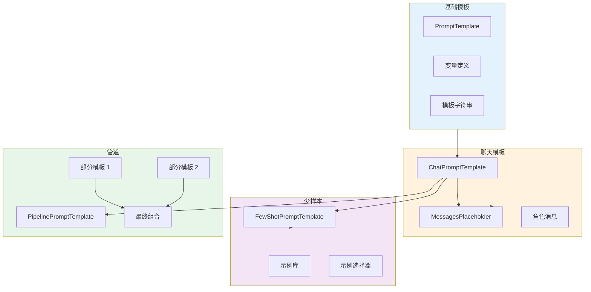

# Prompt Template 提示模板

Prompt Template 是 LangChain 中用于动态生成提示词的核心组件。它允许你将提示词模板化，并在运行时填充变量。

## PromptTemplate vs ChatPromptTemplate

### PromptTemplate - 基础模板

`PromptTemplate` 用于生成纯文本提示，适用于传统 LLM。

```python
from langchain.prompts import PromptTemplate

# 方式 1：从模板字符串
prompt = PromptTemplate.from_template(
    "写一篇关于{topic}的{length}文章"
)

# 填充变量
formatted = prompt.format(topic="人工智能", length="简短")
print(formatted)
# 输出：写一篇关于人工智能的简短文章

# 方式 2：完整构造
prompt = PromptTemplate(
    input_variables=["topic", "length"],
    template="写一篇关于{topic}的{length}文章",
    template_format="f-string",  # 或 jinja2
)

# 使用
text = prompt.format(topic="机器学习", length="详细")
```

### ChatPromptTemplate - 聊天模板

`ChatPromptTemplate` 用于生成消息列表，适用于 Chat Model。

```python
from langchain_core.prompts import ChatPromptTemplate

# 方式 1：从模板字符串（自动转为 HumanMessage）
prompt = ChatPromptTemplate.from_template(
    "写一篇关于{topic}的文章"
)

messages = prompt.format_messages(topic="AI")
print(messages)
# [HumanMessage(content="写一篇关于 AI 的文章")]

# 方式 2：从消息列表
prompt = ChatPromptTemplate.from_messages([
    ("system", "你是一个{role}专家。"),
    ("human", "{question}")
])

messages = prompt.format_messages(role="Python", question="什么是装饰器？")
# [SystemMessage(...), HumanMessage(...)]

# 方式 3：使用元组
prompt = ChatPromptTemplate.from_messages([
    ("system", "你是助手"),
    ("human", "你好"),
    ("ai", "你好！"),
    ("human", "{input}")
])
```

### 对比

| 特性 | PromptTemplate | ChatPromptTemplate |
|------|---------------|-------------------|
| **输出类型** | 字符串 | 消息列表 |
| **适用模型** | 传统 LLM | Chat Model |
| **角色支持** | ❌ | ✅ System/Human/AI |
| **多轮对话** | ❌ | ✅ |
| **推荐使用** | ⚠️ 遗留代码 | ✅ 新项目 |

## MessagesPlaceholder - 消息占位符

`MessagesPlaceholder` 用于在对话历史中插入动态消息列表。

```python
from langchain_core.prompts import ChatPromptTemplate, MessagesPlaceholder

# 带历史消息的提示
prompt = ChatPromptTemplate.from_messages([
    ("system", "你是一个有帮助的助手。"),
    MessagesPlaceholder(variable_name="history"),  # 动态历史
    ("human", "{input}")
])

# 使用
from langchain_core.messages import HumanMessage, AIMessage

history = [
    HumanMessage(content="你好"),
    AIMessage(content="你好！有什么可以帮助你的？"),
]

messages = prompt.format_messages(
    history=history,
    input="今天天气怎么样？"
)

print(messages)
# [
#     SystemMessage(...),
#     HumanMessage(content="你好"),
#     AIMessage(content="..."),
#     HumanMessage(content="今天天气怎么样？")
# ]
```

### optional 参数

```python
# 可选的历史消息
prompt = ChatPromptTemplate.from_messages([
    ("system", "你是助手"),
    MessagesPlaceholder(variable_name="history", optional=True),  # 可选
    ("human", "{input}")
])

# 不提供 history 也能工作
messages = prompt.format_messages(input="你好")
```

### 条件历史

```python
from langchain_core.prompts import MessagesPlaceholder
from langchain_core.runnables import RunnableLambda

# 根据条件决定是否包含历史
def conditional_history(input_data):
    if input_data.get("use_history"):
        return input_data["history"]
    return []

prompt = ChatPromptTemplate.from_messages([
    ("system", "你是助手"),
    MessagesPlaceholder(variable_name="history", optional=True),
    ("human", "{input}")
])

chain = RunnableLambda(lambda x: {
    **x,
    "history": conditional_history(x)
}) | prompt
```

## FewShotPromptTemplate - 少样本提示

### FewShotPromptTemplate - 纯文本

```python
from langchain_core.prompts import FewShotPromptTemplate, PromptTemplate
from langchain_core.example_selectors import SemanticSimilarityExampleSelector
from langchain_community.vectorstores import FAISS
from langchain_openai import OpenAIEmbeddings

# 定义示例
examples = [
    {
        "question": "谁是美国第一任总统？",
        "answer": "乔治·华盛顿"
    },
    {
        "question": "法的资本是哪里？",
        "answer": "巴黎"
    },
    {
        "question": "10 的平方根是多少？",
        "answer": "约 3.162"
    },
]

# 示例模板
example_prompt = PromptTemplate.from_template(
    "问题：{question}\n答案：{answer}"
)

# 创建 FewShot 模板
few_shot_prompt = FewShotPromptTemplate(
    examples=examples,
    example_prompt=example_prompt,
    prefix="请回答以下问题：",
    suffix="问题：{question}\n答案：",
    input_variables=["question"],
    example_separator="\n\n",
)

# 使用
formatted = few_shot_prompt.format(question="谁发明了电话？")
print(formatted)
```

### FewShotChatMessagePromptTemplate - 聊天

```python
from langchain_core.prompts import FewShotChatMessagePromptTemplate

# 聊天示例
examples = [
    {
        "input": "2+2 等于多少？",
        "output": "4"
    },
    {
        "input": "10*10 等于多少？",
        "output": "100"
    },
]

# 示例提示模板
example_prompt = ChatPromptTemplate.from_messages([
    ("human", "{input}"),
    ("ai", "{output}")
])

# FewShot 聊天模板
few_shot_chat = FewShotChatMessagePromptTemplate(
    examples=examples,
    example_prompt=example_prompt,
    input_variables=["input"],
)

# 与主提示组合
from langchain_core.prompts import ChatPromptTemplate

final_prompt = ChatPromptTemplate.from_messages([
    ("system", "你是一个数学助手。"),
    few_shot_chat,  # 插入示例
    ("human", "{input}")
])

# 使用
messages = final_prompt.format_messages(input="5*5 等于多少？")
```

### 动态示例选择

```python
from langchain_core.example_selectors import SemanticSimilarityExampleSelector
from langchain_community.vectorstores import FAISS
from langchain_openai import OpenAIEmbeddings

examples = [
    {"input": "你好", "output": "你好！有什么可以帮助你的？"},
    {"input": "再见", "output": "再见，祝你有美好的一天！"},
    {"input": "谢谢", "output": "不客气！"},
    # ... 更多示例
]

# 创建示例选择器
example_selector = SemanticSimilarityExampleSelector.from_examples(
    examples,
    OpenAIEmbeddings(),
    FAISS,
    k=5,  # 选择最相关的 5 个示例
)

# 使用选择器
few_shot = FewShotChatMessagePromptTemplate(
    example_selector=example_selector,
    example_prompt=ChatPromptTemplate.from_messages([
        ("human", "{input}"),
        ("ai", "{output}")
    ]),
)
```

## PipelinePromptTemplate - 管道提示

`PipelinePromptTemplate` 允许将多个提示模板组合成一个管道。

```python
from langchain_core.prompts import PipelinePromptTemplate, ChatPromptTemplate

# 定义各个部分
intro_prompt = ChatPromptTemplate.from_template(
    "你是一个{role}专家。"
)

examples_prompt = ChatPromptTemplate.from_template(
    "示例：{examples}"
)

question_prompt = ChatPromptTemplate.from_template(
    "问题：{question}"
)

# 组合成管道
full_prompt = ChatPromptTemplate.from_messages([
    ("system", "{intro}"),
    ("system", "{examples}"),
    ("human", "{question}")
])

pipeline = PipelinePromptTemplate(
    final_prompt=full_prompt,
    pipeline_prompts=[
        ("intro", intro_prompt),
        ("examples", examples_prompt),
        ("question", question_prompt),
    ],
    input_variables=["role", "examples", "question"],
)

# 使用
formatted = pipeline.format(
    role="Python",
    examples="print('Hello') 是打印语句",
    question="如何打印？"
)
```

## 模板变量与部分变量

### 基础变量

```python
from langchain_core.prompts import PromptTemplate

# 要求所有变量
prompt = PromptTemplate.from_template(
    "用{language}写一个{style}的{topic}程序"
)

# 必须提供所有变量
result = prompt.format(
    language="Python",
    style="简洁",
    topic="Hello World"
)
```

### 部分变量（Partial）

```python
from langchain_core.prompts import PromptTemplate

# 创建模板
prompt = PromptTemplate.from_template(
    "{greeting}, {name}! 今天是{date}。"
)

# 部分填充
partial_prompt = prompt.partial(
    greeting="你好",
    date="2024-01-01"
)

# 使用时只需提供剩余变量
result = partial_prompt.format(name="小明")
# 输出：你好，小明！今天是 2024-01-01。

# 部分变量也适用于 ChatPromptTemplate
from langchain_core.prompts import ChatPromptTemplate

chat_prompt = ChatPromptTemplate.from_messages([
    ("system", "你是{role}专家"),
    ("human", "{question}")
])

partial_chat = chat_prompt.partial(role="Python")
messages = partial_chat.format_messages(question="什么是列表推导？")
```

### 带函数的 Partial

```python
from datetime import datetime

prompt = PromptTemplate.from_template(
    "今天是{date}，请回答{question}"
)

# 使用函数提供 partial
partial_prompt = prompt.partial(
    date=lambda: datetime.now().strftime("%Y-%m-%d")
)

result = partial_prompt.format(question="天气如何？")
```

## 模板组合与继承

### 组合多个模板

```python
from langchain_core.prompts import ChatPromptTemplate

# 基础系统提示
system_template = ChatPromptTemplate.from_messages([
    ("system", "你是一个{role}助手。")
])

# 对话历史
history_template = ChatPromptTemplate.from_messages([
    ("placeholder", "{history}")
])

# 用户问题
question_template = ChatPromptTemplate.from_messages([
    ("human", "{question}")
])

# 组合
full_prompt = ChatPromptTemplate.from_messages(
    system_template.messages + 
    history_template.messages + 
    question_template.messages
)
```

### 继承与扩展

```python
from langchain_core.prompts import ChatPromptTemplate

# 基础提示
base_prompt = ChatPromptTemplate.from_messages([
    ("system", "你是助手"),
    ("human", "{input}")
])

# 扩展提示
extended_prompt = ChatPromptTemplate.from_messages([
    ("system", "你是专业的{domain}助手"),
    ("system", "请用{language}回答"),
    *base_prompt.messages[1:],  # 继承用户消息
])
```

::: v-pre

:::

## 实际应用场景

### 场景 1：多语言支持

```python
from langchain_core.prompts import ChatPromptTemplate

translations = {
    "zh": ("system", "你是一个中文助手。"),
    "en": ("system", "You are an English assistant."),
    "ja": ("system", "あなたは日本語のアシスタントです。"),
}

def get_multilingual_prompt(language: str, question: str):
    prompt = ChatPromptTemplate.from_messages([
        translations.get(language, translations["en"]),
        ("human", "{question}")
    ])
    return prompt.format_messages(question=question)
```

### 场景 2：角色扮演

```python
from langchain_core.prompts import ChatPromptTemplate, MessagesPlaceholder

role_prompts = {
    "teacher": ("system", "你是一位耐心的老师，善于解释复杂概念。"),
    "engineer": ("system", "你是一位资深工程师，提供实用的技术建议。"),
    "doctor": ("system", "你是一位医生，提供健康咨询。"),
}

def role_chat(role: str, history: list, question: str):
    prompt = ChatPromptTemplate.from_messages([
        role_prompts.get(role, role_prompts["engineer"]),
        MessagesPlaceholder(variable_name="history", optional=True),
        ("human", "{question}")
    ])
    return prompt.format_messages(history=history, question=question)
```

### 场景 3：RAG 提示

```python
from langchain_core.prompts import ChatPromptTemplate

RAG_PROMPT = ChatPromptTemplate.from_messages([
    ("system", """你是一个基于上下文回答问题的助手。
如果上下文中没有答案，请说"我不知道"。"""),
    ("system", "相关上下文:\n{context}"),
    MessagesPlaceholder(variable_name="history", optional=True),
    ("human", "{question}")
])

# 使用
def rag_query(context: str, question: str, history: list = None):
    messages = RAG_PROMPT.format_messages(
        context=context,
        question=question,
        history=history or []
    )
    return messages
```

## 💡 提示块

> 💡 **最佳实践**
>
> 1. **优先使用 ChatPromptTemplate**：新项目不要用 PromptTemplate
> 2. **保持模板简洁**：复杂的逻辑放在代码中
> 3. **使用 MessagesPlaceholder**：便于管理对话历史
> 4. **少样本提示要有质量**：示例比数量更重要
> 5. **测试边界情况**：空历史、特殊字符等
> 6. **模板版本化**：重要的模板应该版本控制

## 总结

| 模板类型 | 用途 | 推荐场景 |
|---------|------|----------|
| **PromptTemplate** | 文本模板 | 遗留代码 |
| **ChatPromptTemplate** | 消息模板 | 所有新项目 |
| **MessagesPlaceholder** | 动态历史 | 多轮对话 |
| **FewShotPromptTemplate** | 少样本提示 | 需要示例的任务 |
| **PipelinePromptTemplate** | 模板组合 | 复杂提示结构 |

掌握提示模板是构建高质量 AI 应用的基础。