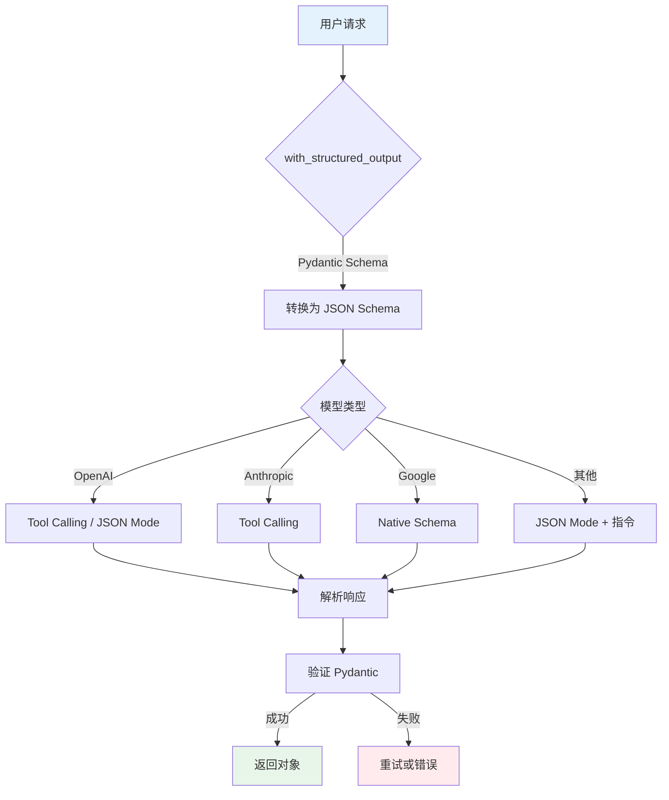

# 结构化输出 Structured Output

`with_structured_output` 是让 LLM 输出结构化数据的强大方法。它自动处理格式指令注入和输出解析，比手动使用 OutputParser 更简洁。

## with_structured_output 方法详解

### 基础用法

```python
from pydantic import BaseModel, Field
from langchain_openai import ChatOpenAI

# 定义输出结构
class Joke(BaseModel):
    setup: str = Field(description="笑话的铺垫")
    punchline: str = Field(description="笑话的笑点")
    rating: int = Field(description="评分 1-10", ge=1, le=10)

# 创建模型
llm = ChatOpenAI(model="gpt-4-turbo")

# 启用结构化输出
structured_llm = llm.with_structured_output(Joke)

# 调用 - 直接返回 Pydantic 模型
result = structured_llm.invoke("讲一个程序员笑话")

print(type(result))  # Joke
print(result.setup)    # 类型安全访问
print(result.punchline)
print(f"评分：{result.rating}/10")
```

### 返回类型选择

```python
# 默认：返回 Pydantic 模型
structured_llm = llm.with_structured_output(Joke)
result = structured_llm.invoke("...")
# result 是 Joke 对象

# 返回 dict
structured_llm = llm.with_structured_output(Joke, return_type="dict")
result = structured_llm.invoke("...")
# result 是 dict: {'setup': '...', 'punchline': '...', 'rating': 9}

# 返回 JSON 字符串
structured_llm = llm.with_structured_output(Joke, return_type="json_string")
result = structured_llm.invoke("...")
# result 是 JSON 字符串: '{"setup": "...", ...}'
```

### Schema 定义方式

```python
from typing import List, Optional
from pydantic import BaseModel, Field

# 方式 1：Pydantic 模型（推荐）
class Person(BaseModel):
    name: str = Field(description="姓名")
    age: int = Field(description="年龄")
    email: Optional[str] = Field(description="邮箱，可选")

structured_llm = llm.with_structured_output(Person)

# 方式 2：JSON Schema (dict 形式)
schema = {
    "title": "Person",
    "type": "object",
    "properties": {
        "name": {"type": "string", "description": "姓名"},
        "age": {"type": "integer", "description": "年龄"},
        "email": {"type": "string", "description": "邮箱"}
    },
    "required": ["name", "age"]
}

structured_llm = llm.with_structured_output(schema)

# 方式 3：直接 dict（简单场景）
structured_llm = llm.with_structured_output({
    "question": "用户问题",
    "answer": "回答内容",
    "confidence": "置信度 0-1"
})
```

## JSON mode vs Tool Calling mode

### JSON Mode

```python
# JSON Mode - 通用方式
structured_llm = llm.with_structured_output(
    Person,
    method="json_mode"  # 强制使用 JSON Mode
)

# 底层使用 response_format={"type": "json_object"}
# 适用于所有支持 JSON 的模型
```

### Tool Calling Mode

```python
# Tool Calling Mode - 使用 function calling
structured_llm = llm.with_structured_output(
    Person,
    method="function_calling"
)

# 底层将 schema 转换为 tool 定义
# 对于支持 tool calling 的模型更可靠
```

### 自动选择

```python
# 默认自动选择最佳方法
structured_llm = llm.with_structured_output(Person)

# GPT-4 Turbo：使用 tool calling
# GPT-3.5：使用 JSON mode
# 其他模型：降级策略
```

### 模式对比

| 特性 | JSON Mode | Tool Calling |
|------|-----------|-------------|
| **原理** | response_format | function calling |
| **可靠性** | 好 | 更好 |
| **速度** | 较快 | 略慢 |
| **支持模型** | 广泛 | 部分模型 |
| **成本** | 标准 | 标准 |

## Pydantic Model 定义输出结构

### 基础字段

```python
from pydantic import BaseModel, Field
from typing import List, Optional

class Article(BaseModel):
    title: str = Field(description="文章标题")
    content: str = Field(description="文章内容")
    author: str = Field(description="作者")
    tags: List[str] = Field(description="标签列表")
    word_count: int = Field(description="字数")
    is_published: bool = Field(description="是否发布")
```

### 嵌套结构

```python
class Address(BaseModel):
    country: str = Field(description="国家")
    city: str = Field(description="城市")
    street: str = Field(description="街道")

class Contact(BaseModel):
    name: str = Field(description="姓名")
    email: str = Field(description="邮箱")
    address: Address = Field(description="地址")

class Company(BaseModel):
    name: str = Field(description="公司名")
    contacts: List[Contact] = Field(description="联系人列表")
    headquarters: Address = Field(description="总部地址")

structured_llm = llm.with_structured_output(Company)

result = structured_llm.invoke("描述一家科技公司")
print(result.headquarters.city)  # 访问嵌套字段
print(result.contacts[0].email)  # 访问列表元素
```

### 枚举类型

```python
from enum import Enum

class Sentiment(str, Enum):
    POSITIVE = "positive"
    NEGATIVE = "negative"
    NEUTRAL = "neutral"

class Analysis(BaseModel):
    text: str = Field(description="分析文本")
    sentiment: Sentiment = Field(description="情感倾向")
    confidence: float = Field(description="置信度", ge=0, le=1)

structured_llm = llm.with_structured_output(Analysis)
```

### 带默认值

```python
class User(BaseModel):
    id: int = Field(description="用户 ID")
    name: str = Field(description="姓名")
    role: str = Field(default="user", description="角色")
    active: bool = Field(default=True, description="是否活跃")

# 如果模型不返回某些字段，使用默认值
```

### 字段验证

```python
from typing import Annotated
from annotated_types import MinLen, MaxLen

class Product(BaseModel):
    name: Annotated[str, MinLen(1), MaxLen(100)] = Field(description="产品名")
    price: float = Field(description="价格", ge=0)
    stock: int = Field(description="库存", ge=0)
    description: Annotated[str, MaxLen(500)] = Field(description="描述")

structured_llm = llm.with_structured_output(Product)

# 如果验证失败，可以添加重试
from langchain_core.output_parsers import RetryWithErrorOutputParser

parser = Product.model_validate
retry_parser = RetryWithErrorOutputParser(parser=parser, llm=llm, max_retries=3)
```

## 嵌套结构输出

### 列表中的嵌套对象

```python
from typing import List

class Ingredient(BaseModel):
    name: str = Field(description="食材名称")
    amount: str = Field(description="用量")
    unit: str = Field(description="单位")

class Recipe(BaseModel):
    title: str = Field(description="菜名")
    ingredients: List[Ingredient] = Field(description="食材列表")
    steps: List[str] = Field(description="步骤列表")
    cooking_time: int = Field(description="烹饪时间（分钟）")

structured_llm = llm.with_structured_output(Recipe)

result = structured_llm.invoke("红烧肉的食谱")

for ingredient in result.ingredients:
    print(f"- {ingredient.name}: {ingredient.amount}{ingredient.unit}")
```

### 多层嵌套

```python
class Subtask(BaseModel):
    title: str
    completed: bool

class Task(BaseModel):
    title: str
    subtasks: List[Subtask]
    due_date: str

class Project(BaseModel):
    name: str
    tasks: List[Task]
    owner: str

structured_llm = llm.with_structured_output(Project)

result = structured_llm.invoke("创建一个软件开发项目的计划")

for task in result.tasks:
    print(f"任务：{task.title}")
    for subtask in task.subtasks:
        status = "✓" if subtask.completed else "○"
        print(f"  {status} {subtask.title}")
```

### 字典类型

```python
from typing import Dict, Any

class Config(BaseModel):
    settings: Dict[str, Any] = Field(description="配置项")
    version: str

structured_llm = llm.with_structured_output(Config)

result = structured_llm.invoke("生成一个应用配置")
print(result.settings)  # dict
```

## 多种模型的结构化输出支持对比

### OpenAI 模型

```python
from langchain_openai import ChatOpenAI

# GPT-4 Turbo - 完整支持
gpt4 = ChatOpenAI(model="gpt-4-turbo")
structured = gpt4.with_structured_output(Person)

# GPT-3.5 Turbo - 完整支持
gpt35 = ChatOpenAI(model="gpt-3.5-turbo")
structured = gpt35.with_structured_output(Person)

# O 系列模型 - 支持
o1 = ChatOpenAI(model="o1-preview")
structured = o1.with_structured_output(Person)
```

### Anthropic 模型

```python
from langchain_anthropic import ChatAnthropic

claude = ChatAnthropic(model="claude-3-sonnet-20240229")

# Claude 通过工具调用实现结构化输出
structured = claude.with_structured_output(Person)
```

### Google 模型

```python
from langchain_google_genai import ChatGoogleGenerativeAI

gemini = ChatGoogleGenerativeAI(model="gemini-pro")

# Gemini 原生支持结构化输出
structured = gemini.with_structured_output(Person)
```

### 国产模型

```python
# 通义千问
from langchain_community.chat_models import QianfanChatEndpoint

qianfan = QianfanChatEndpoint(model="ERNIE-Bot-4")
structured = qianfan.with_structured_output(Person)

# 智谱 AI
from langchain_community.chat_models import ChatZhipuAI

zhipu = ChatZhipuAI(model="glm-4")
structured = zhipu.with_structured_output(Person)
```

### 对比表

| 模型提供商 | 结构化输出 | 方法 | 备注 |
|-----------|-----------|------|------|
| **OpenAI GPT-4** | ✅ | Tool Calling | 最可靠 |
| **OpenAI GPT-3.5** | ✅ | JSON Mode | 可靠 |
| **Anthropic Claude** | ✅ | Tool Calling | 可靠 |
| **Google Gemini** | ✅ | Native | 原生支持 |
| **通义千问** | ✅ | JSON | 支持良好 |
| **智谱 GLM** | ✅ | JSON | 支持良好 |

::: v-pre

:::

## 实际应用场景

### 场景 1：数据提取

```python
from pydantic import BaseModel, Field
from typing import List

class PersonInfo(BaseModel):
    name: str
    age: int
    occupation: str

class ArticleExtraction(BaseModel):
    people: List[PersonInfo] = Field(description="文中提到的人物")
    locations: List[str] = Field(description="地点列表")
    date: str = Field(description="日期")

llm = ChatOpenAI(model="gpt-4-turbo")
extractor = llm.with_structured_output(ArticleExtraction)

text = """
2024 年 1 月 15 日，张三在北京会见了李四。
张三今年 35 岁，是一名工程师。
李四 28 岁，在上海工作，是产品经理。
"""

result = extractor.invoke(f"从以下文本提取信息:\n{text}")

print(f"人物：{len(result.people)} 个")
print(f"地点：{result.locations}")
```

### 场景 2：API 响应模拟

```python
class APIResponse(BaseModel):
    success: bool
    data: dict
    error: Optional[str] = None
    code: int = 200

llm = ChatOpenAI(model="gpt-3.5-turbo")
api_simulator = llm.with_structured_output(APIResponse)

# 成功的响应
result = api_simulator.invoke(
    "模拟一个获取用户信息的成功 API 响应"
)
print(result.success)  # True
print(result.data)     # 用户数据

# 失败的响应
result = api_simulator.invoke(
    "模拟一个资源未找到的 API 错误响应"
)
print(result.success)  # False
print(result.error)    # 错误信息
print(result.code)     # 404
```

### 场景 3：评估与评分

```python
class Evaluation(BaseModel):
    score: float = Field(description="总体评分 1-5", ge=1, le=5)
    strengths: List[str] = Field(description="优点列表")
    weaknesses: List[str] = Field(description="缺点列表")
    suggestions: List[str] = Field(description="改进建议")

llm = ChatOpenAI(model="gpt-4-turbo")
evaluator = llm.with_structured_output(Evaluation)

content = "这是一篇关于 AI 的文章..."
result = evaluator.invoke(f"评价以下内容:\n{content}")

print(f"评分：{result.score}/5")
print(f"优点：{result.strengths}")
print(f"建议：{result.suggestions}")
```

### 场景 4：多步工作流

```python
class SearchQuery(BaseModel):
    query: str
    filters: dict

class SearchResult(BaseModel):
    items: List[dict]
    total: int

class FinalAnswer(BaseModel):
    analysis: str
    conclusion: str

llm = ChatOpenAI(model="gpt-4-turbo")

# 步骤 1：生成搜索查询
query_llm = llm.with_structured_output(SearchQuery)
query = query_llm.invoke("找到最新的 AI 新闻")

# 步骤 2：执行搜索（实际 API 调用）
# results = search_api(query.query)

# 步骤 3：分析结果
analysis_llm = llm.with_structured_output(FinalAnswer)
answer = analysis_llm.invoke(f"基于搜索结果分析:\n{results}")
```

## 错误处理

### 验证错误

```python
from pydantic import ValidationError

try:
    result = structured_llm.invoke("生成无效数据")
except ValidationError as e:
    print(f"验证失败：{e}")
    # 可以重试或降级处理
```

### 自动重试

```python
from langchain_core.output_parsers import RetryWithErrorOutputParser

llm = ChatOpenAI(model="gpt-3.5-turbo")

base_parser = PydanticOutputParser(pydantic_object=Person)
retry_parser = RetryWithErrorOutputParser(
    parser=base_parser,
    llm=llm,
    max_retries=3
)

chain = prompt | llm | retry_parser
```

## 💡 提示块

> 💡 **最佳实践**
>
> 1. **使用 Pydantic 模型**：类型安全，自动验证
> 2. **添加详细描述**：Field 的 description 帮助模型理解
> 3. **设置合理约束**：ge/le 等验证提高质量
> 4. **简化结构**：过深的嵌套可能降低可靠性
> 5. **提供示例**：复杂输出时给 few-shot 示例
> 6. **处理空值**：使用 Optional 或默认值

## 总结

| 特性 | 说明 |
|------|------|
| **方法** | `with_structured_output()` |
| **输入** | Pydantic 模型或 JSON Schema |
| **输出** | 结构化对象 |
| **优势** | 类型安全、自动验证、简洁 |
| **适用** | 所有需要结构化数据的场景 |

`with_structured_output` 是构建类型安全 AI 应用的核心工具。