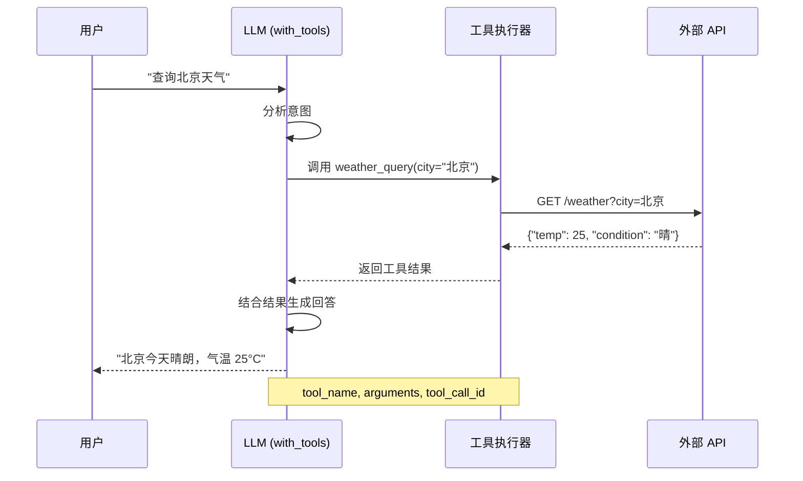
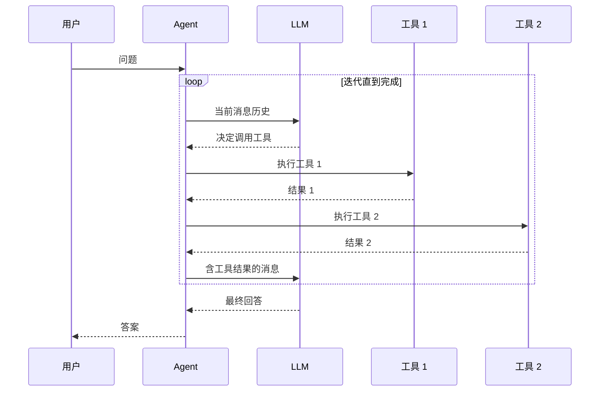

# Tool Calling 工具调用

Tool Calling（工具调用）是让 LLM 能够调用外部函数/API 的能力。这是构建 Agent 和实现 AI 与实际系统交互的核心机制。

## Tool Calling / Function Calling 概念

### 什么是 Tool Calling？

Tool Calling 允许 LLM：
1. 理解可用的工具/函数
2. 决定何时调用哪个工具
3. 生成正确的工具调用参数
4. 接收工具执行结果并继续推理

```
用户问题 → LLM → 决定调用工具 → 执行工具 → 返回结果 → LLM → 最终回答
```

### 核心流程

::: v-pre

:::

## @tool 装饰器定义工具

### 基础用法

```python
from langchain_core.tools import tool

@tool
def search(query: str) -> str:
    """搜索网络获取最新信息。
    
    Args:
        query: 搜索关键词
        
    Returns:
        搜索结果摘要
    """
    # 实际实现可能调用搜索 API
    return f"关于'{query}'的搜索结果..."

# 工具属性
print(search.name)        # "search"
print(search.description) # 函数 docstring
print(search.args_schema) # 参数 schema
```

### 自定义工具名称和描述

```python
from langchain_core.tools import tool

@tool("web_search", return_direct=True)
def my_search_function(query: str) -> str:
    """使用搜索引擎查找信息。
    
    这个工具会调用网络搜索 API，
    返回与查询最相关的结果摘要。
    """
    return search_web(query)

# return_direct=True 表示直接返回工具结果
# 不再让 LLM 处理工具输出
```

### 带参数验证的工具

```python
from pydantic import BaseModel, Field
from langchain_core.tools import tool

class SearchArgs(BaseModel):
    query: str = Field(description="搜索关键词")
    language: str = Field(default="zh", description="语言代码")
    num_results: int = Field(default=10, ge=1, le=100, description="结果数量")

@tool(args_schema=SearchArgs)
def search(query: str, language: str = "zh", num_results: int = 10) -> str:
    """搜索网络信息"""
    # 参数已通过 Pydantic 验证
    return f"搜索：{query} ({language}, {num_results}条)"
```

### 异步工具

```python
from langchain_core.tools import tool
import aiohttp

@tool
async def fetch_url(url: str) -> str:
    """异步获取网页内容"""
    async with aiohttp.ClientSession() as session:
        async with session.get(url) as response:
            return await response.text()

# 异步工具可以与异步 LLM 链配合使用
```

## bind_tools - 绑定工具

### 基础用法

```python
from langchain_openai import ChatOpenAI
from langchain_core.tools import tool

@tool
def calculator(expression: str) -> str:
    """计算数学表达式"""
    return str(eval(expression))

@tool
def search(query: str) -> str:
    """搜索信息"""
    return f"搜索结果：{query}"

llm = ChatOpenAI(model="gpt-4-turbo")

# 绑定工具
llm_with_tools = llm.bind_tools([calculator, search])

# 调用
response = llm_with_tools.invoke("计算 123 * 456")

# 检查是否有工具调用
if response.tool_calls:
    for tool_call in response.tool_calls:
        print(f"工具：{tool_call['name']}")
        print(f"参数：{tool_call['args']}")
        print(f"ID: {tool_call['id']}")
```

### 多个工具

```python
from typing import List

tools = [
    calculator,
    search,
    # ... 更多工具
]

llm_with_tools = llm.bind_tools(tools)

# LLM 自动选择最合适的工具
response = llm_with_tools.invoke(
    "先搜索最新的 AI 新闻，然后总结主要内容"
)

# 可能返回多个工具调用
for tool_call in response.tool_calls:
    print(f"调用 {tool_call['name']}: {tool_call['args']}")
```

### 工具执行器

```python
from langchain_core.tools import tool

# 定义工具映射
TOOLS = {
    "calculator": calculator,
    "search": search,
}

def execute_tool_call(tool_call):
    """执行单个工具调用"""
    tool_name = tool_call["name"]
    tool_args = tool_call["args"]
    tool_id = tool_call["id"]
    
    # 找到并执行工具
    tool_func = TOOLS.get(tool_name)
    if tool_func:
        result = tool_func.invoke(tool_args)
        return {
            "tool_call_id": tool_id,
            "result": result
        }
    else:
        return {
            "tool_call_id": tool_id,
            "error": f"未知工具：{tool_name}"
        }

# 完整流程
response = llm_with_tools.invoke("计算 1+1")

if response.tool_calls:
    results = [execute_tool_call(tc) for tc in response.tool_calls]
    
    # 将结果返回给 LLM 生成最终回答
    final_response = llm_with_tools.invoke([
        response,  # 原始 AI 响应（含工具调用）
        # 添加工具结果
        *[ToolMessage(result["result"], tool_call_id=result["tool_call_id"])
          for result in results]
    ])
    
    print(final_response.content)
```

## 模型原生 tool calling vs JSON mode

### 原生 Tool Calling

```python
# GPT-4、Claude 等支持原生 tool calling
llm = ChatOpenAI(model="gpt-4-turbo")

llm_with_tools = llm.bind_tools([search, calculator])

response = llm_with_tools.invoke("搜索 AI 新闻")

# 响应格式
{
    "name": "search",
    "args": {"query": "AI 新闻"},
    "id": "call_xxx",
    "type": "tool_call"
}

# 优点：
# - 模型经过专门训练
# - 参数验证更可靠
# - 支持多工具调用
```

### JSON Mode 模拟

```python
# 对于不支持 tool calling 的模型，可以用 JSON 模拟
from pydantic import BaseModel, Field
from langchain_core.output_parsers import PydanticOutputParser

class ToolCall(BaseModel):
    name: str = Field(description="工具名称")
    args: dict = Field(description="参数")

llm = ChatOpenAI(model="gpt-3.5-turbo")
structured_llm = llm.with_structured_output(ToolCall)

# 提示中说明可用工具
prompt = """
你可以使用以下工具：
- search(query): 搜索信息
- calculator(expression): 计算

用户问：{question}

请决定调用哪个工具：
"""

response = structured_llm.invoke(prompt.format(question="1+1=?"))
```

### 对比

| 特性 | 原生 Tool Calling | JSON Mode 模拟 |
|------|-----------------|---------------|
| **可靠性** | 高 | 中 |
| **多工具支持** | ✅ 原生 | ⚠️ 需手动 |
| **参数验证** | 自动 | 手动 |
| **支持模型** | 部分 | 广泛 |
| **成本** | 标准 | 标准 |

## 多工具协同

### 工具链

```python
from langchain_core.runnables import RunnableLambda

# 工具 1：搜索
@tool
def search_news(topic: str) -> str:
    """搜索新闻"""
    return f"关于{topic}的最新新闻..."

# 工具 2：摘要
@tool
def summarize(text: str) -> str:
    """总结文本"""
    return f"摘要：{text[:100]}..."

# 工具 3：翻译
@tool
def translate(text: str, target_lang: str) -> str:
    """翻译文本"""
    return f"[{target_lang}] {text}"

# 链式工具调用
llm = ChatOpenAI(model="gpt-4-turbo")

# 方法 1：LLM 决定完整流程
tools = [search_news, summarize, translate]
llm_with_tools = llm.bind_tools(tools)

response = llm_with_tools.invoke("找到 AI 新闻，总结并翻译成日语")

# 方法 2：手动编排
class NewsProcessor:
    def __init__(self):
        self.llm = llm.bind_tools(tools)
    
    async def process(self, topic: str):
        # 步骤 1：搜索
        search_result = search_news.invoke({"topic": topic})
        
        # 步骤 2：总结
        summary = summarize.invoke({"text": search_result})
        
        # 步骤 3：翻译
        translated = translate.invoke({
            "text": summary,
            "target_lang": "日语"
        })
        
        return translated

processor = NewsProcessor()
result = await processor.process("人工智能")
```

### 工具路由

```python
from langchain_core.runnables import RunnableBranch

# 根据问题类型路由到不同工具
search_llm = ChatOpenAI(model="gpt-3.5-turbo").bind_tools([search])
calc_llm = ChatOpenAI(model="gpt-3.5-turbo").bind_tools([calculator])
general_llm = ChatOpenAI(model="gpt-3.5-turbo")

router = RunnableBranch(
    (
        lambda x: any(c in x["question"] for c in ["+", "-", "*", "/"]),
        calc_llm
    ),
    (
        lambda x: any(word in x["question"] for word in ["搜索", "查找", "新闻"]),
        search_llm
    ),
    # 默认
    general_llm
)

result = router.invoke({"question": "1+1 等于几？"})
```

## 完整示例：ReAct Agent

```python
from langchain_core.tools import tool
from langchain_core.messages import HumanMessage, AIMessage, ToolMessage
from langchain_openai import ChatOpenAI

# 定义工具
@tool
def search(query: str) -> str:
    """搜索网络信息"""
    return f"搜索结果：{query}"

@tool
def calculator(expression: str) -> str:
    """计算表达式"""
    return str(eval(expression))

@tool
def get_date() -> str:
    """获取当前日期"""
    from datetime import datetime
    return datetime.now().strftime("%Y-%m-%d")

class SimpleAgent:
    def __init__(self):
        self.tools = [search, calculator, get_date]
        self.tool_map = {t.name: t for t in self.tools}
        self.llm = ChatOpenAI(model="gpt-4-turbo").bind_tools(self.tools)
    
    def run(self, question: str, max_iterations: int = 5) -> str:
        messages = [HumanMessage(content=question)]
        
        for i in range(max_iterations):
            # LLM 决定下一步
            response = self.llm.invoke(messages)
            
            # 检查是否有工具调用
            if not response.tool_calls:
                # 没有工具调用，返回最终答案
                return response.content
            
            # 执行工具调用
            for tool_call in response.tool_calls:
                tool = self.tool_map[tool_call["name"]]
                result = tool.invoke(tool_call["args"])
                
                # 添加工具结果
                messages.append(ToolMessage(
                    result,
                    tool_call_id=tool_call["id"]
                ))
            
            messages.append(response)
        
        return "达到最大迭代次数"

# 使用
agent = SimpleAgent()
print(agent.run("今天日期是什么？然后计算 123 * 456"))
```

::: v-pre

:::

## 实际应用场景

### 场景 1：天气查询

```python
@tool
def get_weather(city: str, unit: str = "celsius") -> str:
    """获取指定城市的天气信息"""
    # 实际实现调用天气 API
    return f"{city}: 25°C, 晴朗"

llm = ChatOpenAI(model="gpt-4-turbo").bind_tools([get_weather])

response = llm.invoke("北京今天天气怎么样？")
# tool_calls: [{"name": "get_weather", "args": {"city": "北京"}}]
```

### 场景 2：数据库查询

```python
@tool
def query_database(sql: str) -> list:
    """执行 SQL 查询"""
    # 注意：实际使用需要 SQL 注入防护
    return execute_sql(sql)

@tool
def list_tables() -> list:
    """列出所有表"""
    return ["users", "orders", "products"]

# LLM 可以决定查询哪个表
llm = ChatOpenAI(model="gpt-4-turbo").bind_tools([query_database, list_tables])
```

### 场景 3：多步骤任务

```python
@tool
def book_flight(origin: str, dest: str, date: str) -> dict:
    """预订航班"""
    return {"flight": "CA123", "price": 1500}

@tool
def book_hotel(city: str, check_in: str, nights: int) -> dict:
    """预订酒店"""
    return {"hotel": "XX 酒店", "price": 800 * nights}

@tool
def process_payment(amount: float, method: str) -> str:
    """处理支付"""
    return f"支付成功：{amount}元 via {method}"

llm = ChatOpenAI(model="gpt-4-turbo").bind_tools([
    book_flight, book_hotel, process_payment
])

# LLM 可以决定调用多个工具完成旅行预订
response = llm.invoke("帮我订下周五北京到上海的行程，住 2 晚")
```

## 💡 提示块

> 💡 **最佳实践**
>
> 1. **工具描述要清晰**：帮助 LLM 理解何时使用该工具
> 2. **参数要有验证**：使用 Pydantic schema 验证输入
> 3. **限制工具数量**：过多工具会降低准确性
> 4. **处理工具错误**：优雅处理工具执行失败
> 5. **设置超时**：防止工具执行挂起
> 6. **记录工具调用**：便于调试和审计
> 7. **考虑幂等性**：工具应该可重复调用

## 总结

| 组件 | 用途 | 关键方法 |
|------|------|---------|
| **@tool 装饰器** | 定义工具 | `@tool`, `args_schema` |
| **bind_tools** | 绑定工具到 LLM | `llm.bind_tools([...])` |
| **tool_calls** | 获取调用意图 | `response.tool_calls` |
| **ToolMessage** | 返回工具结果 | `ToolMessage(result, tool_call_id)` |
| **多工具协同** | 复杂任务编排 | 组合多个工具 |

Tool Calling 是构建智能 Agent 的核心能力，让 AI 能够与外部世界交互。