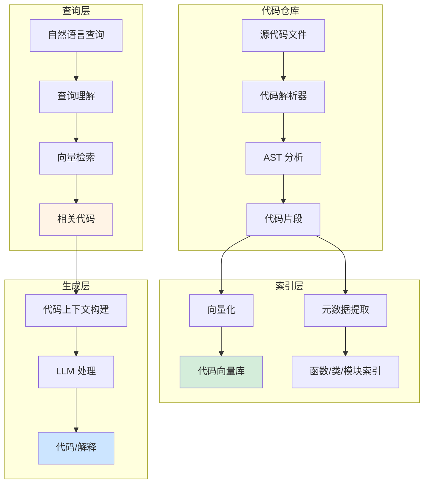
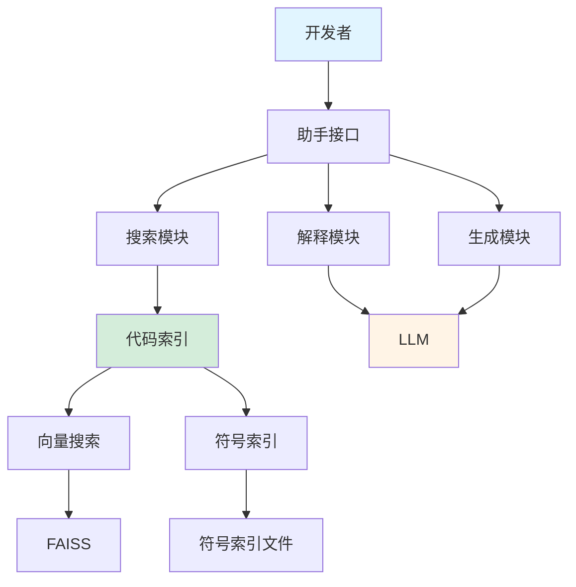

# 项目二：代码助手

代码助手是开发者最常用的 AI 工具之一。本项目将构建一个智能代码助手，支持代码文件索引、语义搜索、代码生成与解释等功能。

## 项目概述

### 功能需求

- 📁 **代码索引**：自动扫描和索引代码仓库
- 🔍 **语义搜索**：用自然语言搜索代码
- 💡 **代码解释**：解释代码功能和逻辑
- ✏️ **代码生成**：根据需求生成代码
- 🐛 **问题诊断**：分析代码问题并提供建议

### 系统架构

::: v-pre

:::

## 完整实现

### 1. 项目结构

```
code-assistant/
├── config/
│   └── settings.py
├── src/
│   ├── __init__.py
│   ├── indexer.py          # 代码索引
│   ├── parser.py           # 代码解析
│   ├── searcher.py         # 语义搜索
│   ├── generator.py        # 代码生成
│   ├── explainer.py        # 代码解释
│   └── assistant.py        # 主助手类
├── tests/
│   └── test_assistant.py
├── requirements.txt
└── main.py
```

### 2. 代码解析器

```python
# src/parser.py
from pathlib import Path
from typing import List, Dict, Any
import ast
import re

class CodeParser:
    """多语言代码解析器"""
    
    SUPPORTED_LANGUAGES = {
        ".py": "python",
        ".js": "javascript",
        ".ts": "typescript",
        ".java": "java",
        ".go": "go",
        ".rs": "rust",
    }
    
    def __init__(self):
        pass
    
    def parse_file(self, file_path: str) -> Dict[str, Any]:
        """解析单个代码文件"""
        path = Path(file_path)
        ext = path.suffix.lower()
        
        if ext not in self.SUPPORTED_LANGUAGES:
            raise ValueError(f"不支持的语言：{ext}")
        
        language = self.SUPPORTED_LANGUAGES[ext]
        
        with open(path, 'r', encoding='utf-8') as f:
            content = f.read()
        
        result = {
            "file_path": str(path),
            "language": language,
            "content": content,
            "symbols": []
        }
        
        # Python AST 解析
        if language == "python":
            result["symbols"] = self._parse_python_ast(content, str(path))
        
        # 其他语言的简单解析
        else:
            result["symbols"] = self._parse_simple(content, str(path), language)
        
        return result
    
    def _parse_python_ast(self, content: str, file_path: str) -> List[Dict]:
        """Python AST 解析"""
        symbols = []
        
        try:
            tree = ast.parse(content)
            
            for node in ast.walk(tree):
                if isinstance(node, ast.FunctionDef):
                    symbols.append({
                        "type": "function",
                        "name": node.name,
                        "line": node.lineno,
                        "end_line": node.end_lineno,
                        "args": [arg.arg for arg in node.args.args],
                        "docstring": ast.get_docstring(node),
                        "file": file_path
                    })
                elif isinstance(node, ast.ClassDef):
                    symbols.append({
                        "type": "class",
                        "name": node.name,
                        "line": node.lineno,
                        "end_line": node.end_line,
                        "methods": [
                            n.name for n in node.body
                            if isinstance(n, ast.FunctionDef)
                        ],
                        "docstring": ast.get_docstring(node),
                        "file": file_path
                    })
        except SyntaxError as e:
            print(f"Python 语法错误 {file_path}: {e}")
        
        return symbols
    
    def _parse_simple(
        self, 
        content: str, 
        file_path: str, 
        language: str
    ) -> List[Dict]:
        """简单正则解析（用于非 Python 语言）"""
        symbols = []
        lines = content.split('\n')
        
        # 函数匹配（简化）
        if language in ["javascript", "typescript"]:
            pattern = r'(?:function|const|let|var)\s+(\w+)\s*[=\(]'
        elif language == "java":
            pattern = r'(?:public|private|protected)?\s*\w+\s+(\w+)\s*\('
        else:
            pattern = r'fn\s+(\w+)\s*\('
        
        for i, line in enumerate(lines, 1):
            match = re.search(pattern, line)
            if match:
                symbols.append({
                    "type": "function",
                    "name": match.group(1),
                    "line": i,
                    "file": file_path
                })
        
        return symbols
    
    def get_code_snippet(
        self, 
        file_path: str, 
        start_line: int, 
        end_line: int
    ) -> str:
        """获取代码片段"""
        with open(file_path, 'r', encoding='utf-8') as f:
            lines = f.readlines()
        
        snippet = ''.join(lines[start_line-1:end_line])
        return snippet.strip()
```

### 3. 代码索引器

```python
# src/indexer.py
from pathlib import Path
from typing import List, Dict, Any
from src.parser import CodeParser
from langchain_openai import OpenAIEmbeddings
from langchain_community.vectorstores import FAISS, Chroma
from langchain_core.documents import Document
import json
import os

class CodeIndexer:
    """代码索引器"""
    
    def __init__(
        self,
        repo_path: str,
        index_dir: str = "./code_index",
        model: str = "text-embedding-3-small"
    ):
        self.repo_path = Path(repo_path)
        self.index_dir = index_dir
        self.parser = CodeParser()
        self.embeddings = OpenAIEmbeddings(model=model)
        self.vectorstore = None
        self.symbol_index: Dict[str, Dict] = {}
    
    def build_index(self) -> Dict[str, Any]:
        """构建代码索引"""
        print(f"开始索引代码仓库：{self.repo_path}")
        
        # 收集所有代码文件
        code_files = []
        for ext in self.parser.SUPPORTED_LANGUAGES.keys():
            code_files.extend(self.repo_path.rglob(f"*{ext}"))
        
        print(f"找到 {len(code_files)} 个代码文件")
        
        # 解析文件
        documents = []
        all_symbols = []
        
        for file_path in code_files:
            try:
                result = self.parser.parse_file(str(file_path))
                
                # 为文件创建文档
                doc = Document(
                    page_content=result["content"],
                    metadata={
                        "file_path": result["file_path"],
                        "language": result["language"],
                        "type": "file",
                        "symbol_count": len(result["symbols"])
                    }
                )
                documents.append(doc)
                
                # 为每个符号创建独立文档
                for symbol in result["symbols"]:
                    symbol_doc = self._create_symbol_document(result, symbol)
                    documents.append(symbol_doc)
                    all_symbols.append(symbol)
                
            except Exception as e:
                print(f"解析失败 {file_path}: {e}")
        
        # 创建向量存储
        self.vectorstore = FAISS.from_documents(
            documents=documents,
            embedding=self.embeddings
        )
        
        # 构建符号索引
        self.symbol_index = {
            f"{s['file']}:{s['name']}": s
            for s in all_symbols
        }
        
        # 保存索引
        self._save_index()
        
        print(f"索引构建完成：{len(documents)} 个文档，{len(all_symbols)} 个符号")
        return {
            "document_count": len(documents),
            "symbol_count": len(all_symbols),
            "file_count": len(code_files)
        }
    
    def _create_symbol_document(
        self, 
        file_result: Dict, 
        symbol: Dict
    ) -> Document:
        """为符号创建文档"""
        # 提取符号的代码片段
        code_snippet = self.parser.get_code_snippet(
            file_result["file_path"],
            symbol["line"],
            symbol.get("end_line", symbol["line"] + 10)
        )
        
        # 构建可搜索的文本
        searchable_text = f"""
文件：{file_result['file_path']}
语言：{file_result['language']}
类型：{symbol['type']}
名称：{symbol['name']}
描述：{symbol.get('docstring', '无描述')}

代码：
{code_snippet}
"""
        
        return Document(
            page_content=searchable_text,
            metadata={
                "file_path": file_result["file_path"],
                "language": file_result["language"],
                "symbol_name": symbol["name"],
                "symbol_type": symbol["type"],
                "line": symbol["line"],
                "type": "symbol"
            }
        )
    
    def _save_index(self):
        """保存索引"""
        os.makedirs(self.index_dir, exist_ok=True)
        
        # 保存向量存储
        if self.vectorstore:
            self.vectorstore.save_local(
                os.path.join(self.index_dir, "vectorstore")
            )
        
        # 保存符号索引
        with open(
            os.path.join(self.index_dir, "symbol_index.json"),
            'w',
            encoding='utf-8'
        ) as f:
            json.dump(self.symbol_index, f, ensure_ascii=False, indent=2)
    
    def load_index(self) -> bool:
        """加载已有索引"""
        vectorstore_path = os.path.join(self.index_dir, "vectorstore")
        symbol_index_path = os.path.join(self.index_dir, "symbol_index.json")
        
        if not (os.path.exists(vectorstore_path) and os.path.exists(symbol_index_path)):
            return False
        
        # 加载向量存储
        self.vectorstore = FAISS.load_local(
            vectorstore_path,
            self.embeddings,
            allow_dangerous_deserialization=True
        )
        
        # 加载符号索引
        with open(symbol_index_path, 'r', encoding='utf-8') as f:
            self.symbol_index = json.load(f)
        
        print(f"已加载代码索引")
        return True
```

### 4. 语义搜索

```python
# src/searcher.py
from typing import List, Dict, Any
from src.indexer import CodeIndexer

class CodeSearcher:
    """代码语义搜索"""
    
    def __init__(self, indexer: CodeIndexer, k: int = 5):
        self.indexer = indexer
        self.k = k
    
    def search(self, query: str) -> List[Dict[str, Any]]:
        """语义搜索代码"""
        if not self.indexer.vectorstore:
            raise ValueError("索引未加载")
        
        # 向量检索
        results = self.indexer.vectorstore.similarity_search_with_score(
            query,
            k=self.k * 2
        )
        
        # 处理和过滤结果
        search_results = []
        for doc, score in results:
            # 转换距离为相似度
            similarity = 1 - score
            
            result = {
                "file_path": doc.metadata.get("file_path"),
                "language": doc.metadata.get("language"),
                "type": doc.metadata.get("type"),
                "symbol_name": doc.metadata.get("symbol_name"),
                "symbol_type": doc.metadata.get("symbol_type"),
                "line": doc.metadata.get("line"),
                "content": doc.page_content,
                "similarity": similarity
            }
            search_results.append(result)
        
        # 去重（优先保留符号级结果）
        seen_files = set()
        deduped_results = []
        for result in sorted(search_results, key=lambda x: -x["similarity"]):
            file_path = result["file_path"]
            if result["type"] == "symbol":
                deduped_results.append(result)
            elif file_path not in seen_files:
                deduped_results.append(result)
                seen_files.add(file_path)
            
            if len(deduped_results) >= self.k:
                break
        
        return deduped_results
    
    def search_function(
        self, 
        query: str, 
        language: str = None
    ) -> List[Dict[str, Any]]:
        """专门搜索函数"""
        all_results = self.search(query)
        
        # 过滤函数
        function_results = [
            r for r in all_results
            if r.get("symbol_type") == "function"
        ]
        
        # 语言过滤
        if language:
            function_results = [
                r for r in function_results
                if r.get("language") == language
            ]
        
        return function_results[:self.k]
    
    def search_by_symbol_name(
        self, 
        name: str
    ) -> Dict[str, Any]:
        """按符号名精确搜索"""
        # 在符号索引中查找
        for key, symbol in self.indexer.symbol_index.items():
            if name in key:
                return {
                    "found": True,
                    "symbol": symbol,
                    "code": self.indexer.parser.get_code_snippet(
                        symbol["file"],
                        symbol["line"],
                        symbol.get("end_line", symbol["line"] + 20)
                    )
                }
        
        return {"found": False}
```

### 5. 代码生成器

```python
# src/generator.py
from typing import Dict, Any, List
from langchain_openai import ChatOpenAI
from langchain_core.prompts import ChatPromptTemplate
from langchain_core.output_parsers import StrOutputParser

class CodeGenerator:
    """代码生成器"""
    
    def __init__(
        self,
        model: str = "gpt-4o",
        language: str = "python"
    ):
        self.llm = ChatOpenAI(model=model, temperature=0.3)
        self.language = language
        self._setup_prompt()
    
    def _setup_prompt(self):
        """设置提示模板"""
        self.prompt = ChatPromptTemplate.from_messages([
            ("system", """你是一个专业的{language}程序员。
根据用户需求生成高质量、可运行的代码。

代码要求：
1. 遵循最佳实践和代码规范
2. 添加必要的注释和文档字符串
3. 处理边界情况和错误
4. 保持代码简洁、可读
5. 使用类型注解（如果适用）

当前语言：{language}
"""),
            ("human", """需求：{requirement}

参考代码（如有）：
{reference_code}

请生成完整的代码实现：""")
        ])
    
    def generate(
        self,
        requirement: str,
        reference_code: str = None,
        context: Dict = None
    ) -> Dict[str, Any]:
        """生成代码"""
        chain = self.prompt | self.llm | StrOutputParser()
        
        # 准备参考代码
        ref_code = reference_code or "无相关参考代码"
        
        # 生成
        code = chain.invoke({
            "language": self.language,
            "requirement": requirement,
            "reference_code": ref_code
        })
        
        # 提取代码块
        extracted_code = self._extract_code_block(code)
        
        return {
            "requirement": requirement,
            "code": extracted_code,
            "full_response": code,
            "language": self.language
        }
    
    def _extract_code_block(self, text: str) -> str:
        """从响应中提取代码块"""
        import re
        
        # 匹配 markdown 代码块
        pattern = r'```(?:\w+)?\n(.*?)\n```'
        match = re.search(pattern, text, re.DOTALL)
        
        if match:
            return match.group(1).strip()
        
        # 如果没有代码块，返回原文（可能已经是纯代码）
        return text.strip()
    
    def complete_code(self, partial_code: str) -> str:
        """代码补全"""
        prompt = ChatPromptTemplate.from_messages([
            ("system", "你是一个智能代码补全助手。补全给定的代码，保持风格一致。"),
            ("human", f"""补全以下代码：

{partial_code}

请从下面开始补全（不要重复已有代码）：""")
        ])
        
        chain = prompt | self.llm | StrOutputParser()
        completion = chain.invoke({})
        
        return partial_code + "\n" + self._extract_code_block(completion)
```

### 6. 代码解释器

```python
# src/explainer.py
from typing import Dict, Any, Optional
from langchain_openai import ChatOpenAI
from langchain_core.prompts import ChatPromptTemplate
from langchain_core.output_parsers import StrOutputParser

class CodeExplainer:
    """代码解释器"""
    
    def __init__(self, model: str = "gpt-4o"):
        self.llm = ChatOpenAI(model=model, temperature=0.3)
        self._setup_prompts()
    
    def _setup_prompts(self):
        """设置提示模板"""
        # 整体解释
        self.explain_prompt = ChatPromptTemplate.from_messages([
            ("system", """你是一个编程教师。用清晰的中文解释代码的功能和逻辑。

解释结构：
1. 功能概述：这段代码做什么
2. 核心逻辑：关键算法或流程
3. 重要部分：关键函数/类的说明
4. 使用示例：如何调用或使用
"""),
            ("human", """请解释以下代码：

```{language}
{code}
```

文件：{file_path}""")
        ])
        
        # 行级解释
        self.line_explain_prompt = ChatPromptTemplate.from_messages([
            ("system", "逐行解释代码的作用"),
            ("human", """解释以下代码的每一行：

```{language}
{code}
```""")
        ])
        
        # 复杂度分析
        self.complexity_prompt = ChatPromptTemplate.from_messages([
            ("system", """分析代码的时间和空间复杂度。
给出 Big O 表示，并解释原因。"""),
            ("human", """分析以下代码的复杂度：

```{language}
{code}
```""")
        ])
    
    def explain(
        self,
        code: str,
        language: str = "python",
        file_path: str = "unknown"
    ) -> Dict[str, Any]:
        """解释代码"""
        chain = self.explain_prompt | self.llm | StrOutputParser()
        
        explanation = chain.invoke({
            "language": language,
            "code": code,
            "file_path": file_path
        })
        
        return {
            "code": code,
            "language": language,
            "file_path": file_path,
            "explanation": explanation,
            "type": "overall"
        }
    
    def explain_line_by_line(
        self,
        code: str,
        language: str = "python"
    ) -> Dict[str, Any]:
        """逐行解释"""
        chain = self.line_explain_prompt | self.llm | StrOutputParser()
        
        explanation = chain.invoke({
            "language": language,
            "code": code
        })
        
        return {
            "code": code,
            "explanation": explanation,
            "type": "line_by_line"
        }
    
    def analyze_complexity(
        self,
        code: str,
        language: str = "python"
    ) -> Dict[str, Any]:
        """复杂度分析"""
        chain = self.complexity_prompt | self.llm | StrOutputParser()
        
        analysis = chain.invoke({
            "language": language,
            "code": code
        })
        
        return {
            "code": code,
            "complexity_analysis": analysis
        }
    
    def explain_symbol(
        self,
        code: str,
        symbol_name: str,
        symbol_type: str
    ) -> Dict[str, Any]:
        """解释特定符号（函数/类）"""
        prompt = ChatPromptTemplate.from_messages([
            ("system", f"""解释这个{symbol_type} '{symbol_name}'。

解释内容：
1. 功能和用途
2. 参数说明
3. 返回值
4. 使用示例
5. 注意事项
"""),
            ("human", f"""```python
{code}
```""")
        ])
        
        chain = prompt | self.llm | StrOutputParser()
        explanation = chain.invoke({})
        
        return {
            "symbol_name": symbol_name,
            "symbol_type": symbol_type,
            "code": code,
            "explanation": explanation
        }
```

### 7. 整合：代码助手

```python
# src/assistant.py
from typing import Dict, Any, List, Optional
from src.indexer import CodeIndexer
from src.searcher import CodeSearcher
from src.generator import CodeGenerator
from src.explainer import CodeExplainer

class CodeAssistant:
    """智能代码助手"""
    
    def __init__(
        self,
        repo_path: str,
        index_dir: str = "./code_index",
        model: str = "gpt-4o"
    ):
        self.repo_path = repo_path
        
        # 初始化索引
        self.indexer = CodeIndexer(repo_path, index_dir)
        if not self.indexer.load_index():
            print("未找到索引，正在构建...")
            self.indexer.build_index()
        
        # 初始化组件
        self.searcher = CodeSearcher(self.indexer)
        self.generator = CodeGenerator(model=model)
        self.explainer = CodeExplainer(model=model)
    
    def search_code(self, query: str, k: int = 5) -> List[Dict]:
        """搜索相关代码"""
        return self.searcher.search(query)
    
    def find_function(self, name: str) -> Dict:
        """查找函数"""
        return self.searcher.search_by_symbol_name(name)
    
    def explain_code(
        self,
        file_path: str = None,
        query: str = None,
        code: str = None
    ) -> Dict:
        """解释代码"""
        if code is None:
            # 通过查询或文件获取代码
            if query:
                results = self.search_code(query)
                if results:
                    code = results[0]["content"]
            
            elif file_path:
                with open(file_path, 'r') as f:
                    code = f.read()
        
        if code:
            return self.explainer.explain(code)
        
        return {"error": "未找到代码"}
    
    def generate_code(
        self,
        requirement: str,
        reference_query: str = None
    ) -> Dict:
        """生成代码"""
        reference_code = None
        
        # 查找参考代码
        if reference_query:
            results = self.search_code(reference_query)
            if results:
                reference_code = results[0]["content"]
        
        return self.generator.generate(
            requirement=requirement,
            reference_code=reference_code
        )
    
    def chat(self, message: str) -> str:
        """智能对话接口"""
        # 判断意图
        message_lower = message.lower()
        
        if any(kw in message_lower for kw in ["搜索", "查找", "find", "search"]):
            # 搜索代码
            query = message.replace("搜索", "").replace("查找", "").strip()
            results = self.search_code(query)
            return self._format_search_results(results)
        
        elif any(kw in message_lower for kw in ["解释", "说明", "explain"]):
            # 解释代码
            query = message.replace("解释", "").replace("说明", "").strip()
            result = self.explain_code(query=query)
            return result.get("explanation", "无法解释")
        
        elif any(kw in message_lower for kw in ["生成", "写一个", "create", "write"]):
            # 生成代码
            requirement = message
            result = self.generate_code(requirement)
            return result.get("code", "生成失败")
        
        else:
            # 通用回答
            return "我可以帮你搜索代码、解释代码或生成代码。请具体说明你的需求。"
    
    def _format_search_results(self, results: List[Dict]) -> str:
        """格式化搜索结果"""
        if not results:
            return "没有找到相关代码。"
        
        output = f"找到 {len(results)} 个相关结果:\n\n"
        for i, r in enumerate(results, 1):
            output += f"[{i}] {r['file_path']}\n"
            output += f"    相似度：{r['similarity']:.2f}\n"
            if r.get('symbol_name'):
                output += f"    符号：{r['symbol_type']} {r['symbol_name']}\n"
            output += f"    代码预览：{r['content'][:200]}...\n\n"
        
        return output
```

## 代码助手架构图

::: v-pre

:::

## 使用示例

```python
# main.py
from src.assistant import CodeAssistant

# 创建助手（索引代码仓库）
assistant = CodeAssistant(
    repo_path="/path/to/your/project",
    index_dir="./my_code_index",
    model="gpt-4o"
)

# 1. 搜索代码
print("=== 搜索代码 ===")
results = assistant.search_code("用户认证")
for r in results:
    print(f"文件：{r['file_path']}")
    print(f"符号：{r.get('symbol_name', 'N/A')}")
    print(f"相似度：{r['similarity']:.2f}\n")

# 2. 查找函数
print("=== 查找函数 ===")
func = assistant.find_function("authenticate_user")
print(func)

# 3. 解释代码
print("=== 解释代码 ===")
expl = assistant.explain_code(query="JWT 认证")
print(expl["explanation"])

# 4. 生成代码
print("=== 生成代码 ===")
gen = assistant.generate_code(
    requirement="写一个 Python 装饰器用于缓存函数结果",
    reference_query="缓存"
)
print(gen["code"])

# 5. 对话式交互
print("=== 对话交互 ===")
print(assistant.chat("搜索数据库连接的代码"))
print(assistant.chat("解释一下这段代码的逻辑"))
print(assistant.chat("写一个快速排序实现"))
```

## 总结

本项目实现了一个功能完整的代码助手：

**核心功能：**
- ✅ 多语言代码解析
- ✅ 语义代码搜索
- ✅ 代码解释（整体/逐行/复杂度）
- ✅ 代码生成
- ✅ 对话式交互

**技术亮点：**
- AST 解析提取符号信息
- 向量 + 符号双重索引
- 多粒度解释（文件/函数/行级）
- 参考代码增强的生成

**适用场景：**
- 新项目探索
- 遗留代码理解
- 快速代码生成
- 代码审查辅助

下一节我们将构建多智能体协作系统。