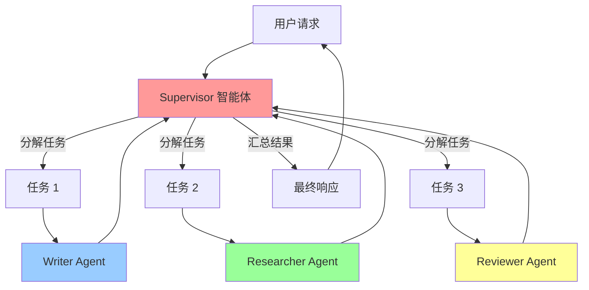
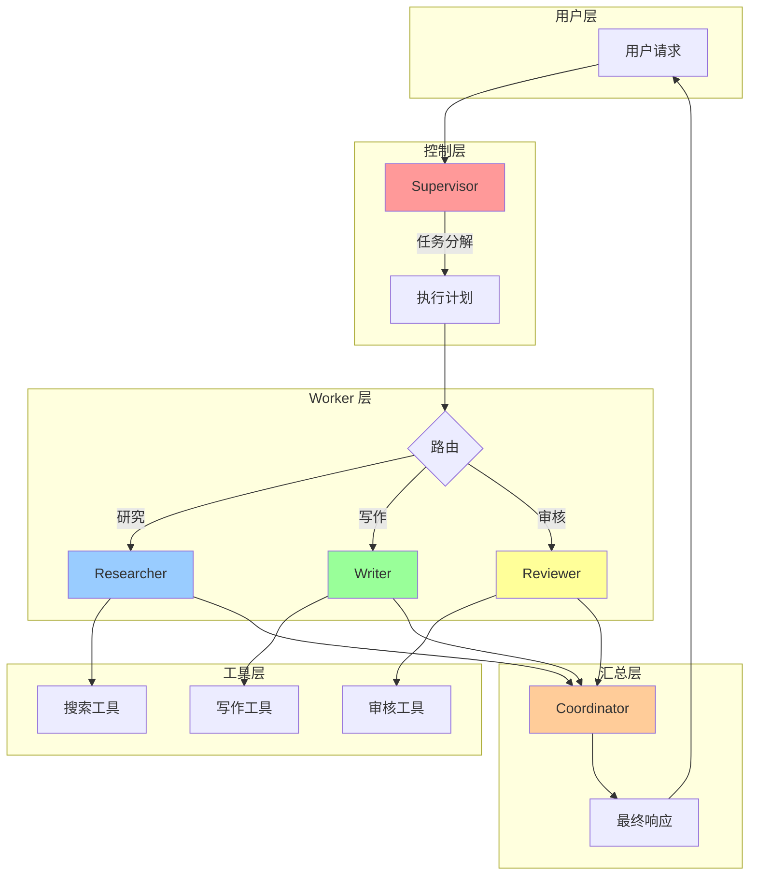

# 项目三：多智能体协作系统

多智能体系统通过多个 specialized agent 协作完成复杂任务。本项目使用 LangGraph 实现一个 Supervisor + Worker 模式的多智能体系统。

## 项目概述

### 什么是多智能体系统？

多智能体系统 (Multi-Agent System, MAS) 由多个具有特定能力的智能体组成，通过协作、竞争或混合方式完成任务。

**典型架构：**
- 🎯 **Supervisor (主管)**：负责任务分解和协调
- 👷 **Worker (工人)**：执行具体子任务
- 🔀 **Router (路由)**：决定任务分发

### 应用场景

| 场景 | 智能体角色 |
|------|-----------|
| 内容创作 | 研究员→撰稿人→编辑→审核 |
| 软件开发 | 架构师→开发→测试→部署 |
| 数据分析 | 数据收集→清洗→分析→可视化 |
| 客户服务 | 接待→技术支持→售后 |

### 系统架构

::: v-pre

:::

## 完整实现

### 1. 项目结构

```
multi-agent-system/
├── config/
│   └── settings.py
├── agents/
│   ├── __init__.py
│   ├── supervisor.py      # 主管智能体
│   ├── writer.py          # 写作智能体
│   ├── researcher.py      # 研究智能体
│   ├── reviewer.py        # 审核智能体
│   └── tools.py           # 共享工具
├── graph/
│   ├── __init__.py
│   └── workflow.py        # LangGraph 工作流
├── main.py
└── requirements.txt
```

### 2. 定义工具

```python
# agents/tools.py
from langchain_core.tools import tool
from typing import List, Dict
import requests

class ResearchTools:
    """研究工具集"""
    
    @tool
    def search_web(query: str) -> str:
        """搜索网络获取信息"""
        # 实际项目中集成搜索 API
        return f"关于'{query}'的搜索结果..."
    
    @tool
    def read_url(url: str) -> str:
        """读取网页内容"""
        try:
            response = requests.get(url, timeout=10)
            return response.text[:2000]  # 限制长度
        except Exception as e:
            return f"读取失败：{e}"
    
    @tool
    def search_knowledge_base(query: str) -> List[Dict]:
        """搜索内部知识库"""
        # 实际项目中连接向量数据库
        return [
            {"title": "相关文档 1", "content": "..."},
            {"title": "相关文档 2", "content": "..."}
        ]

class WritingTools:
    """写作工具集"""
    
    @tool
    def check_grammar(text: str) -> str:
        """检查语法错误"""
        # 集成语法检查 API
        return f"语法检查完成，发现 0 处错误"
    
    @tool
    def count_words(text: str) -> int:
        """统计字数"""
        return len(text.split())
    
    @tool
    def generate_outline(topic: str) -> str:
        """生成大纲"""
        return f"""
# {topic}
1. 引言
2. 背景介绍
3. 核心内容
4. 总结
"""

class CodeTools:
    """代码工具集"""
    
    @tool
    def run_code(code: str, language: str = "python") -> str:
        """运行代码并返回结果"""
        # 实际项目中在沙箱环境运行
        if language == "python":
            try:
                import io
                import sys
                old_stdout = sys.stdout
                sys.stdout = io.StringIO()
                exec(code)
                result = sys.stdout.getvalue()
                sys.stdout = old_stdout
                return result
            except Exception as e:
                return f"执行错误：{e}"
        return "不支持的语言"
    
    @tool
    def analyze_complexity(code: str) -> Dict:
        """分析代码复杂度"""
        return {
            "time": "O(n)",
            "space": "O(1)",
            "lines": len(code.split('\n'))
        }
```

### 3. Worker 智能体

```python
# agents/researcher.py
from langchain_openai import ChatOpenAI
from langchain_core.prompts import ChatPromptTemplate
from langchain_core.messages import HumanMessage, AIMessage
from agents.tools import ResearchTools

class ResearcherAgent:
    """研究智能体 - 负责信息收集"""
    
    def __init__(self, model: str = "gpt-4o"):
        self.llm = ChatOpenAI(model=model, temperature=0.3)
        self.tools = ResearchTools()
        self.prompt = ChatPromptTemplate.from_messages([
            ("system", """你是一个专业的研究助手。
你的任务是收集和整理信息。

工作步骤：
1. 理解研究需求
2. 使用工具搜索相关信息
3. 整理和总结收集的信息
4. 提供结构化的研究报告

保持客观、准确，注明信息来源。"""),
            ("human", "{task}")
        ])
    
    def execute(self, task: str, context: dict = None) -> dict:
        """执行研究任务"""
        prompt = self.prompt.format(task=task)
        response = self.llm.invoke([HumanMessage(content=prompt)])
        
        return {
            "agent": "researcher",
            "task": task,
            "result": response.content,
            "status": "completed"
        }

# agents/writer.py
from langchain_openai import ChatOpenAI
from langchain_core.prompts import ChatPromptTemplate
from langchain_core.messages import HumanMessage
from agents.tools import WritingTools

class WriterAgent:
    """写作智能体 - 负责内容创作"""
    
    def __init__(self, model: str = "gpt-4o"):
        self.llm = ChatOpenAI(model=model, temperature=0.7)
        self.tools = WritingTools()
        self.prompt = ChatPromptTemplate.from_messages([
            ("system", """你是一个专业的内容创作者。
根据提供的资料和要求创作高质量内容。

写作要求：
1. 结构清晰，逻辑连贯
2. 语言流畅，表达准确
3. 符合目标受众的阅读习惯
4. 长度适中，信息密度合理

根据内容类型调整风格：
- 技术文档：专业、准确
- 营销文案：生动、有吸引力
- 分析报告：客观、数据驱动
"""),
            ("human", """任务：{task}

参考资料：{context}

创作要求：{requirements}""")
        ])
    
    def execute(
        self, 
        task: str, 
        context: str = "",
        requirements: str = "标准质量要求"
    ) -> dict:
        """执行写作任务"""
        prompt = self.prompt.format(
            task=task,
            context=context or "无额外资料",
            requirements=requirements
        )
        
        response = self.llm.invoke([HumanMessage(content=prompt)])
        
        return {
            "agent": "writer",
            "task": task,
            "content": response.content,
            "word_count": len(response.content.split()),
            "status": "completed"
        }

# agents/reviewer.py
from langchain_openai import ChatOpenAI
from langchain_core.prompts import ChatPromptTemplate
from langchain_core.messages import HumanMessage

class ReviewerAgent:
    """审核智能体 - 负责质量检查"""
    
    def __init__(self, model: str = "gpt-4o"):
        self.llm = ChatOpenAI(model=model, temperature=0.3)
        self.prompt = ChatPromptTemplate.from_messages([
            ("system", """你是一个严格的内容审核员。
审查内容的准确性、完整性和质量。

审核维度：
1. 准确性：信息是否准确无误
2. 完整性：是否覆盖所有要点
3. 一致性：前后是否一致
4. 可读性：语言是否流畅
5. 合规性：是否符合规范

对每个维度打分 (1-5)，并提供改进建议。"""),
            ("human", """审核以下内容：

{content}

内容类型：{content_type}
审核标准：{criteria}""")
        ])
    
    def execute(
        self,
        content: str,
        content_type: str = "general",
        criteria: str = "标准要求"
    ) -> dict:
        """执行审核任务"""
        prompt = self.prompt.format(
            content=content,
            content_type=content_type,
            criteria=criteria
        )
        
        response = self.llm.invoke([HumanMessage(content=prompt)])
        
        return {
            "agent": "reviewer",
            "content_type": content_type,
            "review": response.content,
            "status": "completed"
        }
```

### 4. Supervisor 智能体

```python
# agents/supervisor.py
from langchain_openai import ChatOpenAI
from langchain_core.prompts import ChatPromptTemplate
from langchain_core.messages import HumanMessage, AIMessage, SystemMessage
from typing import List, Dict, Any
import json

class SupervisorAgent:
    """主管智能体 - 负责任务分解和协调"""
    
    AVAILABLE_WORKERS = ["researcher", "writer", "reviewer", "coder"]
    
    def __init__(self, model: str = "gpt-4o"):
        self.llm = ChatOpenAI(model=model, temperature=0.3)
        self._setup_prompt()
    
    def _setup_prompt(self):
        self.prompt = ChatPromptTemplate.from_messages([
            SystemMessage(content="""你是一个项目管理主管。
负责分析用户需求，分解任务，协调各个 worker 智能体完成工作。

可用的 worker:
- researcher: 信息收集和研究
- writer: 内容创作和写作
- reviewer: 质量审核和检查
- coder: 代码编写和调试

任务分解原则:
1. 识别任务类型和复杂度
2. 确定需要的 worker 角色
3. 定义每个子任务的输入输出
4. 规划执行顺序（串行/并行）
5. 定义完成标准

输出格式 (JSON):
{
    "task_analysis": "任务分析",
    "subtasks": [
        {
            "id": 1,
            "worker": "researcher",
            "description": "任务描述",
            "dependencies": []
        }
    ],
    "execution_order": [[1], [2, 3], [4]],  // 并行组
    "completion_criteria": "完成标准"
}
"""),
            ("human", "用户需求：{user_request}\n\n请分解任务并制定执行计划:")
        ])
    
    def plan(self, user_request: str) -> Dict[str, Any]:
        """制定任务执行计划"""
        prompt = self.prompt.format(user_request=user_request)
        response = self.llm.invoke([HumanMessage(content=prompt)])
        
        # 解析 JSON 响应
        try:
            # 提取 JSON 部分
            import re
            json_match = re.search(r'\{.*\}', response.content, re.DOTALL)
            if json_match:
                plan = json.loads(json_match.group())
            else:
                plan = self._parse_fallback(response.content)
        except:
            plan = self._parse_fallback(response.content)
        
        return {
            "original_request": user_request,
            "plan": plan,
            "status": "planned"
        }
    
    def _parse_fallback(self, text: str) -> Dict:
        """降级解析"""
        return {
            "task_analysis": text[:200],
            "subtasks": [
                {
                    "id": 1,
                    "worker": "researcher",
                    "description": text[:100],
                    "dependencies": []
                }
            ],
            "execution_order": [[1]],
            "completion_criteria": "完成主要任务"
        }
    
    def coordinate(
        self,
        plan: Dict,
        worker_results: Dict[int, Dict]
    ) -> str:
        """协调汇总结果"""
        prompt = ChatPromptTemplate.from_messages([
            SystemMessage(content="你是项目主管，汇总各 worker 的结果，形成最终响应。"),
            HumanMessage(content=f"""
原始需求：{plan.get('original_request', '')}

各 worker 执行结果：
{json.dumps(worker_results, ensure_ascii=False, indent=2)}

请汇总以上结果，提供完整、连贯的最终响应。""")
        ])
        
        response = self.llm.invoke(prompt.messages)
        return response.content
```

### 5. LangGraph 工作流

```python
# graph/workflow.py
from typing import TypedDict, Annotated, List, Any
from langgraph.graph import StateGraph, END
from langgraph.graph.message import add_messages
from agents.supervisor import SupervisorAgent
from agents.researcher import ResearcherAgent
from agents.writer import WriterAgent
from agents.reviewer import ReviewerAgent

# 定义状态
class AgentState(TypedDict):
    """工作流状态"""
    messages: Annotated[List[Any], add_messages]
    current_task: str
    plan: dict
    worker_results: dict
    final_response: str
    step: int

class MultiAgentWorkflow:
    """多智能体工作流"""
    
    def __init__(self, model: str = "gpt-4o"):
        # 初始化智能体
        self.supervisor = SupervisorAgent(model)
        self.researcher = ResearcherAgent(model)
        self.writer = WriterAgent(model)
        self.reviewer = ReviewerAgent(model)
        
        # 构建图
        self.graph = self._build_graph()
    
    def _build_graph(self) -> StateGraph:
        """构建 LangGraph 工作流"""
        workflow = StateGraph(AgentState)
        
        # 添加节点
        workflow.add_node("supervisor", self._supervisor_node)
        workflow.add_node("researcher", self._researcher_node)
        workflow.add_node("writer", self._writer_node)
        workflow.add_node("reviewer", self._reviewer_node)
        workflow.add_node("coordinator", self._coordinator_node)
        
        # 设置入口
        workflow.set_entry_point("supervisor")
        
        # 添加边
        workflow.add_conditional_edges(
            "supervisor",
            self._route_after_supervisor,
            {
                "researcher": "researcher",
                "writer": "writer",
                "reviewer": "reviewer",
                "coordinator": "coordinator",
                "end": END
            }
        )
        
        workflow.add_edge("researcher", "supervisor")
        workflow.add_edge("writer", "supervisor")
        workflow.add_edge("reviewer", "supervisor")
        workflow.add_edge("coordinator", END)
        
        return workflow.compile()
    
    def _supervisor_node(self, state: AgentState) -> AgentState:
        """主管节点"""
        if "plan" not in state or state["step"] == 0:
            # 初次调用，制定计划
            plan = self.supervisor.plan(state["current_task"])
            return {
                **state,
                "plan": plan,
                "worker_results": {},
                "step": 1
            }
        else:
            # 已有计划，决定下一步
            return state
    
    def _route_after_supervisor(self, state: AgentState) -> str:
        """路由决策"""
        plan = state.get("plan", {})
        subtasks = plan.get("subtasks", [])
        completed = state.get("worker_results", {})
        
        if not subtasks:
            return "end"
        
        # 找到下一个未完成的子任务
        for task in subtasks:
            if task["id"] not in completed:
                worker = task.get("worker", "researcher")
                return worker
        
        # 所有任务完成，进入协调
        return "coordinator"
    
    def _researcher_node(self, state: AgentState) -> AgentState:
        """研究员节点"""
        plan = state.get("plan", {})
        subtasks = plan.get("subtasks", [])
        
        # 找到当前研究员任务
        current_task = next(
            (t for t in subtasks if t["worker"] == "researcher" 
             and t["id"] not in state.get("worker_results", {})),
            None
        )
        
        if current_task:
            result = self.researcher.execute(current_task["description"])
            worker_results = state.get("worker_results", {})
            worker_results[current_task["id"]] = result
            
            return {
                **state,
                "worker_results": worker_results,
                "step": state["step"] + 1
            }
        
        return state
    
    def _writer_node(self, state: AgentState) -> AgentState:
        """写作者节点"""
        plan = state.get("plan", {})
        subtasks = plan.get("subtasks", [])
        worker_results = state.get("worker_results", {})
        
        current_task = next(
            (t for t in subtasks if t["worker"] == "writer"
             and t["id"] not in worker_results),
            None
        )
        
        if current_task:
            # 收集研究结果作为上下文
            context = "\n".join([
                r.get("result", "")
                for r in worker_results.values()
                if r.get("agent") == "researcher"
            ])
            
            result = self.writer.execute(
                task=current_task["description"],
                context=context
            )
            worker_results[current_task["id"]] = result
            
            return {
                **state,
                "worker_results": worker_results,
                "step": state["step"] + 1
            }
        
        return state
    
    def _reviewer_node(self, state: AgentState) -> AgentState:
        """审核员节点"""
        plan = state.get("plan", {})
        subtasks = plan.get("subtasks", [])
        worker_results = state.get("worker_results", {})
        
        current_task = next(
            (t for t in subtasks if t["worker"] == "reviewer"
             and t["id"] not in worker_results),
            None
        )
        
        if current_task:
            # 获取待审核内容
            content_to_review = "\n".join([
                r.get("content", "")
                for r in worker_results.values()
                if r.get("agent") == "writer"
            ])
            
            result = self.reviewer.execute(content=content_to_review)
            worker_results[current_task["id"]] = result
            
            return {
                **state,
                "worker_results": worker_results,
                "step": state["step"] + 1
            }
        
        return state
    
    def _coordinator_node(self, state: AgentState) -> AgentState:
        """协调汇总节点"""
        plan = state.get("plan", {})
        worker_results = state.get("worker_results", {})
        
        final_response = self.supervisor.coordinate(plan, worker_results)
        
        return {
            **state,
            "final_response": final_response
        }
    
    def run(self, task: str, debug: bool = False) -> str:
        """运行工作流"""
        initial_state = {
            "messages": [],
            "current_task": task,
            "plan": {},
            "worker_results": {},
            "final_response": "",
            "step": 0
        }
        
        if debug:
            print(f"开始处理任务：{task}\n")
        
        result = self.graph.invoke(initial_state)
        
        if debug:
            print(f"\n完成！共 {result['step']} 步")
            print(f"Worker 结果：{len(result['worker_results'])} 个")
        
        return result["final_response"]
```

## Multi-Agent 系统架构图

::: v-pre

:::

## 使用示例

```python
# main.py
from graph.workflow import MultiAgentWorkflow

# 创建工作流
workflow = MultiAgentWorkflow(model="gpt-4o")

# 示例 1: 技术文章创作
task1 = """
请帮我写一篇关于「LangChain 多智能体系统」的技术文章。
要求：
1. 包含基础概念介绍
2. 提供实际代码示例
3. 分析优缺点
4. 长度 2000 字左右
"""

result1 = workflow.run(task1, debug=True)
print(result1)

# 示例 2: 竞品分析报告
task2 = """
请分析 LangChain、LlamaIndex、Haystack 三个框架的异同。
输出一份结构化的竞品分析报告。
"""

result2 = workflow.run(task2, debug=True)
print(result2)

# 示例 3: 代码审查
task3 = """
请审查以下代码的安全性和性能问题：

def authenticate(username, password):
    query = f"SELECT * FROM users WHERE username='{username}' AND password='{password}'"
    return execute_query(query)
"""

result3 = workflow.run(task3, debug=True)
print(result3)
```

## 总结

本项目实现了一个基于 LangGraph 的多智能体协作系统：

**核心特性：**
- ✅ Supervisor-Worker 架构
- ✅ 任务自动分解
- ✅ 多角色协作 (研究/写作/审核)
- ✅ LangGraph 状态管理
- ✅ 可扩展的 Worker 设计

**适用场景：**
- 复杂内容创作
- 多步骤分析任务
- 代码审查和改进
- 研究性报告生成

**优势：**
- 专业分工，质量更高
- 并行执行，效率提升
- 可追溯，便于调试
- 易于扩展新角色

下一节我们将构建生产级 RAG Pipeline。