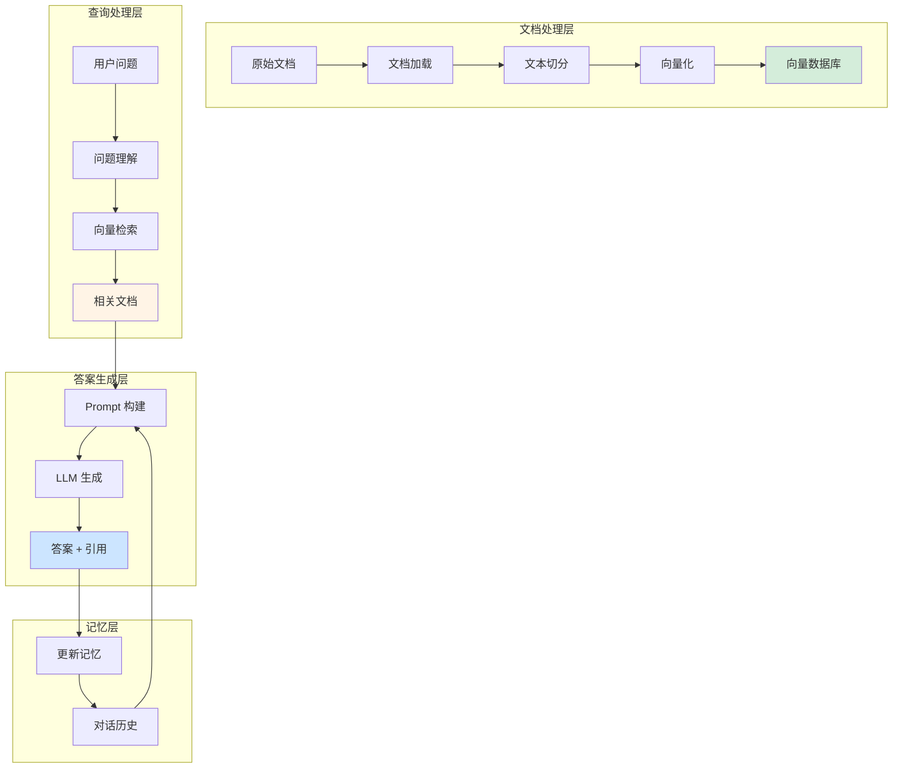

# 项目一：企业知识库问答 Bot

企业知识库问答是最常见的 LLM 应用场景之一。本项目将带你从零构建一个完整的企业知识库问答系统，支持文档加载、切分、向量化、检索、生成，并具备对话记忆和来源引用功能。

## 项目概述

### 功能需求

- 📄 **文档管理**：支持 PDF、Word、Markdown 等多种格式
- 🔍 **智能检索**：向量相似度检索 + 关键词检索
- 💬 **对话记忆**：记住用户历史问题，支持多轮对话
- 📎 **来源引用**：回答中标注信息来源，便于验证
- 🎯 **准确回答**：基于检索内容生成，减少幻觉

### 系统架构

::: v-pre

:::

## 完整实现

### 1. 项目结构

```
qa-bot/
├── config/
│   └── settings.py          # 配置文件
├── data/
│   └── docs/                # 原始文档
├── src/
│   ├── __init__.py
│   ├── loader.py           # 文档加载
│   ├── splitter.py         # 文本切分
│   ├── embeddings.py       # 向量化
│   ├── retriever.py        # 检索器
│   ├── generator.py        # 答案生成
│   └── bot.py              # 问答机器人
├── tests/
│   └── test_bot.py
├── requirements.txt
└── main.py                 # 入口文件
```

### 2. 文档加载

```python
# src/loader.py
from pathlib import Path
from typing import List
from langchain_community.document_loaders import (
    PyPDFLoader,
    Docx2txtLoader,
    UnstructuredMarkdownLoader,
    TextLoader,
    DirectoryLoader
)
from langchain_core.documents import Document

class DocumentLoader:
    """多格式文档加载器"""
    
    def __init__(self, docs_dir: str):
        self.docs_dir = Path(docs_dir)
    
    def load_all(self) -> List[Document]:
        """加载目录下所有文档"""
        all_docs = []
        
        # PDF 文件
        pdf_loader = DirectoryLoader(
            self.docs_dir,
            glob="**/*.pdf",
            loader_cls=PyPDFLoader
        )
        all_docs.extend(pdf_loader.load())
        
        # Word 文档
        docx_loader = DirectoryLoader(
            self.docs_dir,
            glob="**/*.docx",
            loader_cls=Docx2txtLoader
        )
        all_docs.extend(docx_loader.load())
        
        # Markdown 文件
        md_loader = DirectoryLoader(
            self.docs_dir,
            glob="**/*.md",
            loader_cls=UnstructuredMarkdownLoader
        )
        all_docs.extend(md_loader.load())
        
        # 文本文件
        txt_loader = DirectoryLoader(
            self.docs_dir,
            glob="**/*.txt",
            loader_cls=TextLoader
        )
        all_docs.extend(txt_loader.load())
        
        print(f"加载完成：{len(all_docs)} 个文档")
        return all_docs
    
    def load_file(self, file_path: str) -> List[Document]:
        """加载单个文件"""
        path = Path(file_path)
        ext = path.suffix.lower()
        
        if ext == ".pdf":
            loader = PyPDFLoader(str(path))
        elif ext == ".docx":
            loader = Docx2txtLoader(str(path))
        elif ext == ".md":
            loader = UnstructuredMarkdownLoader(str(path))
        elif ext == ".txt":
            loader = TextLoader(str(path))
        else:
            raise ValueError(f"不支持的文件格式：{ext}")
        
        return loader.load()
```

### 3. 文本切分

```python
# src/splitter.py
from typing import List
from langchain_text_splitters import (
    RecursiveCharacterTextSplitter,
    CharacterTextSplitter
)
from langchain_core.documents import Document

class TextSplitter:
    """智能文本切分器"""
    
    def __init__(
        self,
        chunk_size: int = 500,
        chunk_overlap: int = 50
    ):
        self.splitter = RecursiveCharacterTextSplitter(
            chunk_size=chunk_size,
            chunk_overlap=chunk_overlap,
            length_function=len,
            separators=[
                "\n\n",  # 段落
                "\n",   # 换行
                "。",    # 中文句号
                "！",    # 感叹号
                "？",    # 问号
                "；",    # 分号
                "，",    # 逗号
                " ",     # 空格
                ""
            ]
        )
    
    def split_documents(self, documents: List[Document]) -> List[Document]:
        """切分文档"""
        chunks = self.splitter.split_documents(documents)
        
        # 为每个 chunk 添加元数据
        for i, chunk in enumerate(chunks):
            chunk.metadata["chunk_id"] = i
            chunk.metadata["total_chunks"] = len(chunks)
        
        print(f"切分完成：{len(documents)} 个文档 -> {len(chunks)} 个片段")
        return chunks
    
    def split_text(self, text: str) -> List[str]:
        """切分纯文本"""
        return self.splitter.split_text(text)
```

### 4. 向量化与存储

```python
# src/embeddings.py
from langchain_openai import OpenAIEmbeddings
from langchain_community.vectorstores import FAISS, Chroma
from langchain_core.documents import Document
from typing import List
import os

class VectorStore:
    """向量存储管理"""
    
    def __init__(
        self,
        model: str = "text-embedding-3-small",
        persist_directory: str = "./vector_store"
    ):
        self.embeddings = OpenAIEmbeddings(model=model)
        self.persist_directory = persist_directory
        self.vectorstore = None
    
    def create(self, documents: List[Document]):
        """创建向量存储"""
        self.vectorstore = FAISS.from_documents(
            documents=documents,
            embedding=self.embeddings
        )
        return self.vectorstore
    
    def save(self):
        """持久化存储"""
        if self.vectorstore:
            self.vectorstore.save_local(self.persist_directory)
            print(f"向量存储已保存到：{self.persist_directory}")
    
    def load(self):
        """加载已有存储"""
        if os.path.exists(self.persist_directory):
            self.vectorstore = FAISS.load_local(
                self.persist_directory,
                self.embeddings,
                allow_dangerous_deserialization=True
            )
            print(f"已加载向量存储：{self.persist_directory}")
            return True
        return False
    
    def search(self, query: str, k: int = 3):
        """相似度搜索"""
        if not self.vectorstore:
            raise ValueError("向量存储未初始化")
        
        results = self.vectorstore.similarity_search(query, k=k)
        return results, [doc.metadata for doc in results]
    
    def search_with_scores(self, query: str, k: int = 3):
        """带分数的相似度搜索"""
        results = self.vectorstore.similarity_search_with_score(query, k=k)
        return results
```

### 5. 检索器

```python
# src/retriever.py
from typing import List, Tuple, Dict, Any
from src.embeddings import VectorStore
from langchain_core.documents import Document

class Retriever:
    """混合检索器"""
    
    def __init__(
        self,
        vector_store: VectorStore,
        search_type: str = "similarity",
        k: int = 3,
        score_threshold: float = 0.7
    ):
        self.vector_store = vector_store
        self.search_type = search_type
        self.k = k
        self.score_threshold = score_threshold
    
    def retrieve(self, query: str) -> Tuple[List[Document], List[float]]:
        """检索相关文档"""
        results = self.vector_store.search_with_scores(query, k=self.k * 2)
        
        # 过滤低分结果
        filtered_results = []
        scores = []
        for doc, score in results:
            # FAISS 返回的是距离，转换为相似度
            similarity = 1 - score
            if similarity >= self.score_threshold:
                filtered_results.append(doc)
                scores.append(similarity)
            
            if len(filtered_results) >= self.k:
                break
        
        return filtered_results, scores
    
    def retrieve_with_metadata(self, query: str) -> Dict[str, Any]:
        """检索并返回详细信息"""
        docs, scores = self.retrieve(query)
        
        return {
            "query": query,
            "documents": [doc.page_content for doc in docs],
            "sources": [doc.metadata.get("source", "Unknown") for doc in docs],
            "scores": scores,
            "count": len(docs)
        }
```

### 6. 答案生成

```python
# src/generator.py
from typing import List, Dict, Any
from langchain_openai import ChatOpenAI
from langchain_core.prompts import ChatPromptTemplate, MessagesPlaceholder
from langchain_core.output_parsers import StrOutputParser
from langchain.memory import ConversationBufferWindowMemory

class AnswerGenerator:
    """答案生成器"""
    
    def __init__(self, model: str = "gpt-4o", temperature: float = 0.3):
        self.llm = ChatOpenAI(model=model, temperature=temperature)
        self.memory = ConversationBufferWindowMemory(
            k=5,
            memory_key="chat_history",
            return_messages=True
        )
        self._setup_prompt()
    
    def _setup_prompt(self):
        """设置提示模板"""
        self.prompt = ChatPromptTemplate.from_messages([
            ("system", """你是一个专业的企业知识库助手。
请基于提供的参考资料回答用户问题。

回答要求：
1. 只根据参考资料回答，不要编造信息
2. 在回答末尾标注信息来源
3. 如果资料中没有相关信息，明确告知用户
4. 保持回答简洁、准确
5. 引用原文时使用引号

参考资料：
{context}

历史对话：
{chat_history}
"""),
            MessagesPlaceholder(variable_name="chat_history"),
            ("human", "{question}")
        ])
    
    def generate(
        self,
        question: str,
        context_docs: List[str],
        sources: List[str]
    ) -> Dict[str, Any]:
        """生成答案"""
        # 构建上下文
        context = "\n\n".join([
            f"[来源{i+1}: {source}]\n{doc}"
            for i, (doc, source) in enumerate(zip(context_docs, sources))
        ])
        
        # 加载历史对话
        history = self.memory.load_memory_variables({})["chat_history"]
        
        # 创建链
        chain = self.prompt | self.llm | StrOutputParser()
        
        # 生成答案
        answer = chain.invoke({
            "context": context,
            "chat_history": history,
            "question": question
        })
        
        # 保存对话
        self.memory.save_context(
            {"input": question},
            {"output": answer}
        )
        
        # 提取引用来源
        citations = self._extract_citations(answer, sources)
        
        return {
            "answer": answer,
            "sources": sources,
            "citations": citations,
            "context_used": context
        }
    
    def _extract_citations(self, answer: str, sources: List[str]) -> List[Dict]:
        """从答案中提取引用"""
        citations = []
        for i, source in enumerate(sources):
            if f"[来源{i+1}]" in answer or source in answer:
                citations.append({
                    "source": source,
                    "index": i + 1
                })
        return citations
    
    def clear_history(self):
        """清除对话历史"""
        self.memory.clear()
```

### 7. 整合：问答机器人

```python
# src/bot.py
from typing import Dict, Any, List
from src.loader import DocumentLoader
from src.splitter import TextSplitter
from src.embeddings import VectorStore
from src.retriever import Retriever
from src.generator import AnswerGenerator

class QABot:
    """企业知识库问答机器人"""
    
    def __init__(
        self,
        docs_dir: str = "./data/docs",
        vector_store_dir: str = "./vector_store",
        model: str = "gpt-4o"
    ):
        self.docs_dir = docs_dir
        
        # 初始化组件
        self.vector_store = VectorStore(persist_directory=vector_store_dir)
        self.retriever = Retriever(self.vector_store, k=3)
        self.generator = AnswerGenerator(model=model)
        
        # 尝试加载已有向量存储
        if not self.vector_store.load():
            print("未找到向量存储，需要初始化...")
            self._initialize()
    
    def _initialize(self):
        """初始化知识库"""
        print("正在初始化知识库...")
        
        # 加载文档
        loader = DocumentLoader(self.docs_dir)
        documents = loader.load_all()
        
        # 切分文本
        splitter = TextSplitter(chunk_size=500, chunk_overlap=50)
        chunks = splitter.split_documents(documents)
        
        # 创建向量存储
        self.vector_store.create(chunks)
        self.vector_store.save()
        
        print("知识库初始化完成!")
    
    def ask(self, question: str) -> Dict[str, Any]:
        """问答接口"""
        # 1. 检索相关文档
        retrieval_result = self.retriever.retrieve_with_metadata(question)
        
        # 2. 生成答案
        result = self.generator.generate(
            question=question,
            context_docs=retrieval_result["documents"],
            sources=retrieval_result["sources"]
        )
        
        # 3. 整合结果
        return {
            "question": question,
            "answer": result["answer"],
            "sources": result["sources"],
            "citations": result["citations"],
            "scores": retrieval_result["scores"]
        }
    
    def chat(self, question: str) -> str:
        """简洁的对话接口"""
        result = self.ask(question)
        return result["answer"]
    
    def clear_history(self):
        """清除对话历史"""
        self.generator.clear_history()
    
    def get_conversation_history(self) -> List:
        """获取对话历史"""
        return self.generator.memory.chat_memory.messages
```

## 使用示例

```python
# main.py
from src.bot import QABot

# 创建机器人
bot = QABot(
    docs_dir="./data/docs",
    vector_store_dir="./vector_store",
    model="gpt-4o"
)

# 单轮问答
result = bot.ask("公司的年假政策是什么？")
print(f"问题：{result['question']}")
print(f"答案：{result['answer']}")
print(f"来源：{result['sources']}")
print(f"置信度：{result['scores']}")

# 多轮对话
print("\n=== 多轮对话 ===")
print(bot.chat("你好，我想了解一下年假"))
print(bot.chat("那病假呢？"))
print(bot.chat("这两种假期有什么区别？"))

# 查看历史
print("\n=== 对话历史 ===")
for msg in bot.get_conversation_history():
    print(f"{msg.type}: {msg.content[:50]}...")

# 清除历史重新开始
bot.clear_history()
```

## 系统架构图

::: v-pre
```mermaid
graph TB
    subgraph 用户界面
        U[用户] -->|问题 | API
        API -->|答案 | U
    end
    
    subgraph API 服务
        API[REST API] --> BOT[QABot]
    end
    
    subgraph 核心处理
        BOT --> RET[检索器]
        RET --> VS[向量搜索]
        BOT --> GEN[生成器]
        GEN --> LLM[LLM]
        GEN --> MEM[记忆]
        MEM --> GEN
    end
    
    subgraph 数据存储
        VS --> FAISS[FAISS 向量库]
        GEN --> HIS[对话历史]
    end
    
    subgraph 文档处理（初始化）
        DOC[原始文档] --> LOAD[加载器]
        LOAD --> SPLIT[切分器]
        SPLIT --> EMB[向量化]
        EMB --> FAISS
    end
    
    style U fill:#e1f5ff
    style API fill:#d4edda
    style FAISS fill:#fff4e6
```
:::

## 支持来源引用

### 引用格式

答案中自动标注来源：
```
根据公司制度，员工享有 15 天带薪年假 [来源 1]。
工作满 5 年后可增加至 20 天 [来源 2]。

---
来源：
[1] 员工手册.pdf - 第 3 章
[2] 福利政策.docx - 休假部分
```

### 引用 API

```python
# 获取带引用的答案
def ask_with_citations(bot: QABot, question: str):
    result = bot.ask(question)
    
    # 格式化带引用的答案
    formatted = result["answer"]
    
    # 添加引用列表
    formatted += "\n\n**参考资料:**\n"
    for i, (source, score) in enumerate(
        zip(result["sources"], result["scores"]), 1
    ):
        formatted += f"[{i}] {source} (置信度：{score:.2f})\n"
    
    return formatted
```

## 性能优化

### 1. 缓存热门问题

```python
from functools import lru_cache
import hashlib

class CachedQABot(QABot):
    def __init__(self, *args, **kwargs):
        super().__init__(*args, **kwargs)
        self.cache = {}
    
    def ask(self, question: str) -> Dict:
        # 生成问题指纹
        q_hash = hashlib.md5(question.encode()).hexdigest()
        
        # 检查缓存
        if q_hash in self.cache:
            print("命中缓存")
            return self.cache[q_hash]
        
        # 正常处理
        result = super().ask(question)
        
        # 缓存结果
        self.cache[q_hash] = result
        return result
```

### 2. 批量向量化

```python
# 批量处理文档，提高效率
def batch_embed(documents: List[Document], batch_size: int = 50):
    embeddings = OpenAIEmbeddings()
    texts = [doc.page_content for doc in documents]
    
    all_embeddings = []
    for i in range(0, len(texts), batch_size):
        batch = texts[i:i+batch_size]
        batch_embeddings = embeddings.embed_documents(batch)
        all_embeddings.extend(batch_embeddings)
        
        # 避免 API 限流
        if i + batch_size < len(texts):
            import time
            time.sleep(0.5)
    
    return all_embeddings
```

## 总结

本项目实现了一个完整的企业知识库问答系统：

**核心功能：**
- ✅ 多格式文档支持
- ✅ 智能文本切分
- ✅ 向量相似度检索
- ✅ 对话记忆支持
- ✅ 来源引用标注

**技术栈：**
- LangChain：应用编排
- FAISS：向量存储
- OpenAI Embeddings：文本向量化
- GPT-4o：答案生成

**下一步：**
- 添加 Web 界面（Streamlit/Gradio）
- 部署为 API 服务（FastAPI）
- 集成 LangSmith 监控
- 添加评估和测试

下一节我们将构建代码助手项目。