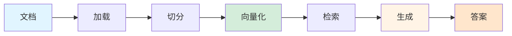
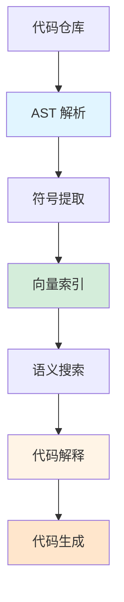
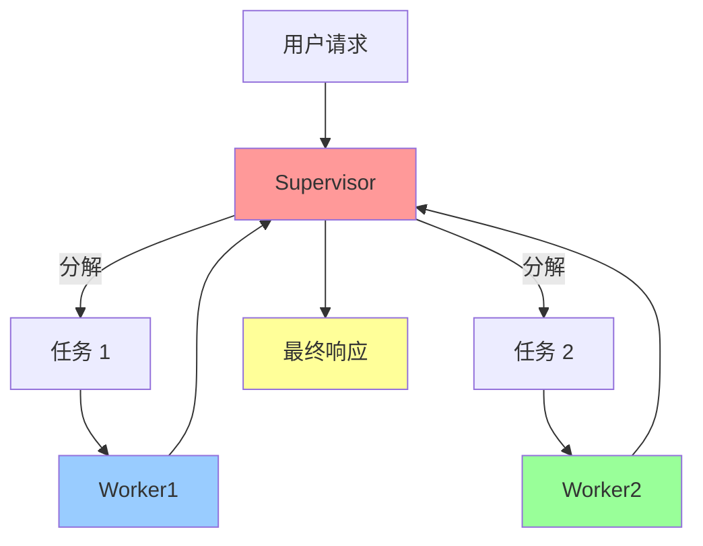
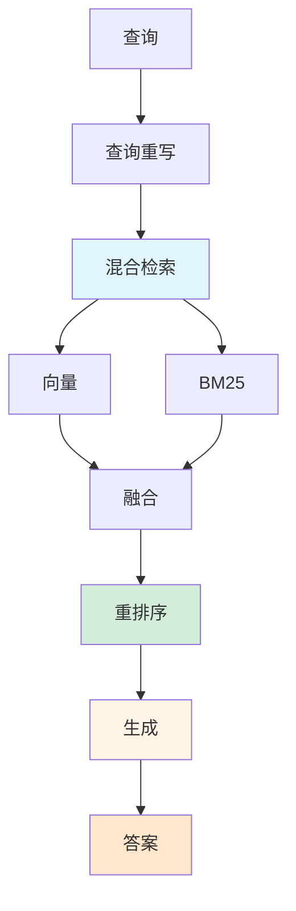
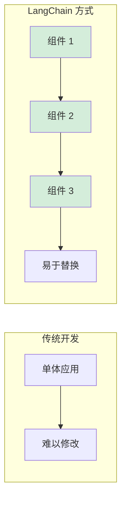
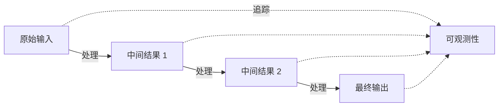
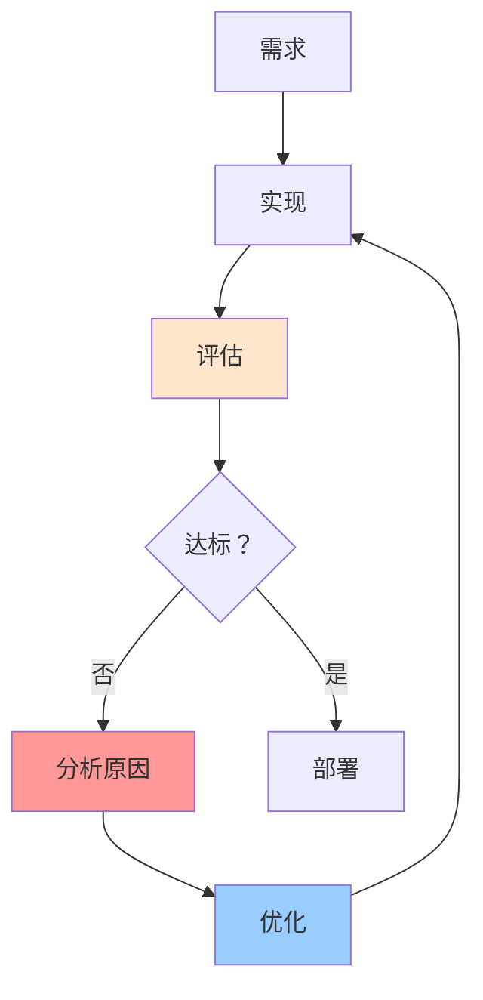
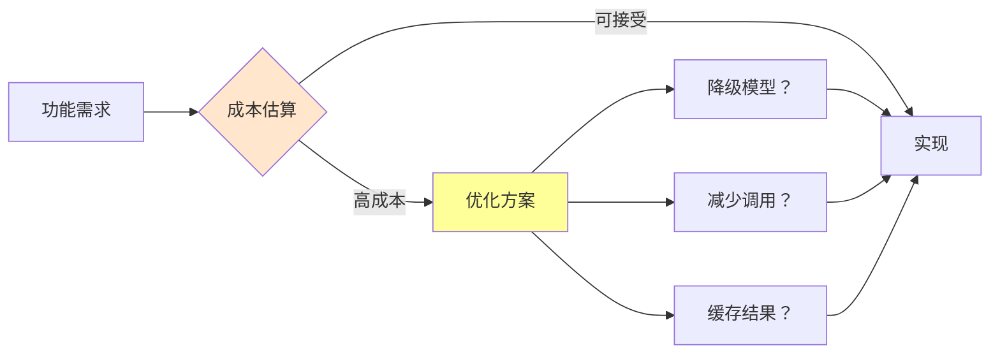
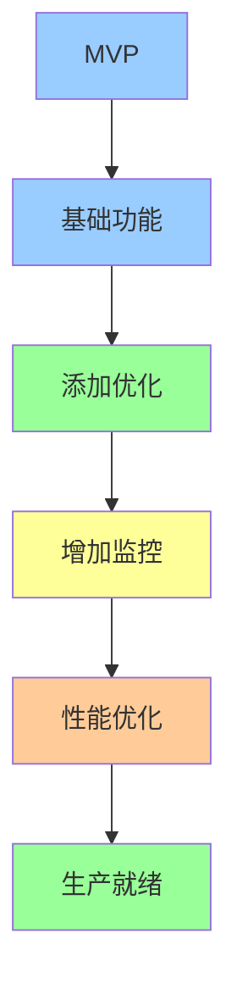
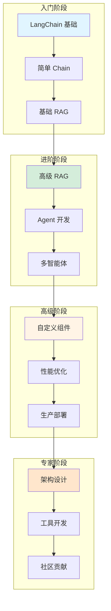

# 总结：从概念到产品

恭喜你完成了四个实战项目！本节将总结核心收获，建立 LangChain 开发思维模型，并规划下一步学习方向。

## 四个项目的核心收获

### 项目一：企业知识库问答 Bot

::: v-pre

:::

**核心技能：**
- 📄 多格式文档加载（PDF、Word、Markdown）
- 🔪 智能文本切分策略
- 📊 向量数据库使用（FAISS）
- 💬 对话记忆集成
- 📎 来源引用追踪

**关键教训：**
1. **切分质量决定检索质量**：好的切分保留语义完整性
2. **元数据很重要**：来源、页码等信息便于验证
3. **记忆不是万能的**：长对话需要摘要或向量记忆
4. **引用增强信任**：标注来源提高答案可信度

**代码片段回顾：**
```python
# 文档加载
loader = DirectoryLoader(docs_dir, glob="**/*.pdf", loader_cls=PyPDFLoader)
documents = loader.load()

# 向量检索
results = vectorstore.similarity_search(query, k=3)

# 对话链
chain = prompt | llm | StrOutputParser()
```

### 项目二：代码助手

::: v-pre

:::

**核心技能：**
- 📁 代码 AST 解析
- 🔍 语义代码搜索
- 💡 代码解释生成
- ✏️ 上下文感知生成
- 🐛 复杂度分析

**关键教训：**
1. **结构化信息很重要**：函数名、类名等元数据提升搜索精度
2. **上下文决定生成质量**：提供参考代码能显著提高生成相关性
3. **多粒度解释**：整体/逐行/符号级解释满足不同需求
4. **语言差异处理**：Python 可以 AST 解析，其他语言需 fallback

**代码片段回顾：**
```python
# AST 解析
tree = ast.parse(content)
for node in ast.walk(tree):
    if isinstance(node, ast.FunctionDef):
        symbols.append({...})

# 语义搜索
results = vectorstore.similarity_search_with_score(query, k=5)
```

### 项目三：多智能体协作系统

::: v-pre

:::

**核心技能：**
- 🤖 智能体角色设计
- 🔄 LangGraph 状态图
- 🎯 任务分解策略
- 👥 多角色协作
- 📋 结果汇总

**关键教训：**
1. **单一职责**：每个 Agent 专注一个能力
2. **清晰接口**：定义好输入输出格式
3. **错误处理**：单个 Agent 失败不影响全局
4. **可追溯性**：记录每个 Agent 的贡献

**代码片段回顾：**
```python
# LangGraph 状态
class AgentState(TypedDict):
    messages: Annotated[List, add_messages]
    plan: dict
    worker_results: dict

# 条件边
graph.add_conditional_edges(
    "supervisor",
    route_after_supervisor,
    {"researcher": "researcher", "writer": "writer", ...}
)
```

### 项目四：生产级 RAG Pipeline

::: v-pre

:::

**核心技能：**
- 🔀 混合检索（稀疏 + 稠密）
- 📈 Cross-Encoder 重排序
- ✍️ 查询重写优化
- 📊 LangSmith 评估
- 🚀 LangServe 部署

**关键教训：**
1. **混合检索提升召回**：单一检索方法有盲点
2. **重排序提升精度**：粗排 + 精排是工业级方案
3. **评估驱动优化**：没有评估就无法改进
4. **API 设计很重要**：好的接口设计便于集成

**代码片段回顾：**
```python
# 混合检索
dense_results = vectorstore.similarity_search_with_score(query, k=10)
sparse_results = bm25_retriever.get_relevant_documents(query)

# RRF 融合
scores[doc_id] += alpha * (1 / (rrf_k + rank))

# Rerank
reranked = reranker.rerank(query, list(zip(docs, scores)))
```

## LangChain 开发思维模型

### 1. 组件化思维

::: v-pre

:::

**原则：**
- 每个组件单一职责
- 组件间松耦合
- 便于单元测试
- 易于热替换

**示例：**
```python
# 不好的设计
class MonolithicRAG:
    def __init__(self):
        # 所有逻辑混在一起
        pass
    
# 好的设计
class RAGPipeline:
    def __init__(self):
        self.loader = DocumentLoader()
        self.splitter = TextSplitter()
        self.retriever = HybridRetriever()
        self.generator = RAGGenerator()
```

### 2. 数据流思维

::: v-pre

:::

**原则：**
- 数据流向清晰
- 中间结果可检查
- 全流程可追踪
- 便于调试定位

**示例：**
```python
# 使用 LangSmith 追踪每个步骤
tracer = LangChainTracer(project_name="rag-pipeline")

response = chain.invoke(
    {"query": user_query},
    config={"callbacks": [tracer]}
)
```

### 3. 评估驱动思维

::: v-pre

:::

**原则：**
- 先定义评估标准
- 持续测量指标
- 数据驱动优化
- A/B 测试验证

**示例：**
```python
# 定义评估指标
evaluators = [
    "accuracy",      # 准确性
    "relevance",     # 相关性
    "faithfulness",  # 事实一致性
    "latency"        # 延迟
]

# 运行评估
results = evaluate(rag_pipeline, data=test_set, evaluators=evaluators)
```

### 4. 成本感知思维

::: v-pre

:::

**原则：**
- 估算 Token 消耗
- 选择合适模型
- 实现缓存策略
- 监控实际成本

**示例：**
```python
# 成本估算
def estimate_cost(tokens: int, model: str) -> float:
    prices = {
        "gpt-4o": 0.000005,
        "gpt-4o-mini": 0.0000015
    }
    return tokens * prices.get(model, 0.000005)

# 缓存热门查询
@lru_cache(maxsize=1000)
def cached_response(query: str) -> str:
    return llm.invoke(query)
```

### 5. 渐进式构建思维

::: v-pre

:::

**原则：**
- 快速验证核心功能
- 逐步添加优化
- 持续收集反馈
- 迭代改进

**示例：**
```python
# V1: 基础检索 + 生成
retriever = vectorstore.as_retriever()
chain = retriever | prompt | llm

# V2: 添加混合检索
retriever = HybridRetriever(dense, sparse)

# V3: 添加重排序
pipeline = retriever | reranker | prompt | llm

# V4: 添加评估和监控
pipeline = with_langsmith(pipeline)
```

## 学习进阶路径图

::: v-pre

:::

### 推荐学习路线

| 阶段 | 主题 | 预期成果 |
|------|------|----------|
| **入门** | Prompt、Chain、Memory | 构建基础对话应用 |
| **进阶** | RAG、Agent、Tools | 构建知识库问答和 Agent |
| **高级** | 多智能体、评估、部署 | 构建生产级系统 |
| **专家** | 自定义组件、性能优化 | 贡献开源、设计架构 |

### 下一步学习方向

#### 1. 深入学习主题

```
深入 RAG:
├── 高级检索策略 (HyDE, Query Expansion)
├── 长文档处理 (Map-Reduce, Refine)
├── 多模态 RAG (图像 + 文本)
└── 实时数据 RAG

深入 Agent:
├── 复杂 Agent 编排
├── Agent 记忆管理
├── 工具学习和发现
└── 自我改进 Agent

深入评估:
├── 自动化评估框架
├── 人工评估流程
├── A/B 测试设计
└── 持续监控体系
```

#### 2. 实践项目建议

| 项目 | 难度 | 涉及技能 |
|------|------|----------|
| 个人知识助手 | ⭐⭐ | RAG、Memory |
| 自动化报告生成 | ⭐⭐⭐ | Agent、Tools |
| 智能客服系统 | ⭐⭐⭐ | 多轮对话、RAG |
| 代码审查助手 | ⭐⭐⭐⭐ | 代码分析、多 Agent |
| 数据分析助手 | ⭐⭐⭐⭐ | Tool Calling、可视化 |

#### 3.  recommended 资源

**官方文档:**
- [LangChain Docs](https://python.langchain.com/)
- [LangGraph Docs](https://langchain-ai.github.io/langgraph/)
- [LangSmith Docs](https://docs.smith.langchain.com/)

**社区资源:**
- LangChain Discord
- Reddit r/LangChain
- GitHub Issues & Discussions

**学习建议:**
1. 动手实践 > 被动阅读
2. 从小项目开始，逐步复杂
3. 参与开源项目
4. 分享学习心得

## 常见陷阱与规避

### ❌ 陷阱 1: 过度工程化

**问题:** 一开始就构建复杂系统

**解决:** 
```python
# 从简单开始
chain = prompt | llm

# 验证有效后再优化
chain = retriever | prompt | llm

# 最后才考虑复杂方案
chain = hybrid_retriever | reranker | prompt | llm
```

### ❌ 陷阱 2: 忽视评估

**问题:** 凭感觉认为"效果不错"

**解决:**
```python
# 定义评估数据集
test_cases = [
    {"query": "...", "expected": "..."},
    ...
]

# 定期运行评估
results = evaluate(pipeline, data=test_cases)
```

### ❌ 陷阱 3: 不考虑成本

**问题:** Token 消耗失控

**解决:**
```python
# 估算成本
with get_openai_callback() as cb:
    response = chain.invoke(query)
    print(f"Cost: ${cb.total_cost}")

# 设置预算告警
```

### ❌ 陷阱 4: 忽视错误处理

**问题:** 异常导致服务中断

**解决:**
```python
try:
    response = chain.invoke(query)
except RateLimitError:
    response = cached_response(query)
except APIError:
    response = fallback_response(query)
```

## 总结

通过四个实战项目，你已经掌握了：

✅ **核心技能:**
- 文档处理和向量化
- 多种检索策略
- 答案生成和优化
- 智能体设计和协作
- 评估和部署

✅ **开发思维:**
- 组件化设计
- 数据流追踪
- 评估驱动
- 成本感知
- 渐进式构建

✅ **工程能力:**
- 完整项目开发
- 问题分析和解决
- 性能优化
- 生产部署

**记住：**
> LangChain 是工具，解决问题才是目的。
> 选择最简单的方案实现需求，然后根据需要逐步优化。

祝你在大模型应用开发的道路上越走越远！🚀