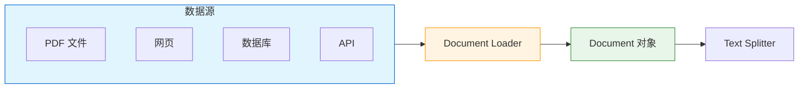
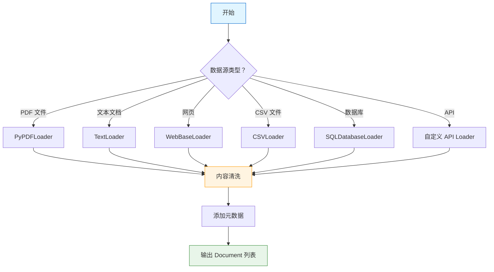

# 文档加载器

> Document Loader 是 RAG 流程的第一步。本章将详细介绍各种文档加载器的使用方法和最佳实践。

## 什么是 Document Loader？

**Document Loader（文档加载器）** 负责从各种数据源读取内容，并将其转换为 LangChain 的 `Document` 对象。它是 RAG（检索增强生成）流水线的入口。

::: v-pre

:::

### Document 对象结构

```python
from langchain_core.documents import Document

doc = Document(
    page_content="这是文档的实际文本内容",
    metadata={
        "source": "example.pdf",
        "page": 1,
        "author": "作者名"
    }
)

print(doc.page_content)  # 文本内容
print(doc.metadata)       # 元数据
```

💡 **提示**：元数据（metadata）在 RAG 中非常重要，可以用于过滤、排序和溯源。

## 内置 Loader 概览

### 1. PyPDFLoader - PDF 文件

```python
from langchain_community.document_loaders import PyPDFLoader

# 加载 PDF
loader = PyPDFLoader("document.pdf")
pages = loader.load()

# 每个页面是一个 Document
print(f"页数：{len(pages)}")
print(f"第一页内容：{pages[0].page_content[:100]}...")
print(f"元数据：{pages[0].metadata}")
# {'source': 'document.pdf', 'page': 0}

# 异步加载
pages = await loader.aload()
```

**高级选项：**

```python
# 提取文本模式
loader = PyPDFLoader(
    "document.pdf",
    extract_images=False,     # 不提取图片
    headers={"User-Agent": "Mozilla/5.0"}  # 自定义请求头
)

# 只加载特定页面
loader = PyPDFLoader("document.pdf", password="password")  # 加密 PDF
```

### 2. TextLoader - 纯文本

```python
from langchain_community.document_loaders import TextLoader

# 基础使用
loader = TextLoader("document.txt")
docs = loader.load()

# 指定编码
loader = TextLoader("document.txt", encoding="utf-8")

# 自动检测编码
from langchain_community.document_loaders import TextLoader
import chardet

with open("document.txt", "rb") as f:
    raw = f.read()
    encoding = chardet.detect(raw)["encoding"]

loader = TextLoader("document.txt", encoding=encoding)
```

### 3. CSVLoader - CSV 文件

```python
from langchain_community.document_loaders import CSVLoader

# 基础使用
loader = CSVLoader("data.csv")
docs = loader.load()

# 指定文本列
loader = CSVLoader("data.csv", source_column="title", text_column="content")

# 自定义元数据
for doc in docs:
    print(doc.metadata)  # {'source': 'data.csv', 'row': 0}
```

**处理大型 CSV：**

```python
from langchain_community.document_loaders import CSVLoader

# 使用生成器处理大文件
def load_large_csv(file_path, chunk_size=1000):
    import pandas as pd
    
    chunks = pd.read_csv(file_path, chunksize=chunk_size)
    
    for chunk in chunks:
        for _, row in chunk.iterrows():
            yield Document(
                page_content=str(row.to_dict()),
                metadata={"source": file_path}
            )

# 使用
for doc in load_large_csv("large_file.csv"):
    process(doc)
```

### 4. UnstructuredHTMLLoader - HTML 文件

```python
from langchain_community.document_loaders import UnstructuredHTMLLoader

# 加载本地 HTML
loader = UnstructuredHTMLLoader("page.html")
docs = loader.load()

# 加载网页
from langchain_community.document_loaders import WebBaseLoader
loader = WebBaseLoader("https://example.com")
docs = loader.load()
```

**解析选项：**

```python
loader = UnstructuredHTMLLoader(
    "page.html",
    mode="elements",      # 或 "single"
    extract_links=True,   # 提取链接
    extract_images=True,  # 提取图片信息
)
```

## Web Loader

### WebBaseLoader

```python
from langchain_community.document_loaders import WebBaseLoader

# 单个网页
loader = WebBaseLoader("https://example.com")
docs = loader.load()

# 多个网页
urls = [
    "https://example.com/page1",
    "https://example.com/page2",
    "https://example.com/page3",
]
loader = WebBaseLoader(urls)
docs = loader.load()

# 自定义请求头
loader = WebBaseLoader(
    "https://example.com",
    header_template={
        "User-Agent": "Mozilla/5.0",
        "Accept": "text/html",
    }
)
```

**批量异步加载：**

```python
import asyncio
from bs4 import BeautifulSoup
import aiohttp

class AsyncWebLoader:
    def __init__(self, urls):
        self.urls = urls
    
    async def fetch(self, session, url):
        async with session.get(url) as response:
            html = await response.text()
            soup = BeautifulSoup(html, 'html.parser')
            
            return Document(
                page_content=soup.get_text(),
                metadata={"source": url, "title": soup.title.string if soup.title else ""}
            )
    
    async def load(self):
        async with aiohttp.ClientSession() as session:
            tasks = [self.fetch(session, url) for url in self.urls]
            return await asyncio.gather(*tasks)

# 使用
# loader = AsyncWebLoader(urls)
# docs = await loader.load()
```

### AsyncHtmlLoader

```python
from langchain_community.document_loaders import AsyncHtmlLoader
from langchain_community.document_transformers import Html2TextTransformer

# 异步加载多个网页
loader = AsyncHtmlLoader([
    "https://example.com/1",
    "https://example.com/2",
])

# 加载
docs = loader.load()

# 转换为纯文本
html2text = Html2TextTransformer()
text_docs = html2text.transform_documents(docs)
```

## 数据库 Loader

### SQLDatabaseLoader

```python
from langchain_community.document_loaders import SQLDatabaseLoader
from langchain_community.utilities import SQLDatabase

# 连接数据库
db = SQLDatabase.from_uri("sqlite:///example.db")

# 执行查询并加载
loader = SQLDatabaseLoader(
    query="SELECT content FROM documents WHERE category = 'tech'",
    db=db
)
docs = loader.load()
```

**自定义 Document 创建：**

```python
from sqlalchemy import create_engine, text

engine = create_engine("sqlite:///example.db")

def load_from_db(query):
    docs = []
    with engine.connect() as conn:
        result = conn.execute(text(query))
        for row in result:
            docs.append(Document(
                page_content=row.content,
                metadata={
                    "id": row.id,
                    "created_at": row.created_at,
                    "category": row.category
                }
            ))
    return docs

docs = load_from_db("SELECT * FROM documents")
```

### MongoDB Loader

```python
from langchain_community.document_loaders import MongoDBLoader

loader = MongoDBLoader(
    connection_string="mongodb://localhost:27017",
    db_name="mydb",
    collection_name="documents",
    filter={"category": "tech"},  # 查询条件
    field_names=["title", "content"]  # 加载的字段
)

docs = loader.load()
```

## 自定义 Loader

当内置 Loader 不满足需求时，可以创建自定义 Loader。

### 继承 DocumentLoader

```python
from langchain_community.document_loaders.base import BaseLoader
from typing import List, Iterator
from langchain_core.documents import Document

class CustomLoader(BaseLoader):
    """自定义文档加载器"""
    
    def __init__(self, source: str):
        self.source = source
    
    def load(self) -> List[Document]:
        """加载文档"""
        return list(self.lazy_load())
    
    def lazy_load(self) -> Iterator[Document]:
        """惰性加载（推荐用于大文件）"""
        # 实现加载逻辑
        content = self._read_content()
        
        yield Document(
            page_content=content,
            metadata={"source": self.source}
        )
    
    def _read_content(self) -> str:
        """读取内容的具体实现"""
        # 实现读取逻辑
        pass

# 使用
loader = CustomLoader("custom_source.txt")
docs = loader.load()
```

### 从 API 加载

```python
from langchain_community.document_loaders.base import BaseLoader
import requests

class APILoader(BaseLoader):
    """从 API 加载文档"""
    
    def __init__(self, url: str, api_key: str = None):
        self.url = url
        self.api_key = api_key
    
    def load(self):
        headers = {}
        if self.api_key:
            headers["Authorization"] = f"Bearer {self.api_key}"
        
        response = requests.get(self.url, headers=headers)
        response.raise_for_status()
        
        data = response.json()
        
        return [
            Document(
                page_content=item["content"],
                metadata={
                    "source": self.url,
                    "id": item["id"],
                    "created_at": item.get("created_at")
                }
            )
            for item in data
        ]

# 使用
loader = APILoader(
    url="https://api.example.com/articles",
    api_key="your_api_key"
)
docs = loader.load()
```

### 惰性加载大文件

```python
from langchain_community.document_loaders.base import BaseLoader
from typing import Iterator

class LargeFileLoader(BaseLoader):
    """惰性加载大文件"""
    
    def __init__(self, file_path: str, chunk_size: int = 10000):
        self.file_path = file_path
        self.chunk_size = chunk_size
    
    def lazy_load(self) -> Iterator[Document]:
        """逐块加载，避免内存溢出"""
        chunk_num = 0
        
        with open(self.file_path, 'r') as f:
            while True:
                chunk = f.read(self.chunk_size)
                if not chunk:
                    break
                
                yield Document(
                    page_content=chunk,
                    metadata={
                        "source": self.file_path,
                        "chunk": chunk_num
                    }
                )
                chunk_num += 1

# 使用（不会一次性加载到内存）
loader = LargeFileLoader("huge_file.txt")
for doc in loader.lazy_load():
    process(doc)  # 逐块处理
```

## 文档加载流水线

::: v-pre

:::

### 完整加载流程

```python
from langchain_community.document_loaders import PyPDFLoader, DirectoryLoader
from langchain_community.document_transformers import EmbeddingsRedundantFilter
from langchain_text_splitters import RecursiveCharacterTextSplitter

# 1. 加载文档
def load_documents(source_path: str):
    """加载指定目录下的所有 PDF"""
    loader = DirectoryLoader(
        source_path,
        glob="**/*.pdf",
        loader_cls=PyPDFLoader
    )
    return loader.load()

# 2. 清洗文档
def clean_documents(docs):
    """清洗文档内容"""
    cleaned = []
    for doc in docs:
        # 移除多余空白
        content = " ".join(doc.page_content.split())
        # 移除特殊字符
        content = content.replace("\x00", "")
        
        doc.page_content = content
        cleaned.append(doc)
    return cleaned

# 3. 添加元数据
def enrich_metadata(docs, category: str):
    """丰富元数据"""
    for doc in docs:
        doc.metadata.update({
            "category": category,
            "loaded_at": datetime.now().isoformat(),
            "word_count": len(doc.page_content.split())
        })
    return docs

# 4. 完整流程
def process_documents(source_path: str, category: str):
    docs = load_documents(source_path)
    docs = clean_documents(docs)
    docs = enrich_metadata(docs, category)
    return docs

# 使用
documents = process_documents("data/pdfs", "技术文档")
```

## 多模态 Loader

### 图片 OCR

```python
from langchain_community.document_loaders import UnstructuredImageLoader

# 加载图片并 OCR
loader = UnstructuredImageLoader("image.png")
docs = loader.load()

# 使用特定 OCR 引擎
loader = UnstructuredImageLoader(
    "image.png",
    strategy="ocr_only",
    languages=["chi_sim", "eng"]  # 中文 + 英文
)
```

### 音频转录

```python
from langchain_community.document_loaders import AssemblyAIAudioTranscriptLoader

loader = AssemblyAIAudioTranscriptLoader(
    file_path="audio.mp3",
    api_key="your_api_key"
)
docs = loader.load()
```

## 性能优化

### 1. 批量加载

```python
from concurrent.futures import ThreadPoolExecutor

def batch_load(file_paths, max_workers=4):
    """批量并行加载"""
    loaders = [TextLoader(f) for f in file_paths]
    
    with ThreadPoolExecutor(max_workers=max_workers) as executor:
        results = list(executor.map(lambda l: l.load(), loaders))
    
    # 展平结果
    return [doc for docs in results for doc in docs]
```

### 2. 缓存加载结果

```python
from functools import lru_cache
import hashlib

@lru_cache(maxsize=100)
def cached_load(file_hash: str, file_path: str):
    loader = TextLoader(file_path)
    return tuple(loader.load())  # tuple 可哈希

def load_with_cache(file_path: str):
    with open(file_path, 'rb') as f:
        content = f.read()
    file_hash = hashlib.md5(content).hexdigest()
    return list(cached_load(file_hash, file_path))
```

### 3. 增量加载

```python
import os
from datetime import datetime

def incremental_load(source_dir: str, state_file: str = ".load_state.json"):
    """只加载新文件"""
    import json
    
    # 加载状态
    if os.path.exists(state_file):
        with open(state_file) as f:
            state = json.load(f)
    else:
        state = {"processed": {}, "timestamp": None}
    
    new_docs = []
    
    for root, _, files in os.walk(source_dir):
        for file in files:
            file_path = os.path.join(root, file)
            mtime = os.path.getmtime(file_path)
            
            # 检查是否已处理且未更新
            if file_path in state["processed"]:
                if mtime <= state["processed"][file_path]:
                    continue
            
            # 加载新/更新的文件
            loader = TextLoader(file_path)
            docs = loader.load()
            new_docs.extend(docs)
            
            # 更新状态
            state["processed"][file_path] = mtime
    
    # 保存状态
    state["timestamp"] = datetime.now().isoformat()
    with open(state_file, 'w') as f:
        json.dump(state, f)
    
    return new_docs
```

## 常见问题排查

| 问题 | 可能原因 | 解决方案 |
|------|----------|----------|
| 乱码 | 编码不正确 | 指定正确的 encoding 参数 |
| PDF 解析失败 | PyPDF 版本问题 | 升级到最新版或使用 PyMuPDFLoader |
| 网页加载超时 | 网络问题 | 增加 timeout 或使用重试 |
| 内存溢出 | 文件太大 | 使用 lazy_load 惰性加载 |
| 元数据丢失 | 未正确设置 | 手动添加 source 等字段 |

## 本章小结

本章介绍了 Document Loader 的各个方面：

1. **基础概念**：Document 对象结构
2. **内置 Loader**：PDF、文本、CSV、HTML
3. **Web 加载**：WebBaseLoader、AsyncHtmlLoader
4. **数据库**：SQL、MongoDB 加载
5. **自定义 Loader**：继承 BaseLoader 创建自己的加载器
6. **流水线**：完整的数据加载处理流程
7. **性能优化**：批量、缓存、增量加载

下一章我们将学习 **文本分割器**，了解如何将文档切分成适合向量化的小块。

## 继续学习

- [文本分割器](./text-splitters.md) - 文本切分策略
- [向量存储](./vector-stores.md) - 向量数据库
- [检索器](./retrievers.md) - 检索策略
- [RAG 最佳实践](./rag-best-practices.md) - RAG 完整指南