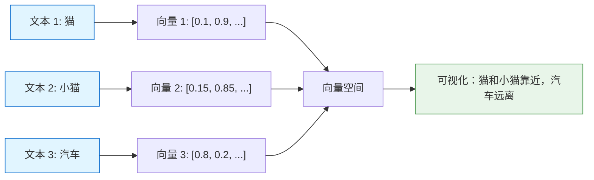
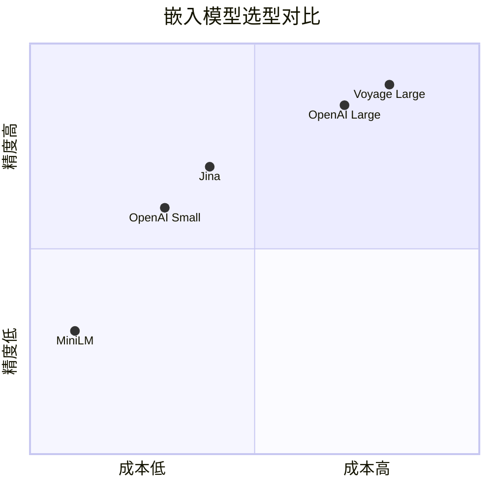
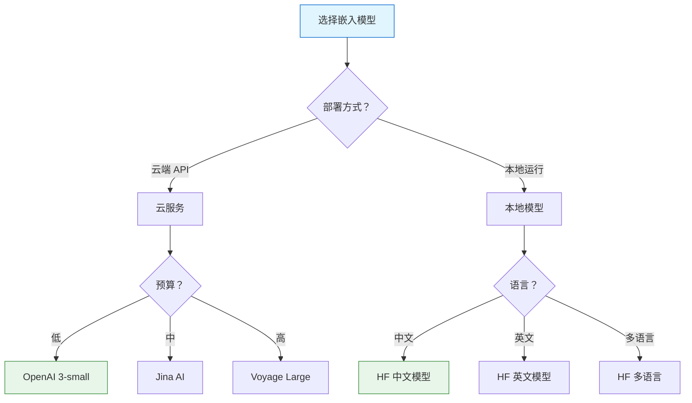

# 嵌入模型

> Embeddings（嵌入）将文本转换为向量表示，是 RAG 系统的核心组件。本章将详细介绍各种嵌入模型和选型策略。

## 什么是 Embeddings？

**Embeddings（词嵌入/向量嵌入）** 是将文本转换为固定长度数值向量的技术。语义相似的文本在向量空间中距离更近。

::: v-pre

:::

### 向量空间示例

```python
# 概念演示
# "猫" 的向量可能接近 "狗"、"宠物"
# "猫" 的向量远离 "汽车"、"电脑"

cat_vector = [0.1, 0.9, 0.3, -0.2, ...]
dog_vector = [0.15, 0.85, 0.25, -0.15, ...]  # 与 cat 相似
car_vector = [0.8, 0.2, -0.5, 0.6, ...]       # 与 cat 差异大

# 计算相似度
from langchain_openai import OpenAIEmbeddings
from sklearn.metrics.pairwise import cosine_similarity

embeddings = OpenAIEmbeddings()

vectors = embeddings.embed_documents(["猫", "小狗", "汽车"])
similarity = cosine_similarity([vectors[0]], [vectors[1]])[0][0]
print(f"猫和小狗的相似度：{similarity:.3f}")  # 约 0.9
```

💡 **提示**：选择嵌入模型时，需要考虑维度、性能、成本、多语言支持等因素。

## OpenAI Embeddings

OpenAI 的嵌入模型是最常用的选择，特别是对于英文内容。

### 基础用法

```python
from langchain_openai import OpenAIEmbeddings

# 初始化
embeddings = OpenAIEmbeddings(
    model="text-embedding-3-small",  # 或 text-embedding-3-large
)

# 嵌入单个文本
vector = embeddings.embed_query("你好，世界")
print(f"向量维度：{len(vector)}")  # 1536

# 嵌入多个文本
texts = ["文本 1", "文本 2", "文本 3"]
vectors = embeddings.embed_documents(texts)
print(f"向量数量：{len(vectors)}")
```

### 模型选择

```python
# text-embedding-3-small: 性价比高
embeddings_small = OpenAIEmbeddings(
    model="text-embedding-3-small",
    dimensions=512,  # 可选：降低维度节省空间
)

# text-embedding-3-large: 精度最高
embeddings_large = OpenAIEmbeddings(
    model="text-embedding-3-large",
    dimensions=3072,  # 最大维度
)

# text-embedding-ada-002: 旧版（不推荐）
embeddings_ada = OpenAIEmbeddings(
    model="text-embedding-ada-002",
)
```

### 模型对比表

| 模型 | 维度 | 性能 | 成本 | 适用场景 |
|------|------|------|------|----------|
| text-embedding-3-small | 1536 | 好 | 低 | 通用场景 |
| text-embedding-3-large | 3072 | 最好 | 中 | 高精度需求 |
| text-embedding-ada-002 | 1536 | 一般 | 低 | 向后兼容 |

```python
# 性能测试
import time

texts = ["测试文本"] * 100

for model in ["text-embedding-3-small", "text-embedding-3-large"]:
    emb = OpenAIEmbeddings(model=model)
    
    start = time.time()
    vectors = emb.embed_documents(texts)
    elapsed = time.time() - start
    
    print(f"{model}: {elapsed:.2f}s, 维度：{len(vectors[0])}")
```

## HuggingFace Embeddings

HuggingFace 提供大量本地运行的嵌入模型，适合隐私敏感场景。

### 基础用法

```python
from langchain_huggingface import HuggingFaceEmbeddings

# 使用默认模型
embeddings = HuggingFaceEmbeddings(
    model_name="sentence-transformers/all-MiniLM-L6-v2"
)

# 测试
vector = embeddings.embed_query("你好")
print(f"维度：{len(vector)}")  # 384
```

### 推荐模型

```python
# 轻量级（快速）
model_mini = HuggingFaceEmbeddings(
    model_name="sentence-transformers/all-MiniLM-L6-v2"
)

# 中等（平衡）
model_base = HuggingFaceEmbeddings(
    model_name="sentence-transformers/all-mpnet-base-v2"
)

# 大型（高精度）
model_large = HuggingFaceEmbeddings(
    model_name="sentence-transformers/LaBSE"
)

# 中文专用
model_chinese = HuggingFaceEmbeddings(
    model_name="shibing624/text2vec-base-chinese"
)

# 多语言
model_multilingual = HuggingFaceEmbeddings(
    model_name="intfloat/multilingual-e5-large"
)
```

### 本地模型配置

```python
# 指定设备
embeddings = HuggingFaceEmbeddings(
    model_name="sentence-transformers/all-MiniLM-L6-v2",
    model_kwargs={"device": "cuda"},      # GPU
    # model_kwargs={"device": "cpu"},     # CPU
    # model_kwargs={"device": "mps"},     # Mac M1/M2
)

# 自定义编码参数
embeddings = HuggingFaceEmbeddings(
    model_name="sentence-transformers/all-MiniLM-L6-v2",
    encode_kwargs={
        "normalize_embeddings": True,      # 归一化
        "batch_size": 32,                  # 批处理大小
        "show_progress_bar": True,
    }
)
```

### 缓存模型

```python
# 模型会自动缓存到 ~/.cache/huggingface
# 首次下载后，后续使用无需网络

from huggingface_hub import snapshot_download

# 预下载模型
snapshot_download(
    repo_id="sentence-transformers/all-MiniLM-L6-v2",
    local_dir="./models/mini-lm"
)

# 使用本地模型
embeddings = HuggingFaceEmbeddings(
    model_name="./models/mini-lm"
)
```

## 其他嵌入模型

### Cohere

```python
from langchain_cohere import CohereEmbeddings

embeddings = CohereEmbeddings(
    model="embed-multilingual-v3.0",  # 多语言
    cohere_api_key="your_api_key"
)

# 或使用 Cohere V2
embeddings_v2 = CohereEmbeddings(
    model="embed-english-v3.0"
)
```

### Jina AI

```python
from langchain_community.embeddings import JinaEmbeddings

embeddings = JinaEmbeddings(
    model="jina-embeddings-v2-base-zh",  # 中文优化
    jina_api_key="your_api_key"
)

# Jina 支持 8192 token 长文本
vector = embeddings.embed_query("长文本..." * 1000)
```

### Voyage AI

```python
from langchain_voyageai import VoyageAIEmbeddings

embeddings = VoyageAIEmbeddings(
    model="voyage-large-2",
    voyage_api_key="your_api_key"
)

# 高维度
# voyage-large-2: 1536 维
# voyage-2: 1024 维
# voyage-law-2: 法律领域专用
# voyage-code-2: 代码专用
```

### Google Generative AI

```python
from langchain_google_genai import GoogleGenerativeAIEmbeddings

embeddings = GoogleGenerativeAIEmbeddings(
    model="models/embedding-001",
    google_api_key="your_api_key"
)
```

## 嵌入模型选型对比

::: v-pre

:::

### 详细对比表

| 提供商 | 模型 | 维度 | 多语言 | 成本 | 延迟 | 推荐场景 |
|--------|------|------|--------|------|------|----------|
| **OpenAI** | 3-small | 1536 | ✅ | $ | 低 | 通用 |
| **OpenAI** | 3-large | 3072 | ✅ | $$$ | 中 | 高精度 |
| **HuggingFace** | MiniLM | 384 | ✅ | 免费 | 低 | 本地部署 |
| **HuggingFace** | mpnet | 768 | ✅ | 免费 | 中 | 平衡 |
| **Cohere** | multi-v3 | 1024 | ✅ | $$ | 中 | 多语言 |
| **Jina** | v2-zh | 768 | 中文 | $ | 低 | 中文 |
| **Voyage** | large-2 | 1536 | ✅ | $$ | 中 | 企业 |

### 选择决策树

```python
def choose_embedding(requirements):
    """根据需求选择嵌入模型"""
    
    if requirements.get("privacy"):
        # 需要本地部署
        return HuggingFaceEmbeddings(model_name="all-MiniLM-L6-v2")
    
    if requirements.get("chinese"):
        # 中文优化
        return JinaEmbeddings(model="jina-embeddings-v2-base-zh")
    
    if requirements.get("high_accuracy"):
        # 高精度
        return OpenAIEmbeddings(model="text-embedding-3-large")
    
    if requirements.get("low_cost"):
        # 低成本
        return OpenAIEmbeddings(model="text-embedding-3-small")
    
    # 默认
    return OpenAIEmbeddings(model="text-embedding-3-small")
```

## 嵌入模型对比图

::: v-pre

:::

## 实战配置

### 配置示例 1：英文知识库

```python
from langchain_openai import OpenAIEmbeddings

# 英文内容，追求性价比
embeddings = OpenAIEmbeddings(
    model="text-embedding-3-small",
    dimensions=512,  # 降低维度节省存储
    show_progress_bar=True,
    request_timeout=30,
    max_retries=3,
)
```

### 配置示例 2：中文知识库

```python
from langchain_huggingface import HuggingFaceEmbeddings

# 中文内容，本地部署
embeddings = HuggingFaceEmbeddings(
    model_name="shibing624/text2vec-base-chinese",
    model_kwargs={"device": "cuda"},
    encode_kwargs={
        "normalize_embeddings": True,
        "batch_size": 64,
    }
)
```

### 配置示例 3：多语言支持

```python
from langchain_cohere import CohereEmbeddings

# 多语言内容
embeddings = CohereEmbeddings(
    model="embed-multilingual-v3.0",
    cohere_api_key="your_key"
)
```

## 高级技巧

### 批量处理

```python
# 批量嵌入，提高效率
texts = [f"文档{i}" for i in range(1000)]

# 分批处理
batch_size = 100
all_vectors = []

for i in range(0, len(texts), batch_size):
    batch = texts[i:i+batch_size]
    vectors = embeddings.embed_documents(batch)
    all_vectors.extend(vectors)
    print(f"完成 {i+len(batch)}/{len(texts)}")
```

### 嵌入缓存

```python
import hashlib
import pickle
from functools import lru_cache

class CachedEmbeddings:
    def __init__(self, base_embeddings, cache_file="embeddings_cache.pkl"):
        self.embeddings = base_embeddings
        self.cache_file = cache_file
        self.cache = self._load_cache()
    
    def _load_cache(self):
        try:
            with open(self.cache_file, "rb") as f:
                return pickle.load(f)
        except:
            return {}
    
    def _save_cache(self):
        with open(self.cache_file, "wb") as f:
            pickle.dump(self.cache, f)
    
    def _hash(self, text: str) -> str:
        return hashlib.md5(text.encode()).hexdigest()
    
    def embed_query(self, text: str):
        key = self._hash(text)
        if key not in self.cache:
            self.cache[key] = self.embeddings.embed_query(text)
            self._save_cache()
        return self.cache[key]

# 使用
base_embeddings = OpenAIEmbeddings()
cached_embeddings = CachedEmbeddings(base_embeddings)
```

### 混合嵌入

```python
# 结合多个嵌入模型的优势
class HybridEmbeddings:
    def __init__(self, *embeddings_list):
        self.embeddings_list = embeddings_list
    
    def embed_documents(self, texts):
        all_vectors = []
        for emb in self.embeddings_list:
            vectors = emb.embed_documents(texts)
            all_vectors.append(vectors)
        
        # 拼接向量
        return [
            sum((v[i] for v in vectors), [])
            for vectors in zip(*all_vectors)
        ]

# 使用
hybrid = HybridEmbeddings(
    OpenAIEmbeddings(model="text-embedding-3-small"),
    HuggingFaceEmbeddings(model_name="all-MiniLM-L6-v2")
)
```

## 常见问题

### Q1: 应该用多少维度的向量？

**A**: 取决于场景：
- 小型项目：256-512 维（节省存储）
- 通用场景：768-1024 维（平衡）
- 高精度需求：1536-3072 维（最佳效果）

### Q2: 嵌入模型的上下文窗口是多少？

**A**: 不同模型不同：
- OpenAI 3-small/large: 8192 tokens
- Cohere: 512 tokens
- HF MiniLM: 256 tokens
- Jina: 8192 tokens

### Q3: 如何评估嵌入模型质量？

**A**: 使用基准测试：
- MTEB (Massive Text Embedding Benchmark)
- 自建测试集评估检索效果

```python
# 简单评估
def evaluate_embeddings(embeddings, queries, relevant_docs):
    """评估嵌入模型的检索效果"""
    from sklearn.metrics.pairwise import cosine_similarity
    import numpy as np
    
    # 嵌入文档
    doc_vectors = embeddings.embed_documents(relevant_docs)
    
    # 对每个查询测试
    scores = []
    for query in queries:
        query_vector = embeddings.embed_query(query)
        similarities = cosine_similarity([query_vector], doc_vectors)[0]
        
        # 相关文档应该在顶部
        ranks = np.argsort(-similarities)
        # 计算 MRR 等指标
        ...
    
    return scores
```

## 本章小结

本章介绍了嵌入模型的各个方面：

1. **基础概念**：什么是嵌入和向量空间
2. **OpenAI Embeddings**：最常用的云端 API
3. **HuggingFace**：本地部署选择
4. **其他提供商**：Cohere、Jina、Voyage 等
5. **选型对比**：详细对比和决策指南
6. **实战配置**：不同场景的配置示例
7. **高级技巧**：缓存、批量、混合嵌入

下一章我们将学习 **向量存储**，了解如何存储和检索嵌入向量。

## 继续学习

- [向量存储](./vector-stores.md) - 向量数据库选型
- [检索器](./retrievers.md) - 检索策略
- [文本分割器](./text-splitters.md) - 分割策略
- [RAG 最佳实践](./rag-best-practices.md) - 完整指南