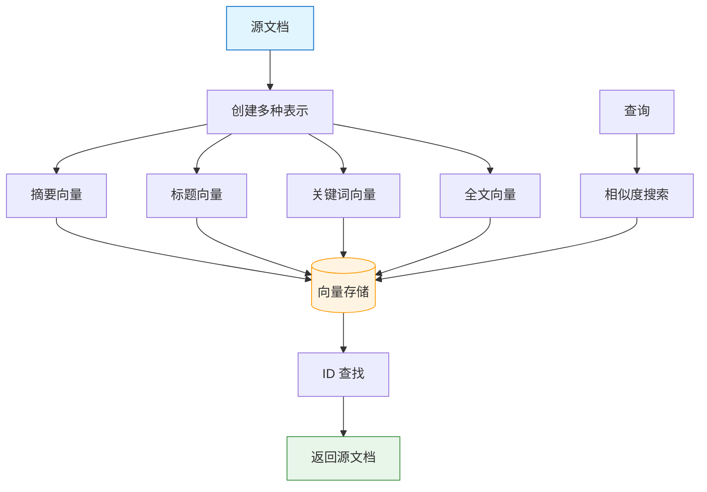
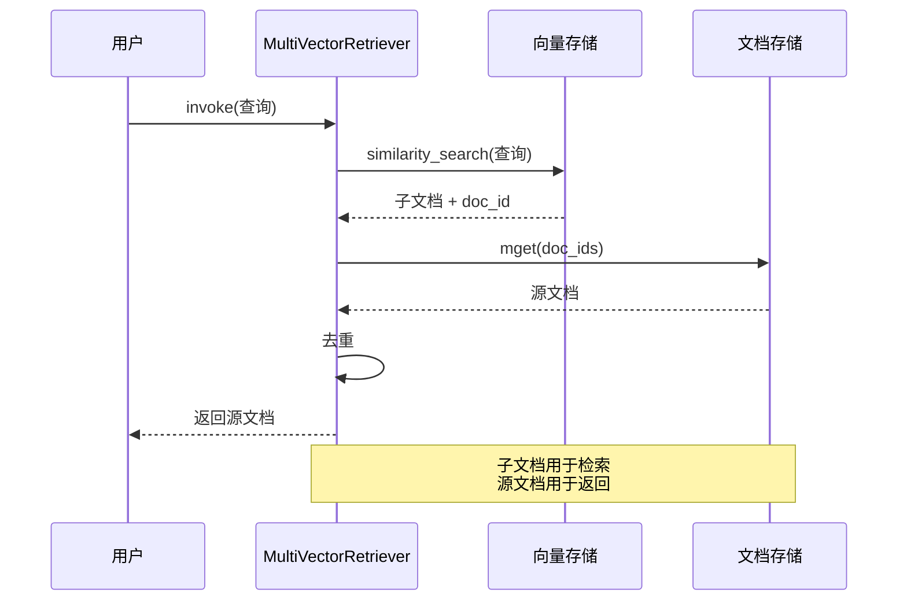

# MultiVectorRetriever

> MultiVectorRetriever 为每个文档存储多个向量表示，实现更精准的检索。本章将详细介绍其原理和实战应用。

## 什么是 MultiVectorRetriever？

**MultiVectorRetriever** 是一种高级检索技术，为每个源文档创建多个向量表示（如摘要、标题、关键词等），检索时使用这些向量，但返回原始文档。

::: v-pre

:::

### 核心思想

- **问题**：大块包含更多上下文但检索不精准，小块检索精准但缺乏上下文
- **解决**：用小块的向量检索，返回大块的原文
- **优势**：结合检索精度和上下文完整性

### 与传统检索对比

| 维度 | 传统检索 | MultiVector |
|------|----------|-------------|
| 向量化对象 | 全文/大块 | 多种表示（摘要/关键词等） |
| 检索精度 | 一般 | 更高 |
| 上下文完整性 | 可能不完整 | 完整源文档 |
| 存储开销 | 1 倍 | 2-4 倍 |
| 复杂度 | 低 | 中等 |

💡 **提示**：MultiVectorRetriever 特别适合需要平衡检索精度和上下文完整性的场景。

## 原理详解

### 工作流程

```python
# 1. 为每个文档创建多个向量表示
document = "源文档内容..."

# 表示 1：摘要
summary = llm.invoke(f"总结以下内容：{document}")

# 表示 2：关键词
keywords = llm.invoke(f"提取关键词：{document}")

# 表示 3：假设问题
questions = llm.invoke(f"根据内容生成相关问题：{document}")

# 2. 向量化所有这些表示
summary_vector = embeddings.embed_query(summary)
keywords_vector = embeddings.embed_query(keywords)
questions_vector = embeddings.embed_query(questions)

# 3. 存储时关联源文档 ID
store.add(summary_vector, metadata={"doc_id": "doc1", "type": "summary"})
store.add(keywords_vector, metadata={"doc_id": "doc1", "type": "keywords"})
store.add(questions_vector, metadata={"doc_id": "doc1", "type": "questions"})

# 4. 检索时去重返回源文档
results = store.similarity_search(query, k=10)
doc_ids = set(r.metadata["doc_id"] for r in results)
final_docs = [get_original_doc(id) for id in doc_ids]
```

## InMemoryStore 实现

### 基础用法

```python
from langchain.retrievers.multi_vector import MultiVectorRetriever
from langchain.storage import InMemoryStore
from langchain_community.vectorstores import FAISS
from langchain_openai import OpenAIEmbeddings
from langchain_core.documents import Document

# 初始化组件
embeddings = OpenAIEmbeddings()
vectorstore = FAISS.from_documents([], embeddings)  # 空的向量存储
store = InMemoryStore()  # 存储源文档

# 创建检索器
retriever = MultiVectorRetriever(
    vectorstore=vectorstore,
    docstore=store,
    id_key="doc_id",  # 关联 ID 的键名
)

# 准备文档
documents = [
    Document(page_content="文档 1 的完整内容...", metadata={"title": "文档 1"}),
    Document(page_content="文档 2 的完整内容...", metadata={"title": "文档 2"}),
]

# 生成子文档表示
from langchain_openai import ChatOpenAI
llm = ChatOpenAI(model="gpt-4o")

def generate_summaries(docs):
    summaries = []
    for doc in docs:
        summary = llm.invoke(f"用 50 字总结：{doc.page_content}").content
        summaries.append(Document(
            page_content=summary,
            metadata={"doc_id": doc.id, "type": "summary"}
        ))
    return summaries

# 添加文档到检索器
from uuid import uuid4

doc_ids = [str(uuid4()) for _ in documents]
summary_docs = generate_summaries(documents)

# 存储源文档
for i, doc in enumerate(documents):
    store.mset([(doc_ids[i], doc)])

# 创建子文档（用于向量化）
sub_docs = []
for i, summary in enumerate(summary_docs):
    summary.metadata["doc_id"] = doc_ids[i]
    sub_docs.append(summary)

# 向量化子文档
vectorstore.add_documents(sub_docs)

# 使用检索器
results = retriever.invoke("查询")
```

### 完整实现

```python
from langchain.retrievers.multi_vector import MultiVectorRetriever
from langchain.storage import InMemoryStore
from langchain_community.vectorstores import FAISS
from langchain_openai import OpenAIEmbeddings, ChatOpenAI
from langchain_core.documents import Document
from typing import List
from uuid import uuid4

class MultiVectorRAG:
    def __init__(self, documents: List[Document]):
        self.embeddings = OpenAIEmbeddings()
        self.llm = ChatOpenAI(model="gpt-4o")
        self.vectorstore = FAISS.from_documents([], self.embeddings)
        self.docstore = InMemoryStore()
        
        self.retriever = MultiVectorRetriever(
            vectorstore=self.vectorstore,
            docstore=self.docstore,
            id_key="doc_id",
        )
        
        self._index_documents(documents)
    
    def _generate_sub_docs(self, doc: Document) -> List[Document]:
        """为文档生成多种表示"""
        sub_docs = []
        doc_id = str(uuid4())
        
        # 存储源文档
        self.docstore.mset([(doc_id, doc)])
        
        # 1. 摘要表示
        summary = self.llm.invoke(
            f"用 30-50 字总结以下内容：\n{doc.page_content}"
        ).content
        sub_docs.append(Document(
            page_content=summary,
            metadata={"doc_id": doc_id, "type": "summary"}
        ))
        
        # 2. 关键词表示
        keywords = self.llm.invoke(
            f"提取 3-5 个关键词，用逗号分隔：\n{doc.page_content}"
        ).content
        sub_docs.append(Document(
            page_content=keywords,
            metadata={"doc_id": doc_id, "type": "keywords"}
        ))
        
        # 3. 假设问题表示
        questions = self.llm.invoke(
            f"生成 2-3 个可以被该文档回答的问题：\n{doc.page_content}"
        ).content
        sub_docs.append(Document(
            page_content=questions,
            metadata={"doc_id": doc_id, "type": "questions"}
        ))
        
        return sub_docs
    
    def _index_documents(self, documents: List[Document]):
        """索引所有文档"""
        all_sub_docs = []
        for doc in documents:
            sub_docs = self._generate_sub_docs(doc)
            all_sub_docs.extend(sub_docs)
        
        # 向量化所有子文档
        self.vectorstore.add_documents(all_sub_docs)
    
    def retrieve(self, query: str, k: int = 3) -> List[Document]:
        """检索相关文档"""
        return self.retriever.invoke(query)
    
    def search(self, query: str) -> str:
        """完整 RAG 搜索"""
        # 检索
        docs = self.retrieve(query)
        
        # 生成回答
        context = "\n\n".join([d.page_content for d in docs])
        response = self.llm.invoke(f"""
        基于以下上下文回答问题：
        
        上下文：
        {context}
        
        问题：{query}
        
        回答：
        """)
        
        return response.content

# 使用
documents = [Document(page_content="..."), ...]
rag = MultiVectorRAG(documents)
result = rag.search("查询问题")
```

## RedisStore 实现

对于生产环境，可以使用 Redis 作为文档存储。

```python
from langchain.storage import RedisStore
from langchain.retrievers.multi_vector import MultiVectorRetriever

# Redis 存储
store = RedisStore(
    redis_url="redis://localhost:6379",
    namespace="multivector"
)

retriever = MultiVectorRetriever(
    vectorstore=vectorstore,
    docstore=store,
    id_key="doc_id",
)

# 添加文档
store.mset([
    ("doc1", Document(page_content="...")),
    ("doc2", Document(page_content="...")),
])

# 检索会自动从 Redis 获取源文档
results = retriever.invoke("查询")
```

## 子文档生成策略

### 策略 1: 摘要 + 原文

```python
def create_summary_docs(docs, llm):
    """创建摘要表示"""
    sub_docs = []
    for doc in docs:
        summary = llm.invoke(f"总结：{doc.page_content}").content
        sub_docs.append(Document(
            page_content=summary,
            metadata={"doc_id": doc.id, "type": "summary"}
        ))
    return sub_docs
```

### 策略 2: 假设问题

```python
def create_hypothetical_questions(docs, llm):
    """创建假设问题表示"""
    sub_docs = []
    for doc in docs:
        questions = llm.invoke(f"""
        基于以下内容生成 5 个相关问题：
        {doc.page_content}
        """).content
        sub_docs.append(Document(
            page_content=questions,
            metadata={"doc_id": doc.id, "type": "questions"}
        ))
    return sub_docs
```

### 策略 3: 多级切分

```python
from langchain_text_splitters import RecursiveCharacterTextSplitter

def create_multi_scale_docs(docs):
    """创建多粒度表示"""
    splitter_large = RecursiveCharacterTextSplitter(
        chunk_size=2000, chunk_overlap=200
    )
    splitter_small = RecursiveCharacterTextSplitter(
        chunk_size=500, chunk_overlap=50
    )
    
    sub_docs = []
    for doc in docs:
        # 大块表示
        large_chunks = splitter_large.split_text(doc.page_content)
        for chunk in large_chunks:
            sub_docs.append(Document(
                page_content=chunk,
                metadata={"doc_id": doc.id, "scale": "large"}
            ))
        
        # 小块表示
        small_chunks = splitter_small.split_text(doc.page_content)
        for chunk in small_chunks:
            sub_docs.append(Document(
                page_content=chunk,
                metadata={"doc_id": doc.id, "scale": "small"}
            ))
    
    return sub_docs
```

## 检索流程图

::: v-pre

:::

## 完整代码示例

```python
from langchain.retrievers.multi_vector import MultiVectorRetriever
from langchain.storage import InMemoryStore
from langchain_community.vectorstores import FAISS
from langchain_openai import OpenAIEmbeddings, ChatOpenAI
from langchain_core.documents import Document
from langchain_core.runnables import RunnablePassthrough
from langchain_core.prompts import ChatPromptTemplate
from langchain_core.output_parsers import StrOutputParser
from typing import List
from uuid import uuid4

# ==================== 初始化 ====================

embeddings = OpenAIEmbeddings()
llm = ChatOpenAI(model="gpt-4o")
vectorstore = FAISS.from_documents([], embeddings)
docstore = InMemoryStore()

retriever = MultiVectorRetriever(
    vectorstore=vectorstore,
    docstore=docstore,
    id_key="doc_id",
)

# ==================== 索引文档 ====================

def index_documents(documents: List[Document]):
    """索引文档到 MultiVector 检索器"""
    
    sub_docs = []
    doc_ids = []
    
    for doc in documents:
        doc_id = str(uuid4())
        doc_ids.append(doc_id)
        
        # 存储源文档
        docstore.mset([(doc_id, doc)])
        
        # 生成摘要
        summary = llm.invoke(
            f"用 1-2 句话总结：{doc.page_content}"
        ).content
        
        sub_docs.append(Document(
            page_content=f"标题：{doc.metadata.get('title', 'N/A')}\n摘要：{summary}",
            metadata={"doc_id": doc_id, "type": "summary"}
        ))
        
        # 生成关键词
        keywords = llm.invoke(
            f"提取 5 个关键词，逗号分隔：{doc.page_content}"
        ).content
        
        sub_docs.append(Document(
            page_content=keywords,
            metadata={"doc_id": doc_id, "type": "keywords"}
        ))
    
    # 向量化所有子文档
    vectorstore.add_documents(sub_docs)
    return doc_ids

# ==================== 创建 RAG 链 ====================

def create_rag_chain():
    """创建完整的 RAG 链"""
    
    # 组装上下文
    def format_docs(docs):
        return "\n\n".join(doc.page_content for doc in docs)
    
    # 提示模板
    prompt = ChatPromptTemplate.from_template("""
    请基于以下上下文回答问题。如果无法回答，请说明。
    
    上下文：
    {context}
    
    问题：{question}
    
    回答：
    """)
    
    # 创建链
    chain = (
        {"context": retriever | format_docs, "question": RunnablePassthrough()}
        | prompt
        | llm
        | StrOutputParser()
    )
    
    return chain

# ==================== 使用示例 ====================

# 准备文档
documents = [
    Document(
        page_content="Python 是一门高级编程语言，由 Guido van Rossum 于 1989 年发明...",
        metadata={"title": "Python 简介", "category": "编程"}
    ),
    Document(
        page_content="机器学习是人工智能的一个分支，它使计算机能够从数据中学习...",
        metadata={"title": "机器学习基础", "category": "AI"}
    ),
]

# 索引
index_documents(documents)

# 创建 RAG 链
rag_chain = create_rag_chain()

# 使用
response = rag_chain.invoke("Python 是什么时候发明的？")
print(response)
```

## 性能优化

### 1. 批量处理

```python
def batch_index(documents, batch_size=10):
    """批量索引文档"""
    for i in range(0, len(documents), batch_size):
        batch = documents[i:i+batch_size]
        index_documents(batch)
        print(f"已索引 {i+len(batch)}/{len(documents)}")
```

### 2. 缓存子文档

```python
import hashlib
import json

class CachedSubDocGenerator:
    def __init__(self, llm, cache_file="subdoc_cache.json"):
        self.llm = llm
        self.cache_file = cache_file
        self.cache = self._load_cache()
    
    def _load_cache(self):
        try:
            with open(self.cache_file) as f:
                return json.load(f)
        except:
            return {}
    
    def _hash(self, text: str) -> str:
        return hashlib.md5(text.encode()).hexdigest()
    
    def generate_summary(self, doc: Document) -> str:
        key = f"summary:{self._hash(doc.page_content)}"
        if key not in self.cache:
            self.cache[key] = self.llm.invoke(
                f"总结：{doc.page_content}"
            ).content
            self._save_cache()
        return self.cache[key]
    
    def _save_cache(self):
        with open(self.cache_file, 'w') as f:
            json.dump(self.cache, f)
```

### 3. 异步处理

```python
import asyncio

async def async_index_documents(documents):
    """异步索引"""
    async def process_doc(doc):
        doc_id = str(uuid4())
        docstore.mset([(doc_id, doc)])
        
        # 异步生成子文档
        summary = await llm.ainvoke(f"总结：{doc.page_content}")
        # ...
    
    await asyncio.gather(*[process_doc(doc) for doc in documents])
```

## 与 ParentDocumentRetriever 的区别

| 特性 | MultiVector | ParentDocument |
|------|-------------|----------------|
| 子文档类型 | 多种表示（摘要/关键词/问题） | 文本切分（小块） |
| 向量化对象 | 摘要/关键词等语义表示 | 小块文本 |
| 适用场景 | 语义检索 | 精确文本检索 |
| 复杂度 | 较高（需要 LLM 生成） | 较低（只需切分） |

## 本章小结

本章介绍了 MultiVectorRetriever：

1. **核心原理**：多表示检索 + 源文档返回
2. **InMemoryStore**：内存存储实现
3. **RedisStore**：生产级存储
4. **生成策略**：摘要/问题/关键词/多级切分
5. **完整示例**：可运行的 RAG 系统
6. **性能优化**：批量/缓存/异步

下一章我们将学习 **ParentDocumentRetriever**，了解父子块检索。

## 继续学习

- [父文档检索器](./parent-doc-retriever.md) - 父子块检索
- [检索器](./retrievers.md) - 检索策略回顾
- [RAG 最佳实践](./rag-best-practices.md) - 完整指南
- [向量存储](./vector-stores.md) - 向量存储回顾