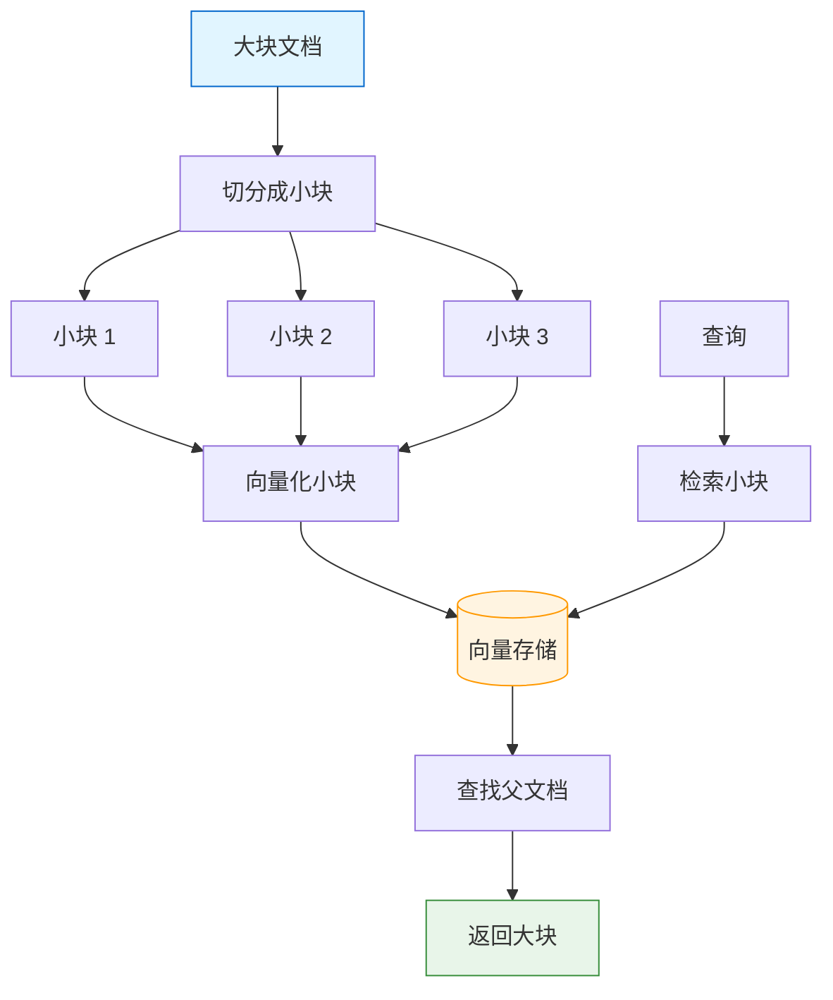
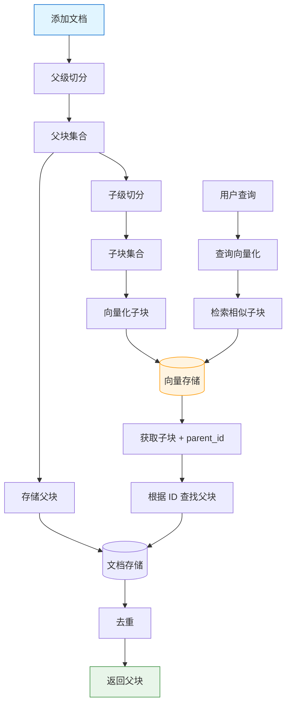
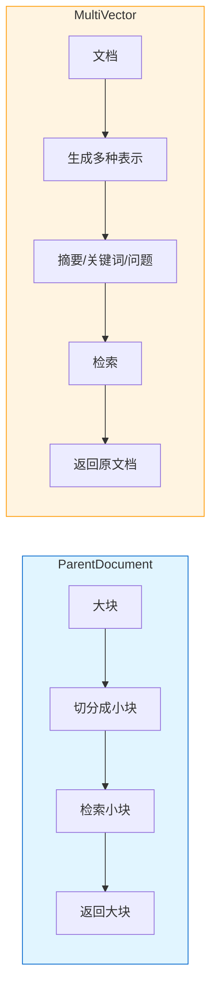

# ParentDocumentRetriever

> ParentDocumentRetriever 通过小块检索、大块返回的方式，平衡检索精度和上下文完整性。本章将详细讲解其原理和应用。

## 什么是 ParentDocumentRetriever？

**ParentDocumentRetriever** 是一种智能检索策略：将大块文档切分成小块进行向量化和检索，但返回时返回包含小块的完整大块（父文档）。

::: v-pre

:::

### 解决的问题

| 问题 | 解释 |
|------|------|
| **大块检索不精准** | 大块包含噪声，向量被稀释，难以精准匹配 |
| **小块上下文不足** | 小块检索精准但返回的内容可能不完整 |
| **ParentDocument** | 小块检索 + 大块返回，两全其美 |

### 与 MultiVector 对比

```python
# MultiVectorRetriever
# - 多种语义表示（摘要/关键词/问题）
# - 适用于生成多种检索视角

# ParentDocumentRetriever  
# - 单一文本切分（大块→小块）
# - 适用于需要完整上下文的场景
```

## 原理详解

### 工作流程

```python
# 1. 准备大块文档
parent_docs = [
    Document(page_content="这是完整的大块文档内容..." * 100),
]

# 2. 切分成小块
from langchain_text_splitters import RecursiveCharacterTextSplitter

parent_splitter = RecursiveCharacterTextSplitter(
    chunk_size=2000,  # 父块大小
    chunk_overlap=200
)

child_splitter = RecursiveCharacterTextSplitter(
    chunk_size=500,   # 子块大小
    chunk_overlap=50
)

# 3. 创建父子映射
# parent_doc.id -> parent_doc.content
# child_doc -> (child_content, parent_id)

# 4. 向量化小块
child_vectorstore.add_documents(child_docs)

# 5. 存储大块
parent_docstore[doc_id] = parent_doc

# 6. 检索时
# - 检索相关小块
# - 根据 parent_id 找到父块
# - 返回去重后的父块
```

## 基础用法

```python
from langchain.retrievers import ParentDocumentRetriever
from langchain.storage import InMemoryStore
from langchain_community.vectorstores import FAISS
from langchain_text_splitters import RecursiveCharacterTextSplitter
from langchain_openai import OpenAIEmbeddings

# 初始化组件
embeddings = OpenAIEmbeddings()
vectorstore = FAISS.from_texts([], embedding=embeddings)
docstore = InMemoryStore()

# 定义切分器
parent_splitter = RecursiveCharacterTextSplitter(
    chunk_size=2000,
    chunk_overlap=200
)

child_splitter = RecursiveCharacterTextSplitter(
    chunk_size=400,
    chunk_overlap=50
)

# 创建 ParentDocumentRetriever
retriever = ParentDocumentRetriever(
    vectorstore=vectorstore,
    docstore=docstore,
    child_splitter=child_splitter,
    parent_splitter=parent_splitter,  # 可选
)

# 准备文档
from langchain_core.documents import Document

documents = [
    Document(
        page_content="长篇文档内容..." * 50,
        metadata={"source": "doc1.pdf"}
    ),
    Document(
        page_content="另一篇长文档..." * 60,
        metadata={"source": "doc2.pdf"}
    ),
]

# 添加文档（自动切分）
retriever.add_documents(documents)

# 检索
results = retriever.invoke("查询问题")
# 返回的是完整的父块，而非小块
```

## 完整配置

```python
from langchain.retrievers import ParentDocumentRetriever
from langchain.storage import InMemoryStore
from langchain_community.vectorstores import FAISS
from langchain_text_splitters import RecursiveCharacterTextSplitter
from langchain_openai import OpenAIEmbeddings, ChatOpenAI
from langchain_core.runnables import RunnablePassthrough
from langchain_core.prompts import ChatPromptTemplate
from langchain_core.output_parsers import StrOutputParser
from langchain_core.documents import Document

# ==================== 组件初始化 ====================

# 嵌入
embeddings = OpenAIEmbeddings(model="text-embedding-3-small")

# 向量存储
vectorstore = FAISS.from_texts([], embedding=embeddings)

# 文档存储
docstore = InMemoryStore()

# 切分器配置
parent_splitter = RecursiveCharacterTextSplitter(
    chunk_size=2000,   # 父块 ~2000 字符
    chunk_overlap=200,
    separators=["\n\n", "\n", "。", ".", " "]
)

child_splitter = RecursiveCharacterTextSplitter(
    chunk_size=400,    # 子块 ~400 字符
    chunk_overlap=50,
    separators=["\n\n", "\n", "。", ".", " "]
)

# ==================== 创建检索器 ====================

retriever = ParentDocumentRetriever(
    vectorstore=vectorstore,
    docstore=docstore,
    child_splitter=child_splitter,
    parent_splitter=parent_splitter,
    search_kwargs={"k": 5},  # 检索 5 个小块
)

# ==================== 添加文档 ====================

documents = [
    Document(
        page_content="""
Python 是一门高级编程语言，由 Guido van Rossum 于 1989 年发明。
Python 的设计哲学强调代码的可读性和简洁性。

Python 的主要特点：
1. 简洁易读的语法
2. 动态类型系统
3. 自动内存管理
4. 丰富的标准库
5. 庞大的第三方库生态系统

Python 广泛应用于：
- Web 开发（Django, Flask）
- 数据科学（NumPy, Pandas）
- 机器学习（TensorFlow, PyTorch）
- 自动化脚本
- 网络爬虫

Python 的版本演进：
- Python 2.x（已停止维护）
- Python 3.x（当前主流版本）
- Python 3.12（最新版本）
        """,
        metadata={"source": "python_intro.md", "category": "编程"}
    ),
    # ... 更多文档
]

# 索引文档
retriever.add_documents(documents)

print(f"已索引 {len(documents)} 个父文档")
print(f"子文档数量：{vectorstore.index.ntotal}")

# ==================== 创建 RAG 链 ====================

# 格式化检索结果
def format_docs(docs):
    return "\n\n---\n\n".join([
        f"[来源：{doc.metadata.get('source', 'unknown')}]\n{doc.page_content}"
        for doc in docs
    ])

# 提示模板
prompt = ChatPromptTemplate.from_template("""
请基于以下上下文专业地回答问题。如果上下文不足以回答问题，请说明。

上下文：
{context}

问题：{question}

请用中文回答：
""")

# 创建链
chain = (
    {"context": retriever | format_docs, "question": RunnablePassthrough()}
    | prompt
    | ChatOpenAI(model="gpt-4o")
    | StrOutputParser()
)

# ==================== 使用 ====================

# 查询
response = chain.invoke("Python 有哪些特点？")
print(response)
```

## 检索流程图

::: v-pre

:::

## 高级配置

### 使用 Redis Store

```python
from langchain.storage import RedisStore

# 生产环境使用 Redis
docstore = RedisStore(
    redis_url="redis://localhost:6379",
    namespace="parent_docs"
)

retriever = ParentDocumentRetriever(
    vectorstore=vectorstore,
    docstore=docstore,
    child_splitter=child_splitter,
    parent_splitter=parent_splitter,
)
```

### 自定义存储策略

```python
# 存储多个父块（当子块属于多个父块时）
retriever = ParentDocumentRetriever(
    vectorstore=vectorstore,
    docstore=docstore,
    child_splitter=child_splitter,
    parent_splitter=parent_splitter,
    search_kwargs={"k": 10},  # 检索更多子块
)
```

### 检索配置

```python
# 带过滤的检索
retriever = ParentDocumentRetriever(
    vectorstore=vectorstore,
    docstore=docstore,
    child_splitter=child_splitter,
    parent_splitter=parent_splitter,
    search_kwargs={
        "k": 5,
        "filter": {"category": "技术"}
    }
)
```

## 切分器配置策略

### 配置建议

| 文档类型 | 父块大小 | 子块大小 | 说明 |
|----------|----------|----------|------|
| 技术文档 | 2000 | 400 | 保持章节完整 |
| 长文章 | 3000 | 500 | 保持段落完整 |
| 对话数据 | 1000 | 200 | 保持对话轮次 |
| 法律文书 | 4000 | 800 | 保持条款完整 |

### 代码优化

```python
# 根据文档类型动态选择配置
def get_splitter_config(doc_type: str):
    configs = {
        "technical": {
            "parent_size": 2000,
            "child_size": 400,
            "parent_overlap": 200,
            "child_overlap": 50,
        },
        "article": {
            "parent_size": 3000,
            "child_size": 500,
            "parent_overlap": 300,
            "child_overlap": 50,
        },
        "legal": {
            "parent_size": 4000,
            "child_size": 800,
            "parent_overlap": 400,
            "child_overlap": 100,
        },
    }
    
    config = configs.get(doc_type, configs["technical"])
    
    parent_splitter = RecursiveCharacterTextSplitter(
        chunk_size=config["parent_size"],
        chunk_overlap=config["parent_overlap"]
    )
    
    child_splitter = RecursiveCharacterTextSplitter(
        chunk_size=config["child_size"],
        chunk_overlap=config["child_overlap"]
    )
    
    return parent_splitter, child_splitter
```

## 与 MultiVector 的区别

::: v-pre

:::

### 详细对比

| 维度 | ParentDocument | MultiVector |
|------|----------------|-------------|
| **切分方式** | 文本切分（大块→小块） | 语义生成（摘要/关键词/问题） |
| **计算成本** | 低（只需切分） | 高（需要 LLM 生成） |
| **子表示数量** | 固定（按切分） | 可配置（3-5 种） |
| **适用场景** | 长文档检索 | 语义增强检索 |
| **实现复杂度** | 简单 | 中等 |
| **检索精度** | 高（精确匹配） | 很高（语义匹配） |

### 选择指南

```python
def choose_retriever(requirements: dict):
    if requirements.get("doc_length", "medium") == "very_long":
        return "ParentDocumentRetriever"
    
    if requirements.get("need_semantic_views", False):
        return "MultiVectorRetriever"
    
    if requirements.get("cost_sensitive", True):
        return "ParentDocumentRetriever"
    
    if requirements.get("accuracy_priority", False):
        return "MultiVectorRetriever"
    
    # 默认
    return "ParentDocumentRetriever"
```

## 性能优化

### 1. 批量索引

```python
def batch_add_documents(retriever, documents, batch_size=20):
    """批量添加文档"""
    for i in range(0, len(documents), batch_size):
        batch = documents[i:i+batch_size]
        retriever.add_documents(batch)
        print(f"已索引 {i+len(batch)}/{len(documents)}")
```

### 2. 缓存优化

```python
# 使用持久化存储替代 InMemoryStore
from langchain.storage import LocalFileStore

docstore = LocalFileStore("./docstore_cache")

retriever = ParentDocumentRetriever(
    vectorstore=vectorstore,
    docstore=docstore,
    child_splitter=child_splitter,
    parent_splitter=parent_splitter,
)
```

### 3. 向量存储优化

```python
# FAISS 索引配置
import faiss

index = faiss.IndexHNSWFlat(
    embeddings.embedding_size,
    M=64,  # 连接数
    metric_type=faiss.METRIC_INNER_PRODUCT
)

vectorstore = FAISS(embeddings, index, None, None)
```

## 常见问题

### Q1: 父块和子块大小如何选择？

**A**: 
- 子块：足够小以精准匹配查询（300-600 字符）
- 父块：足够大以提供完整上下文（1500-3000 字符）

### Q2: 如何处理重叠？

**A**: 
- 子块重叠：50-100 字符，避免边界切割
- 父块重叠：100-300 字符，保持上下文连贯

### Q3: 什么时候不使用 ParentDocument？

**A**: 
- 文档本身就很短（<1000 字符）
- 需要精确返回特定片段
- 存储资源有限

## 本章小结

本章介绍了 ParentDocumentRetriever：

1. **核心原理**：小块检索 + 大块返回
2. **基础用法**：ParentDocumentRetriever 配置
3. **完整示例**：可运行的 RAG 系统
4. **高级配置**：Redis Store、自定义策略
5. **与 MultiVector 对比**：选择指南
6. **性能优化**：批量、缓存、索引优化

下一章我们将学习 **RAG 最佳实践**，总结完整的 RAG 优化策略。

## 继续学习

- [RAG 最佳实践](./rag-best-practices.md) - 完整优化指南
- [多向量检索器](./multi-vector-retriever.md) - 高级检索回顾
- [检索器](./retrievers.md) - 检索策略回顾
- [文本分割器](./text-splitters.md) - 切分策略回顾