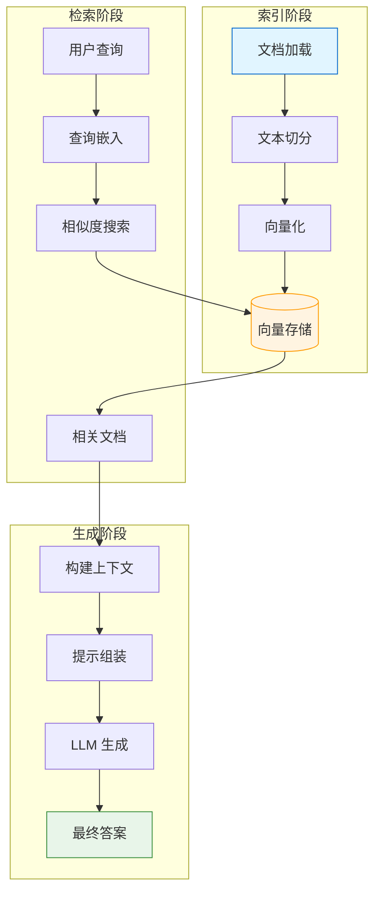
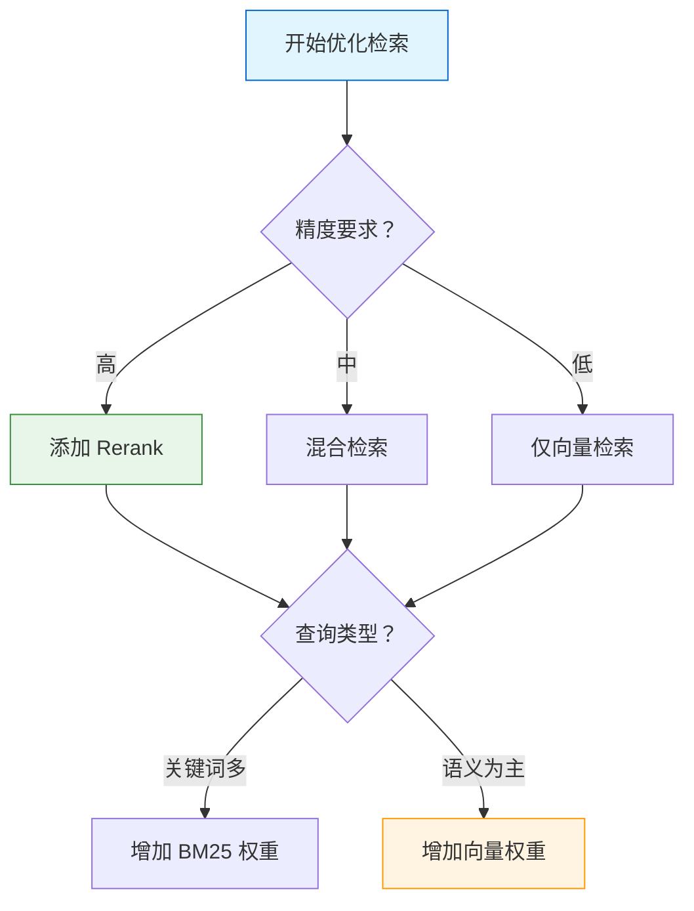
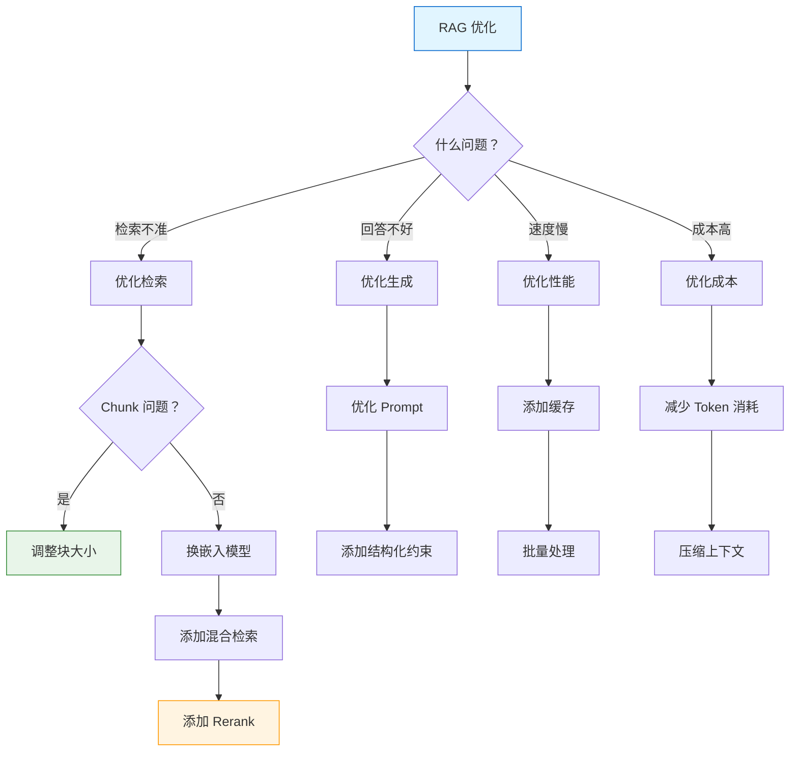

# RAG 最佳实践

> RAG（检索增强生成）最佳实践总结。本章汇总检索质量优化、生成质量优化、生产部署策略和常见问题排查清单。

## RAG 系统架构总览

::: v-pre

:::

RAG 质量由三个关键因素决定：
1. **检索质量**：能否找到相关文档
2. **上下文质量**：文档是否有助于回答问题
3. **生成质量**：LLM 是否充分利用上下文

## 检索质量优化

### 1. Chunking 策略优化

块大小直接影响检索效果。

```python
# 测试不同块大小
chunk_sizes = [256, 512, 1024, 2048]
results = {}

for size in chunk_sizes:
    splitter = RecursiveCharacterTextSplitter(
        chunk_size=size,
        chunk_overlap=size // 5
    )
    
    chunks = splitter.split_documents(docs)
    vectorstore = FAISS.from_documents(chunks, embeddings)
    retriever = vectorstore.as_retriever(search_kwargs={"k": 5})
    
    # 评估检索效果
    score = evaluate_retrieval(retriever, test_queries)
    results[size] = score
    print(f"chunk_size={size}: 检索得分={score:.2f}")

# 选择最优配置
best_size = max(results, key=results.get)
```

### 块大小建议

| 内容类型 | 建议块大小 | 重叠 |
|----------|------------|------|
| 普通文档 | 500-1000 | 50-100 |
| 技术文档 | 1000-2000 | 100-200 |
| 对话数据 | 200-500 | 50 |
| 法律条款 | 800-1500 | 100 |
| 代码文件 | 按函数/类 | 0 |

### 2. 嵌入模型选择

```python
# 嵌入模型对比
from langchain_openai import OpenAIEmbeddings
from langchain_huggingface import HuggingFaceEmbeddings

# OpenAI - 通用最佳
openai_emb = OpenAIEmbeddings(model="text-embedding-3-small")

# HF MiniLM - 轻量级
hf_mini = HuggingFaceEmbeddings(model_name="all-MiniLM-L6-v2")

# HF mpnet - 高质量
hf_mpnet = HuggingFaceEmbeddings(model_name="all-mpnet-base-v2")

# 中文专用
chinese_emb = HuggingFaceEmbeddings(model_name="shibing624/text2vec-base-chinese")
```

### 3. 混合检索

```python
from langchain.retrievers import EnsembleRetriever
from langchain_community.retrievers import BM25Retriever

# 向量检索
vector_retriever = vectorstore.as_retriever(search_kwargs={"k": 5})

# 关键词检索
bm25_retriever = BM25Retriever.from_documents(docs, k=5)

# 混合
ensemble = EnsembleRetriever(
    retrievers=[bm25_retriever, vector_retriever],
    weights=[0.4, 0.6]  # 根据场景调整
)
```

### 4. 重排序 (Rerank)

```python
from langchain.retrievers.document_compressors import CrossEncoderReranker
from langchain_community.cross_encoders import HuggingFaceCrossEncoder

# 初始检索
base_retriever = vectorstore.as_retriever(search_kwargs={"k": 20})

# 重排序
reranker = CrossEncoderReranker(
    encoder=HuggingFaceCrossEncoder(
        model_name="BAAI/bge-reranker-large"
    ),
    top_n=5  # 保留前 5 个
)

# 组合
from langchain.retrievers import ContextualCompressionRetriever
final_retriever = ContextualCompressionRetriever(
    base_compressor=reranker,
    base_retriever=base_retriever
)
```

### 5. Hybrid 检索决策树

::: v-pre

:::

## 生成质量优化

### 1. Prompt 优化

```python
from langchain_core.prompts import ChatPromptTemplate

# ❌ 不好的 Prompt
BAD_PROMPT = ChatPromptTemplate.from_template("""
基于以下内容回答问题：
{context}
问题：{question}
""")

# ✅ 好的 Prompt
GOOD_PROMPT = ChatPromptTemplate.from_template("""
你是一个专业的问答助手。请根据以下上下文回答问题。

【要求】
1. 只基于提供的上下文回答，不要编造信息
2. 如果上下文不足以回答问题，请说明
3. 引用上下文中的关键信息支持你的回答
4. 使用 Markdown 格式组织回答

【上下文】
{context}

【问题】
{question}

【回答】
""")

# ✅ 更好的 Prompt（带示例）
FEWSHOT_PROMPT = ChatPromptTemplate.from_messages([
    ("system", """你是一个专业助手。基于上下文回答问题。

如果问题无法基于上下文回答，请说"根据提供的信息无法回答此问题"。

好的回答示例：
- 直接回答问题
- 引用相关数据
- 结构化呈现"""),
    ("human", "【上下文】\n{context}\n\n【问题】\n{question}\n\n【回答】")
])
```

### 2. 上下文构建

```python
# 优化上下文格式
def format_context(docs):
    """格式化文档为上下文"""
    sections = []
    
    for i, doc in enumerate(docs, 1):
        source = doc.metadata.get("source", "未知来源")
        page = doc.metadata.get("page", "")
        
        sections.append(f"""
--- 资料{i} ---
来源：{source}{' 第' + str(page) + '页' if page else ''}
内容：{doc.page_content}
        """)
    
    return "\n".join(sections)

# 使用
context = format_docs(retrieved_docs)
```

### 3. Structured Output

```python
from pydantic import BaseModel, Field

class RAGResponse(BaseModel):
    """结构化响应"""
    answer: str = Field(description="对问题的回答")
    confidence: float = Field(description="置信度 0-1")
    citations: list[str] = Field(description="引用的来源")
    has_sufficient_context: bool = Field(description="上下文是否足够回答问题")

# 使用结构化输出
llm = ChatOpenAI(model="gpt-4o").with_structured_output(RAGResponse)

chain = (
    {"context": retriever, "question": RunnablePassthrough()}
    | format_docs
    | prompt
    | llm
)

response = chain.invoke("问题")
print(response.answer)
print(f"引用：{response.citations}")
print(f"置信度：{response.confidence}")
```

### 4. 防止幻觉

```python
# 添加反幻觉指令
ANTI_HALLUCINATION_PROMPT = ChatPromptTemplate.from_template("""
【重要指示】
你必须严格遵守以下规则：
1. 只能使用【上下文】中提供的信息
2. 不要编造上下文之外的任何信息
3. 如果上下文不足以回答问题，请直接说"根据提供的信息无法回答"
4. 不要添加上下文未提及的观点或建议

【上下文】
{context}

【问题】
{question}

【回答】
""")
```

## 生产部署优化

### 1. 缓存策略

```python
from functools import lru_cache
import hashlib

class CachedRAG:
    def __init__(self, rag_chain):
        self.rag_chain = rag_chain
        self.query_cache = {}
    
    def _hash_query(self, query: str) -> str:
        return hashlib.md5(query.encode()).hexdigest()
    
    def invoke(self, query: str):
        query_hash = self._hash_query(query)
        
        if query_hash not in self.query_cache:
            self.query_cache[query_hash] = self.rag_chain.invoke(query)
        
        return self.query_cache[query_hash]

# 使用
cached_rag = CachedRAG(rag_chain)
response = cached_rag.invoke("常见问题")  # 后续调用会命中缓存
```

### 2. 批处理

```python
async def batch_query(queries: list[str]) -> list:
    """批量处理查询"""
    import asyncio
    
    async def process_single(query):
        return await rag_chain.ainvoke(query)
    
    results = await asyncio.gather(*[
        process_single(q) for q in queries
    ])
    
    return results

# 使用
queries = ["问题 1", "问题 2", "问题 3"]
responses = await batch_query(queries)
```

### 3. 监控和日志

```python
from langchain.callbacks import get_openai_callback
import logging

def monitored_invoke(query: str):
    with get_openai_callback() as cb:
        response = rag_chain.invoke(query)
        
        # 记录指标
        logging.info({
            "query": query[:50],
            "tokens_used": cb.total_tokens,
            "cost": cb.total_cost,
            "response_length": len(response)
        })
        
        return response
```

### 4. 降级策略

```python
def robust_rag(query: str):
    """带降级策略的 RAG"""
    try:
        # 主流程
        return rag_chain.invoke(query)
    except Exception as e:
        logging.warning(f"RAG 失败：{e}")
        
        # 降级 1: 增加 k 值重试
        try:
            retriever.search_kwargs["k"] = 10
            return rag_chain.invoke(query)
        except:
            pass
        
        # 降级 2: 使用纯 LLM（不检索）
        llm = ChatOpenAI(model="gpt-4o")
        return llm.invoke(query).content
```

## 常见问题排查清单

### 检索问题

| 问题 | 可能原因 | 解决方案 |
|------|----------|----------|
| **检索不到相关文档** | 块大小不合适 | 尝试更小的 chunk_size |
| | 嵌入模型不匹配 | 切换嵌入模型（中文用中文模型） |
| | 查询嵌入质量差 | 优化查询表述 |
| **检索结果太多噪声** | k 值过大 | 减小 k，添加 rerank |
| | 过滤条件不足 | 增加元数据过滤 |
| **部分文档无法检索** | 未正确索引 | 检查索引流程 |
| | 嵌入失败 | 检查异常处理 |

### 生成问题

| 问题 | 可能原因 | 解决方案 |
|------|----------|----------|
| **LLM 忽略上下文** | Prompt 不清晰 | 强化上下文重要性说明 |
| | 上下文太长 | 优化块大小和 k 值 |
| **幻觉/捏造** | 约束不足 | 添加反幻觉指令 |
| | 模型能力问题 | 换用更强模型 |
| **回答不完整** | 上下文不足 | 增加 k 值或使用父文档检索 |

### 性能问题

| 问题 | 可能原因 | 解决方案 |
|------|----------|----------|
| **响应慢** | 检索过多文档 | 减小 k 值 |
| | 文档切分太细 | 增大 chunk_size |
| | LLM 调用过多 | 实现缓存 |
| **成本高** | Token 消耗大 | 优化上下文长度 |
| | 频繁调用嵌入 API | 缓存查询结果 |

## RAG 优化决策树

::: v-pre

:::

## 评估指标

```python
from sklearn.metrics import precision_score, recall_score, f1_score
import numpy as np

class RAGEvaluator:
    def __init__(self, rag_chain, test_cases):
        self.rag_chain = rag_chain
        self.test_cases = test_cases  # [(query, expected_docs, expected_answer)]
    
    def evaluate(self):
        metrics = {
            "retrieval_precision": [],
            "retrieval_recall": [],
            "answer_accuracy": [],
            "latency": [],
        }
        
        for query, expected_docs, expected_answer in self.test_cases:
            import time
            start = time.time()
            
            result = self.rag_chain.invoke(query)
            latency = time.time() - start
            
            # 检索指标
            retrieved_docs = set(result["source_docs"])
            expected_set = set(expected_docs)
            
            if expected_set:
                precision = len(retrieved_docs & expected_set) / len(retrieved_docs)
                recall = len(retrieved_docs & expected_set) / len(expected_set)
            else:
                precision = recall = 1.0
            
            metrics["retrieval_precision"].append(precision)
            metrics["retrieval_recall"].append(recall)
            
            # 答案质量（可替换为更复杂的评估）
            answer_match = expected_answer.lower() in result["answer"].lower()
            metrics["answer_accuracy"].append(1.0 if answer_match else 0.5)
            metrics["latency"].append(latency)
        
        return {
            k: np.mean(v) for k, v in metrics.items()
        }

# 使用
evaluator = RAGEvaluator(rag_chain, test_cases)
report = evaluator.evaluate()
print(f"检索精确率：{report['retrieval_precision']:.2f}")
print(f"检索召回率：{report['retrieval_recall']:.2f}")
print(f"答案准确率：{report['answer_accuracy']:.2f}")
print(f"平均延迟：{report['latency']:.2f}s")
```

## 完整最佳实践清单

### ✅ 检索优化

- [ ] Chunk 大小适合内容类型（500-2000）
- [ ] 使用合适的嵌入模型（中文用中文模型）
- [ ] 考虑混合检索（BM25 + 向量）
- [ ] 对高精度场景添加 Rerank
- [ ] 使用元数据过滤提高精度
- [ ] 测试不同 k 值

### ✅ 生成优化

- [ ] Prompt 清晰说明约束
- [ ] 添加反幻觉指令
- [ ] 格式化上下文提高可读性
- [ ] 考虑结构化输出
- [ ] 处理"无法回答"的情况

### ✅ 性能优化

- [ ] 实现查询缓存
- [ ] 批量处理请求
- [ ] 优化向量索引类型
- [ ] 监控 Token 消耗

### ✅ 运维监控

- [ ] 记录检索质量指标
- [ ] 监控 LLM 调用成本
- [ ] 设置告警阈值
- [ ] 定期评估和调优

## 本章小结

本章汇总了 RAG 系统的最佳实践：

1. **检索优化**：Chunking、嵌入模型、混合检索、Rerank
2. **生成优化**：Prompt 工程、上下文格式、结构化输出
3. **部署优化**：缓存、批处理、降级策略
4. **问题排查**：检索/生成/性能问题清单
5. **评估指标**：精确率、召回率、延迟

## 继续学习

- [文档加载器](./document-loaders.md) - 数据加载
- [文本分割器](./text-splitters.md) - 切分策略
- [嵌入模型](./embeddings.md) - 向量化
- [向量存储](./vector-stores.md) - 向量数据库
- [检索器](./retrievers.md) - 检索策略