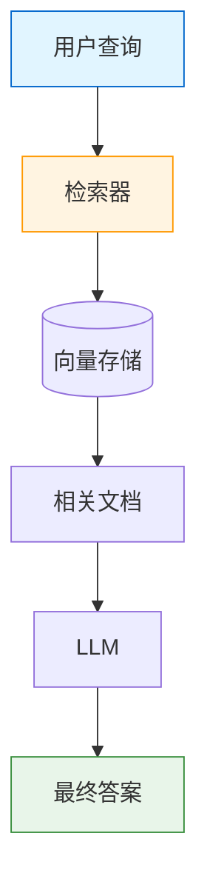
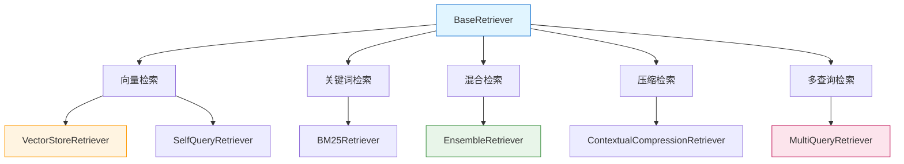
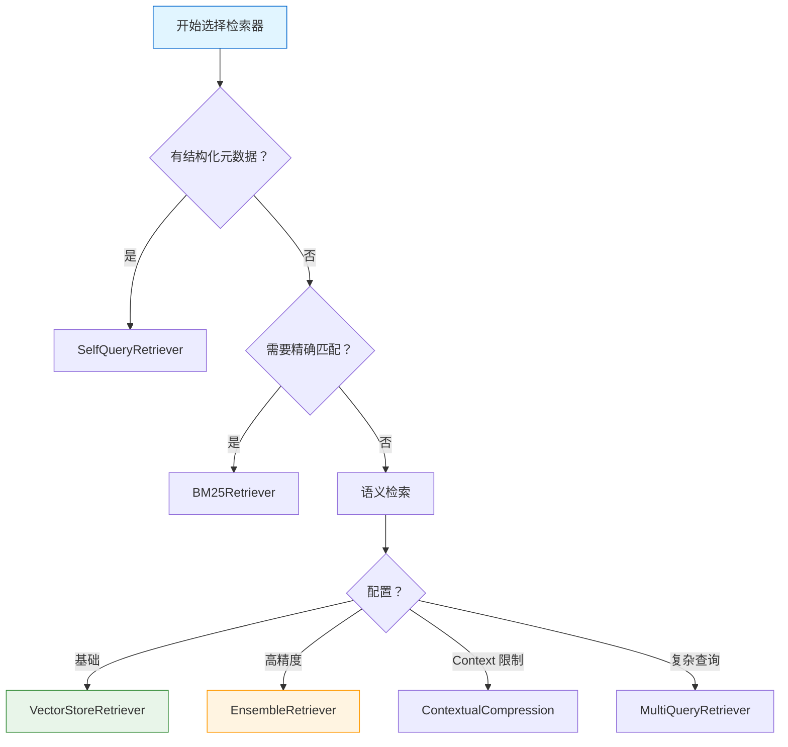

# 检索器

> Retriever（检索器）负责从向量存储中检索相关文档。本章将介绍各种检索策略和高级技巧。

## 什么是 Retriever？

**Retriever（检索器）** 是一个接口，用于从数据源（通常是向量存储）检索相关文档。它是 RAG 流水线的核心组件。

::: v-pre

:::

```python
from langchain_community.vectorstores import FAISS
from langchain_openai import OpenAIEmbeddings

# 创建向量存储
embeddings = OpenAIEmbeddings()
vectorstore = FAISS.from_documents(documents, embeddings)

# 获取检索器
retriever = vectorstore.as_retriever(
    search_type="similarity",
    search_kwargs={"k": 4}
)

# 使用检索器
docs = retriever.invoke("查询内容")
```

💡 **提示**：检索器是一个抽象层，可以灵活切换不同的检索策略。

## VectorStoreRetriever

这是最基础的检索器，直接从向量存储检索。

### 基础用法

```python
from langchain_community.vectorstores import FAISS
from langchain_openai import OpenAIEmbeddings

# 创建向量存储
embeddings = OpenAIEmbeddings()
vectorstore = FAISS.from_documents(docs, embeddings)

# 创建检索器
retriever = vectorstore.as_retriever()

# 检索文档
results = retriever.invoke("查询问题")

# 带参数
retriever = vectorstore.as_retriever(
    search_type="similarity",  # 或 mmr, similarity_score_threshold
    search_kwargs={
        "k": 5,                    # 返回数量
        "score_threshold": 0.7,    # 分数阈值
        "filter": {"category": "tech"}  # 过滤条件
    }
)
```

### 搜索类型

```python
# 1. 相似度搜索（默认）
retriever = vectorstore.as_retriever(
    search_type="similarity",
    search_kwargs={"k": 4}
)

# 2. MMR（最大边际相关）- 多样性
retriever = vectorstore.as_retriever(
    search_type="mmr",
    search_kwargs={
        "k": 4,
        "fetch_k": 20,         # 先取 20 个
        "lambda_mult": 0.5     # 多样性权重
    }
)

# 3. 分数阈值
retriever = vectorstore.as_retriever(
    search_type="similarity_score_threshold",
    search_kwargs={"score_threshold": 0.7}
)
```

## BM25Retriever - 关键词检索

**BM25** 是基于关键词匹配的传统检索算法，与向量检索互补。

```python
from langchain_community.retrievers import BM25Retriever
from langchain_core.documents import Document

# 准备文档
documents = [
    Document(page_content="Python 是编程语言"),
    Document(page_content="机器学习需要数据"),
    Document(page_content="深度学习使用神经网络"),
]

# 创建 BM25 检索器
retriever = BM25Retriever.from_documents(
    documents,
    k=3
)

# 检索
results = retriever.invoke("Python 编程")
print(results)
# 会精确匹配包含"Python"和"编程"的文档
```

### 与向量检索结合

```python
# 混合检索通常效果更好
from langchain.retrievers import EnsembleRetriever
from langchain_community.vectorstores import FAISS
from langchain_openai import OpenAIEmbeddings

# 向量检索器
embeddings = OpenAIEmbeddings()
vectorstore = FAISS.from_documents(docs, embeddings)
vector_retriever = vectorstore.as_retriever(search_kwargs={"k": 3})

# BM25 检索器
bm25_retriever = BM25Retriever.from_documents(docs, k=3)

# 组合
ensemble_retriever = EnsembleRetriever(
    retrievers=[bm25_retriever, vector_retriever],
    weights=[0.5, 0.5]  # 权重分配
)

results = ensemble_retriever.invoke("查询")
```

## EnsembleRetriever - 混合检索

**EnsembleRetriever** 组合多个检索器，结合不同检索策略的优势。

```python
from langchain.retrievers import EnsembleRetriever

# 组合多个检索器
ensemble = EnsembleRetriever(
    retrievers=[
        bm25_retriever,      # 关键词匹配
        vector_retriever,    # 语义匹配
        hybrid_retriever,    # 其他策略
    ],
    weights=[0.4, 0.4, 0.2]  # 权重
)

results = ensemble.invoke("查询")
```

### 自定义加权

```python
# 根据查询动态调整权重
class AdaptiveEnsembleRetriever:
    def __init__(self, retrievers):
        self.retrievers = retrievers
    
    def invoke(self, query):
        # 分析查询类型
        if self._is_keyword_query(query):
            weights = [0.8, 0.2]  # 关键词检索权重高
        else:
            weights = [0.3, 0.7]  # 语义检索权重高
        
        results = []
        for retriever, weight in zip(self.retrievers, weights):
            sub_results = retriever.invoke(query)
            for doc in sub_results:
                doc.metadata["score"] = weight
            results.extend(sub_results)
        
        # 去重和排序
        return self._deduplicate(results)
```

## ContextualCompressionRetriever

**ContextualCompressionRetriever** 在检索后对结果进行再排序和压缩。

```python
from langchain.retrievers import ContextualCompressionRetriever
from langchain.retrievers.document_compressors import LLMChainExtractor
from langchain_openai import ChatOpenAI

# 基础检索器
base_retriever = vectorstore.as_retriever(search_kwargs={"k": 10})

# 压缩器：用 LLM 提取相关内容
llm = ChatOpenAI(model="gpt-4o")
compressor = LLMChainExtractor.from_llm(llm)

# 组合
compression_retriever = ContextualCompressionRetriever(
    base_compressor=compressor,
    base_retriever=base_retriever
)

# 使用
results = compression_retriever.invoke("查询")
# 返回的是压缩后的精简文档
```

### 不同压缩器

```python
from langchain.retrievers.document_compressors import (
    LLMChainExtractor,
    LLMChainFilter,
    EmbeddingsFilter,
)

# 1. LLM 提取器
compressor = LLMChainExtractor.from_llm(llm)

# 2. LLM 过滤器
compressor = LLMChainFilter.from_llm(llm)

# 3. 嵌入过滤器（基于相似度过滤）
compressor = EmbeddingsFilter(
    embeddings=embeddings,
    similarity_threshold=0.7
)
```

## SelfQueryRetriever

**SelfQueryRetriever** 可以从查询中提取结构化过滤条件。

```python
from langchain.retrievers import SelfQueryRetriever
from langchain.chains.query_constructor.base import AttributeInfo

# 定义元数据字段
metadata_field_info = [
    AttributeInfo(
        name="category",
        description="文档类别",
        type="string",
    ),
    AttributeInfo(
        name="date",
        description="发布日期 YYYY-MM-DD",
        type="date",
    ),
    AttributeInfo(
        name="author",
        description="作者名称",
        type="string",
    ),
]

# 文档内容描述
document_content_description = "技术文档和文章"

# 创建 SelfQueryRetriever
retriever = SelfQueryRetriever.from_llm(
    llm=ChatOpenAI(model="gpt-4o"),
    vectorstore=vectorstore,
    document_contents=document_content_description,
    metadata_field_info=metadata_field_info,
    verbose=True
)

# 使用
# 查询："找一下张三写的技术文档"
# 会自动提取 filter: {"author": "张三", "category": "技术"}
results = retriever.invoke("找一下张三写的技术文档")
```

### 启用过滤

```python
retriever = SelfQueryRetriever.from_llm(
    llm=llm,
    vectorstore=vectorstore,
    document_contents="技术文档",
    metadata_field_info=metadata_field_info,
    enable_limit=True,      # 支持 limit
    force_wrap_filter=True, # 强制使用过滤
)
```

## MultiQueryRetriever

**MultiQueryRetriever** 生成多个版本的查询，从不同角度检索。

```python
from langchain.retrievers.multi_query import MultiQueryRetriever
from langchain_openai import ChatOpenAI

# 基础检索器
base_retriever = vectorstore.as_retriever()

# 创建 MultiQueryRetriever
retriever = MultiQueryRetriever.from_llm(
    retriever=base_retriever,
    llm=ChatOpenAI(model="gpt-4o"),
    include_original=True  # 包含原始查询
)

# 使用
results = retriever.invoke("查询问题")

# 查看生成的多个查询
print(f"生成的查询版本数：{len(results)}")
```

### 自定义提示

```python
from langchain_core.prompts import PromptTemplate
from langchain.retrievers.multi_query import MultiQueryRetriever

QUERY_PROMPT = PromptTemplate(
    input_variables=["question"],
    template="""你是一个 AI 助手，你的任务是为以下问题生成 3 个不同版本的查询。
每个版本应该从不同角度提问，但语义相同。

原问题：{question}

生成的查询（每行一个）：
"""
)

retriever = MultiQueryRetriever.from_llm(
    retriever=base_retriever,
    llm=llm,
    prompt=QUERY_PROMPT,
)
```

## Retriever 类型层次图

::: v-pre

:::

### 对比表

| 检索器 | 原理 | 优点 | 缺点 | 适用场景 |
|--------|------|------|------|----------|
| **VectorStore** | 向量相似度 | 语义理解好 | 可能遗漏关键词 | 通用 |
| **BM25** | 关键词匹配 | 精确匹配 | 无语义理解 | 专业术语 |
| **Ensemble** | 多策略组合 | 效果全面 | 复杂度高 | 高精度需求 |
| **Compression** | 检索 + 压缩 | 结果精简 | 开销大 | 上下文有限 |
| **SelfQuery** | 提取过滤条件 | 可过滤筛选 | 需要结构化元数据 | 元数据丰富 |
| **MultiQuery** | 多版本查询 | 覆盖全面 | 多次检索开销大 | 复杂查询 |

## 实战配置

### 配置 1: 简单场景

```python
# 基础向量检索
retriever = vectorstore.as_retriever(
    search_type="similarity",
    search_kwargs={"k": 4}
)
```

### 配置 2: 高精度场景

```python
# 混合检索 + 压缩
from langchain.retrievers import EnsembleRetriever, ContextualCompressionRetriever
from langchain.retrievers.document_compressors import LLMChainExtractor

# 混合检索
ensemble = EnsembleRetriever(
    retrievers=[bm25_retriever, vector_retriever],
    weights=[0.5, 0.5]
)

# 添加压缩
compressor = LLMChainExtractor.from_llm(llm)
final_retriever = ContextualCompressionRetriever(
    base_compressor=compressor,
    base_retriever=ensemble
)
```

### 配置 3: 元数据过滤

```python
# SelfQuery 支持复杂过滤
retriever = SelfQueryRetriever.from_llm(
    llm=llm,
    vectorstore=vectorstore,
    document_contents="技术文档",
    metadata_field_info=[
        AttributeInfo(name="date", description="日期", type="date"),
        AttributeInfo(name="category", description="类别", type="string"),
    ],
    enable_limit=True,
)
```

## 检索策略选择

::: v-pre

:::

## 评估检索效果

```python
from sklearn.metrics import precision_score, recall_score
import numpy as np

def evaluate_retriever(retriever, test_queries, relevant_docs):
    """评估检索器效果"""
    precisions = []
    recalls = []
    
    for query, relevant in zip(test_queries, relevant_docs):
        results = retriever.invoke(query)
        retrieved_ids = [doc.metadata["id"] for doc in results]
        relevant_ids = set(relevant)
        
        # 计算精确率和召回率
        true_positives = len(set(retrieved_ids) & relevant_ids)
        precision = true_positives / len(retrieved_ids) if retrieved_ids else 0
        recall = true_positives / len(relevant_ids) if relevant_ids else 0
        
        precisions.append(precision)
        recalls.append(recall)
    
    return {
        "precision": np.mean(precisions),
        "recall": np.mean(recalls),
        "f1": 2 * np.mean(precisions) * np.mean(recalls) / (np.mean(precisions) + np.mean(recalls))
    }

# 使用
metrics = evaluate_retriever(retriever, test_queries, relevant_docs)
print(f"精确率：{metrics['precision']:.2f}")
print(f"召回率：{metrics['recall']:.2f}")
print(f"F1 分数：{metrics['f1']:.2f}")
```

## 本章小结

本章介绍了各种检索器：

1. **VectorStoreRetriever**：基础向量检索
2. **BM25Retriever**：关键词检索
3. **EnsembleRetriever**：混合检索
4. **ContextualCompressionRetriever**：压缩检索
5. **SelfQueryRetriever**：结构化过滤
6. **MultiQueryRetriever**：多版本查询
7. **选型指南**：根据场景选择合适的检索器

下一章我们将学习 **MultiVectorRetriever**，了解高级检索技术。

## 继续学习

- [多向量检索器](./multi-vector-retriever.md) - 高级检索
- [父文档检索器](./parent-doc-retriever.md) - 父子块检索
- [RAG 最佳实践](./rag-best-practices.md) - 完整指南
- [向量存储](./vector-stores.md) - 向量存储回顾