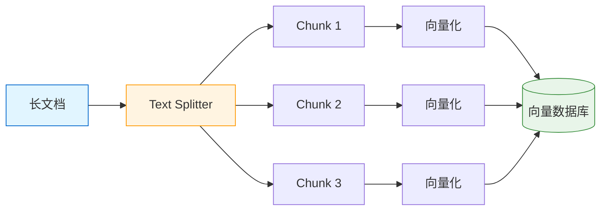
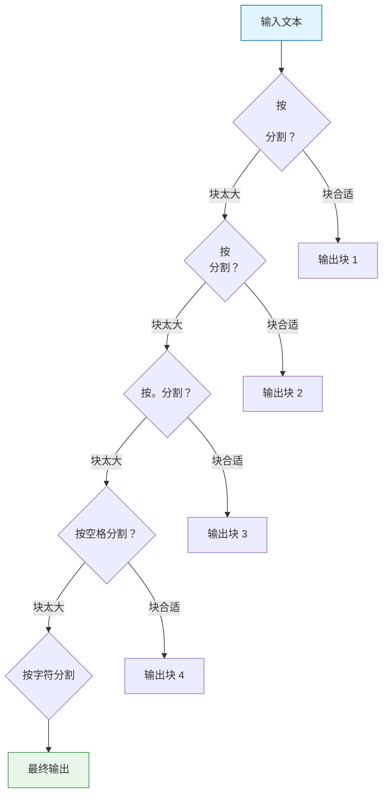
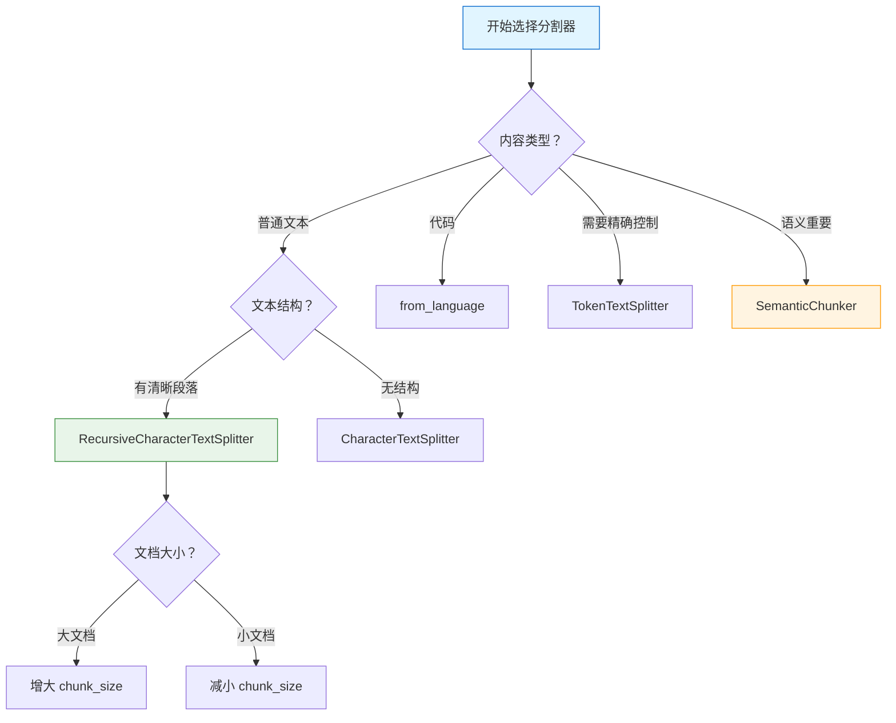
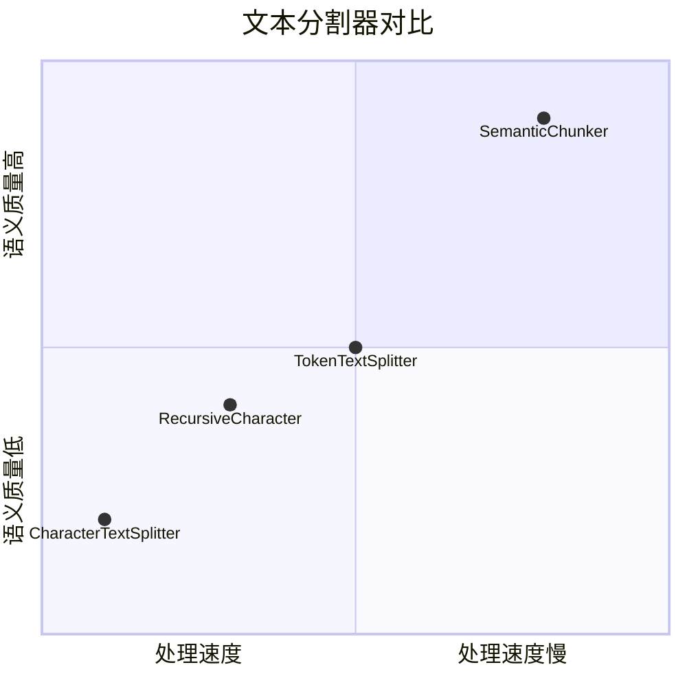

# 文本分割器

> Text Splitter 将长文档切分成小块，是 RAG 流程的关键步骤。本章将详细介绍各种分割策略和最佳实践。

## 为什么需要文本分割？

在 RAG 系统中，文本分割是关键步骤，原因包括：

1. **LLM 上下文限制**：模型有最大 token 限制
2. **检索精度**：小块更容易精准匹配查询
3. **成本控制**：只检索相关片段，减少 token 消耗
4. **向量质量**：语义连贯的小块生成更好的嵌入

::: v-pre

:::

### 分割尺寸建议

| 内容类型 | 建议块大小 | 重叠 |
|----------|------------|------|
| 普通文本 | 500-1000 tokens | 50-200 tokens |
| 技术文档 | 1000-2000 tokens | 100-300 tokens |
| 对话内容 | 200-500 tokens | 50-100 tokens |
| 代码片段 | 按函数/类分割 | 0-50 tokens |

💡 **提示**：块大小没有绝对标准，需要根据具体场景调整。较大的块包含更多上下文，但可能降低检索精度。

## CharacterTextSplitter

**CharacterTextSplitter** 是最简单的分割器，按字符数分割。

```python
from langchain_text_splitters import CharacterTextSplitter

# 基础使用
splitter = CharacterTextSplitter(
    separator="\n\n",      # 分隔符
    chunk_size=1000,       # 块大小（字符数）
    chunk_overlap=200,     # 重叠大小
    length_function=len,   # 长度计算函数
)

texts = splitter.split_text("这是一段很长的文本内容...")

# 或使用 split_documents
from langchain_core.documents import Document

docs = [Document(page_content="文档内容...")]
split_docs = splitter.split_documents(docs)

print(f"原始文档数：{len(docs)}")
print(f"分割后文档数：{len(split_docs)}")
```

### 参数说明

```python
splitter = CharacterTextSplitter(
    # 核心参数
    separator="\n\n",      # 首选分隔符
    chunk_size=1000,       # 目标块大小
    chunk_overlap=200,     # 块间重叠
    
    # 高级参数
    length_function=len,   # 计算长度的函数
    keep_separator=True,   # 是否保留分隔符
    add_start_index=False, # 是否添加块在原文中的起始索引
    strip_whitespace=True, # 是否去除空白
)
```

### 实际示例

```python
text = """
第一章：引言

人工智能正在改变世界。本章介绍 AI 的基本概念和发展历史。

第二章：机器学习

机器学习是 AI 的核心技术。主要包括监督学习、无监督学习和强化学习。

监督学习需要标注数据，无监督学习从无标注数据中发现模式。

第三章：深度学习

深度学习是机器学习的子领域，使用多层神经网络。

卷积神经网络用于图像处理，循环神经网络用于序列数据。
"""

splitter = CharacterTextSplitter(
    separator="\n\n",
    chunk_size=100,
    chunk_overlap=20,
)

chunks = splitter.split_text(text)

for i, chunk in enumerate(chunks):
    print(f"=== 块 {i+1} ({len(chunk)} 字符) ===")
    print(chunk[:50]}...")
```

## RecursiveCharacterTextSplitter

**RecursiveCharacterTextSplitter** 是最常用的分割器，它使用多级分隔符递归分割。

### 基础用法

```python
from langchain_text_splitters import RecursiveCharacterTextSplitter

splitter = RecursiveCharacterTextSplitter(
    chunk_size=1000,
    chunk_overlap=200,
    length_function=len,
    is_separator_regex=False,
)

chunks = splitter.split_text(long_text)
```

### 分隔符优先级

```python
# 默认分隔符（按优先级）
separators = [
    "\n\n",      # 段落
    "\n",        # 换行
    "。",        # 句子（中文）
    "!",         # 句子
    "？",        # 句子
    " ",         # 单词
    "",          # 字符
]

# 自定义分隔符
splitter = RecursiveCharacterTextSplitter(
    separators=["\n\n", "\n", ".", "。", " ", ""],
    chunk_size=500,
    chunk_overlap=50,
)
```

### 工作原理

::: v-pre

:::

```python
# 实际演示
text = """
这是第一段，包含多个句子。这是第二个句子。这是第三个句子。

这是第二段。同样有多个句子。

这是第三段。
"""

splitter = RecursiveCharacterTextSplitter(
    separators=["\n\n", "。", " "],
    chunk_size=30,
    chunk_overlap=5,
)

chunks = splitter.split_text(text)

for i, chunk in enumerate(chunks):
    print(f"块 {i+1}: [{chunk.strip()}]")
```

### 按类型配置

```python
# 针对代码的分割器
code_splitter = RecursiveCharacterTextSplitter.from_language(
    language="python",
    chunk_size=500,
    chunk_overlap=50,
)

# 支持的语言
# python, java, cpp, javascript, typescript, php, go, rust, ruby, etc.

code_text = """
def hello():
    print("Hello, World!")

class MyClass:
    def __init__(self):
        pass
"""

code_chunks = code_splitter.split_text(code_text)
```

## TokenTextSplitter

**TokenTextSplitter** 按 token 数量精确控制块大小，适合需要精确控制的场景。

```python
from langchain_text_splitters import TokenTextSplitter

splitter = TokenTextSplitter(
    chunk_size=500,        # 500 tokens
    chunk_overlap=50,      # 50 tokens 重叠
    model_name="gpt-4",    # 使用与目标模型一致的 tokenizer
)

chunks = splitter.split_text(text)

# 验证 token 数
import tiktoken
encoding = tiktoken.encoding_for_model("gpt-4")

for i, chunk in enumerate(chunks):
    token_count = len(encoding.encode(chunk))
    print(f"块 {i+1}: {token_count} tokens")
```

### 不同模型的 tokenizer

```python
# OpenAI 模型
splitter_gpt3 = TokenTextSplitter(model_name="gpt-3.5-turbo")
splitter_gpt4 = TokenTextSplitter(model_name="gpt-4")

# Claude
splitter_claude = TokenTextSplitter(model_name="claude-3")

# 本地模型
splitter_local = TokenTextSplitter(model_name="cl100k_base")
```

## SemanticChunker

**SemanticChunker** 基于语义相似度进行分割，能保持语义完整性。

```python
from langchain_experimental.text_splitter import SemanticChunker
from langchain_openai import OpenAIEmbeddings

# 需要嵌入模型
embeddings = OpenAIEmbeddings()

splitter = SemanticChunker(
    embeddings,
    breakpoint_threshold_type="percentile",  # 分割阈值类型
    breakpoint_threshold_amount=90,          # 百分位阈值
    chunk_size=500,                          # 最小块大小
    min_chunk_size=50,                       # 最小块大小
)

chunks = splitter.split_text(text)
```

### 分割阈值类型

```python
# percentile - 使用百分位阈值（推荐）
splitter = SemanticChunker(
    embeddings,
    breakpoint_threshold_type="percentile",
    breakpoint_threshold_amount=90,  # 90% 的相似度变化才分割
)

# standard_deviation - 使用标准差
splitter = SemanticChunker(
    embeddings,
    breakpoint_threshold_type="standard_deviation",
    breakpoint_threshold_amount=3,  # 3 个标准差
)

# interquartile - 使用四分位距
splitter = SemanticChunker(
    embeddings,
    breakpoint_threshold_type="interquartile",
)
```

### 语义分割原理

```python
# 语义分割工作流程
# 1. 将文本分成小句子
# 2. 计算相邻句子的嵌入相似度
# 3. 在相似度最低的地方分割
# 4. 合并小块直到达到最小块大小

# 示例
sentences = ["句子 1", "句子 2", "句子 3", "句子 4", "句子 5"]
similarities = [0.95, 0.3, 0.92, 0.88]  # 相邻句子相似度

# 在相似度最低处（0.3）分割
# 结果：["句子 1, 句子 2"], ["句子 3, 句子 4, 句子 5"]
```

## 切分策略选择指南

::: v-pre

:::

### 选择决策表

| 场景 | 推荐分割器 | 配置建议 |
|------|------------|----------|
| 通用文档 | RecursiveCharacter | chunk_size=1000, overlap=200 |
| 技术文档 | RecursiveCharacter | chunk_size=2000, overlap=300 |
| 代码 | RecursiveCharacter.from_language | 按语言选择 |
| 对话 | Character | chunk_size=500, overlap=100 |
| 精确控制 | TokenText | 与目标模型一致 |
| 语义连贯 | SemanticChunker | threshold=90 |
| 长文章 | RecursiveCharacter | 多级分隔符 |
| 短文本 | Character | 简单分割 |

### 实战配置

```python
# 配置 1: 知识库文档
kb_splitter = RecursiveCharacterTextSplitter(
    separators=["\n\n", "\n", "。", ". ", " "],
    chunk_size=1000,
    chunk_overlap=150,
)

# 配置 2: 代码文档
code_splitter = RecursiveCharacterTextSplitter.from_language(
    language="python",
    chunk_size=800,
    chunk_overlap=100,
)

# 配置 3: 对话数据
chat_splitter = CharacterTextSplitter(
    separator="\n",
    chunk_size=500,
    chunk_overlap=50,
)

# 配置 4: 法律文档（需要完整语义）
legal_splitter = SemanticChunker(
    embeddings=embeddings,
    breakpoint_threshold_type="percentile",
    breakpoint_threshold_amount=95,  # 高阈值，保持语义完整
)
```

## 切分策略对比图

::: v-pre

:::

### 性能对比

```python
import time
from langchain_text_splitters import (
    CharacterTextSplitter,
    RecursiveCharacterTextSplitter,
    TokenTextSplitter,
)
from langchain_experimental.text_splitter import SemanticChunker

# 测试文本
text = "测试文本。" * 1000

# CharacterTextSplitter
start = time.time()
char_splitter = CharacterTextSplitter(chunk_size=500)
char_chunks = char_splitter.split_text(text)
char_time = time.time() - start

# RecursiveCharacterTextSplitter
start = time.time()
rec_splitter = RecursiveCharacterTextSplitter(chunk_size=500)
rec_chunks = rec_splitter.split_text(text)
rec_time = time.time() - start

# TokenTextSplitter
start = time.time()
token_splitter = TokenTextSplitter(chunk_size=500)
token_chunks = token_splitter.split_text(text)
token_time = time.time() - start

print(f"Character: {char_time:.3f}s, {len(char_chunks)} 块")
print(f"Recursive: {rec_time:.3f}s, {len(rec_chunks)} 块")
print(f"Token: {token_time:.3f}s, {len(token_chunks)} 块")
# SemanticChunker 最慢，因为需要计算嵌入
```

## 高级技巧

### 1. 自定义分割函数

```python
from langchain_text_splitters import TextSplitter

class CustomSplitter(TextSplitter):
    """自定义分割逻辑"""
    
    def split_text(self, text: str):
        # 自定义分割逻辑
        paragraphs = text.split("\n\n")
        chunks = []
        
        for para in paragraphs:
            if len(para) > self._chunk_size:
                # 大段落进一步分割
                sub_chunks = self._split_paragraph(para)
                chunks.extend(sub_chunks)
            else:
                chunks.append(para)
        
        return chunks
    
    def _split_paragraph(self, paragraph: str):
        # 按句子分割
        sentences = paragraph.split("。")
        chunks = []
        current_chunk = ""
        
        for sentence in sentences:
            if len(current_chunk) + len(sentence) > self._chunk_size:
                chunks.append(current_chunk)
                current_chunk = sentence
            else:
                current_chunk += sentence + "。"
        
        if current_chunk:
            chunks.append(current_chunk)
        
        return chunks

splitter = CustomSplitter(chunk_size=500, chunk_overlap=50)
```

### 2. 添加元数据

```python
from langchain_core.documents import Document

def split_with_metadata(text: str, source: str):
    splitter = RecursiveCharacterTextSplitter(
        chunk_size=1000,
        chunk_overlap=200,
        add_start_index=True,  # 添加起始索引
    )
    
    chunks = splitter.split_text(text)
    
    docs = []
    for i, chunk in enumerate(chunks):
        docs.append(Document(
            page_content=chunk,
            metadata={
                "source": source,
                "chunk_index": i,
                "total_chunks": len(chunks),
            }
        ))
    
    return docs
```

### 3. 分层分割

```python
# 先按大结构分割，再细分
def hierarchical_split(text: str):
    # 第一层：按章节
    chapters = text.split("## ")
    
    all_chunks = []
    chapter_splitter = RecursiveCharacterTextSplitter(
        chunk_size=500,
        chunk_overlap=50,
    )
    
    for i, chapter in enumerate(chapters):
        if chapter.strip():
            # 第二层：细分章节
            sub_chunks = chapter_splitter.split_text(chapter)
            
            for chunk in sub_chunks:
                all_chunks.append(Document(
                    page_content=chunk,
                    metadata={"chapter": i}
                ))
    
    return all_chunks
```

## 常见问题

### Q1: 如何确定最优 chunk_size？

**A**: 通过实验确定：
```python
# 测试不同 chunk_size 的效果
for size in [256, 512, 1024, 2048]:
    splitter = RecursiveCharacterTextSplitter(
        chunk_size=size,
        chunk_overlap=size // 5
    )
    chunks = splitter.split_documents(docs)
    print(f"chunk_size={size}: {len(chunks)} 块")
    
    # 评估检索效果
    # ...
```

### Q2: 重叠应该设为多少？

**A**: 一般是 chunk_size 的 10-20%：
- 小块（<500）：重叠 50-100
- 中块（500-1000）：重叠 100-200
- 大块（>1000）：重叠 200-300

### Q3: 如何处理表格数据？

**A**: 保持表格完整性：
```python
# 表格应该作为一个整体
splitter = RecursiveCharacterTextSplitter(
    separators=["\n\n\n", "\n\n", "\n"],  # 保留表格结构
    chunk_size=2000,
    chunk_overlap=0,  # 表格不需要重叠
)
```

## 本章小结

本章深入探讨了文本分割器：

1. **分割原理**：为什么需要文本分割
2. **CharacterTextSplitter**：基础字符分割
3. **RecursiveCharacterTextSplitter**：最常用分割器
4. **TokenTextSplitter**：精确 token 控制
5. **SemanticChunker**：语义感知分割
6. **选择指南**：根据场景选择合适的分割器
7. **高级技巧**：自定义分割逻辑

下一章我们将学习 **嵌入模型**，了解如何将文本转换为向量。

## 继续学习

- [嵌入模型](./embeddings.md) - 向量化文本
- [向量存储](./vector-stores.md) - 存储和检索向量
- [检索器](./retrievers.md) - 检索策略
- [文档加载器](./document-loaders.md) - 数据加载回顾